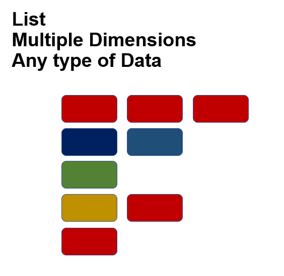

```{r, echo=FALSE, eval=FALSE}
htmltools::img(src = knitr::image_uri("./Images/LATree.PNG"),
               alt = 'logo', 
               style = 'position:absolute; top:0; right:0; padding:10px; width:200px;')
```


```{r setup, include=FALSE}
knitr::opts_chunk$set(echo = TRUE)
```


***
# Janitor Package

This is great package for exploring and cleaning data.

It works well with the pipe operator.

main uses,

* clean names of columns, i.e format names

* creating tables, i.e frequency tables, cross tabs

* finding duplicate records


## Dataset

I will be using the bikes data for this tutorial.

```{r message=FALSE, warning=FALSE, include=FALSE}
library(readr)

library(tidyr)

library(janitor)

library(dplyr)

library(downloadthis)

library(pander)

library(kableExtra)

library(reactable)

library(ggplot2)

library(purrr)

library(stringr)


bikes <- read_csv("D:/R ideas/bikes.csv")

revenue_dataset <- read_csv("D:/R ideas/revenue_dataset.csv")

titanic <- read_csv("D:/R New/ITR_campus/ITR_campus/Data/titanic.csv")


```

```{r echo=FALSE}

bikes %>% 
 kable() %>% 
  kable_styling(bootstrap_options = c("striped", "hover", "condensed")) %>% 
  scroll_box(width = "100", height = "300px")


bikes %>% 
  download_this(
    output_name = "bikes_data_set",
    output_extension = ".csv",
    button_label = "Download data",
    button_type = "danger",
    has_icon = TRUE,
    icon = "download"
  )
```
 
 


## Useful Functions


### clean_names()


We can view bikes data with terrible column names, some in different cases, spaces between the words.

```{r}
#To display the column names
base::names(bikes)
```

We can now clean the names using the clean names function.

```{r}
#Cleaning names using the clean_names function
cleaned_names_bike_data <-janitor::clean_names(bikes)

#To display our new clean names
base::names(cleaned_names_bike_data)
```


### remove_empty()

We can remove empty row and columns, here we are removing both rows and columns, but also can use,

remove_empty_cols()

remove_empty_rows()

I had purposely added in a new column which i named `empty column`, just to demonstrate this.


```{r}

#Removing empty rows and columns from our data
#specifying using a vectors to remove both rows and columns
#here we specify the dataset first
#And then wheether we want to do it row or columns
#In this case its both
removed_empty_data <- janitor::remove_empty(cleaned_names_bike_data,
                                            c("rows", "cols"))

#To display the data
removed_empty_data
```

We now dont have the columns and rows with no data.

### get_dupes()

To identify and examine duplicate records.

If you haven't noticed i had purposely duplicated some records.

The `get_dupes function` identifies the duplicated records.

we can remove them using the `distinct` function from dplyr, here we are removing rows using the columns date and count, the `.keep_all` is used to retain all other variables in the output data frame.

```{r}
#To display the duplicated data
get_dupes(removed_empty_data, date, count)


#To remove the duplicate data
#Here we use dplyr distinct function
#here we are removing rows using the columns date and count
#`.keep_all` function is used to retain all other variables in the output data frame
removed_duplicates_data <-  dplyr::distinct(removed_empty_data, date, count, .keep_all = T)

#To display the data without duplicates
removed_duplicates_data
```


### tabyl()

This generates a frequency table, here am creating a table of frequency also included missing values.


```{r}
#Creating a frequnecy table using tably function
#First define the dataset
#then we define the column, here it is season
#Show-na includes the missing values
table_season <- janitor::tabyl(removed_duplicates_data, season, show_na = T)

#To display the frequnency table
table_season
```

We can add multiple columns in our table.

```{r}
#Creating a frequnecy table using tably function
#First define the dataset
#then we define the column, here it is season and is holiday

multiple_column_table <- tabyl(removed_duplicates_data, season, is_holiday)

#To display the data
multiple_column_table
```

We can add the `adorn functions` to dress up our results.

* adorn_totals()

* adorn_percentages()

```{r}
#Adding total to our frequncy table
multiple_column_table %>% 
  adorn_totals(where="row")

```

We can further format the table, like below,

Play around with the `adorn` functions there a few them, here am just using a few of them.


```{r}
#Here i am adding a row total
#also adding some percentages using our rows as a denominator
#adorn pct formating just formats our percentages to be diplayed a bit better
#adorn ns lets you specify the position of the percentages
#adorn title lets you add a heading here we can add the is holiday title at the top of the table

multiple_column_table %>% 
  adorn_totals(where="row") %>% 
  adorn_percentages(denominator = "row") %>% 
  adorn_pct_formatting() %>% 
  adorn_ns(position = "front") %>% 
  adorn_title(placement = "top")
```


# Tidyr

Was created for simplifying the process of creating tidy data.

One of the key underlying structures of the tidyverse is that data structures follow a tidy format:

* Each variable is in a column

* Each observation is a row

* Each value is a cell

If you make sure your data is tidy, you’ll spend less time rummaging through rubbish on your research path and spend more time working on your all important analysis.

## Dataset
I will be using the revenue data for this tutorial. (Please note this is an entire made up dataset using random numbers)
```{r echo=FALSE}

revenue_dataset %>% 
 kable() %>% 
  kable_styling(bootstrap_options = c("striped", "hover", "condensed")) %>% 
  scroll_box(width = "100", height = "300px")


revenue_dataset %>% 
  download_this(
    output_name = "revenue_data_set",
    output_extension = ".csv",
    button_label = "Download data",
    button_type = "danger",
    has_icon = TRUE,
    icon = "download"
  )
```

<br>

## Useful functions

### pivot_longer(), was previously gather()
Makes wide data longer.

A common problem is a dataset where some of the column names are not names of variables, but values of a variable.

The pivot_longer() function will take multiple columns and collapse them into key value pairs, duplicating all other columns as needed.

this is our dataset below.

```{r}
#To display the data
revenue_dataset
```

The data is considered wide as the data is represented in quarters which spread across, which all relate to time.

To restructure the time variable to be an individual variable,

We can gather each quarter to be within one column.

We can also gather the values within each quarter in a second column variable.


```{r}
#example showing how to use pivot longer
#here we specify the names
#also the values
#and the columns to be gathered
pivot_longer_example <- revenue_dataset %>% 
  pivot_longer(names_to = "quarter", values_to = "income", cols=quarter_one:quarter_four)

#To display the data
pivot_longer_example
```

In the final result, the pivoted columns are dropped, and we get new quarter and income columns. 


### separate()
Splits a single columns into a single column.

separate() pulls apart one column into multiple columns, by splitting wherever a separator character appears.

Sometimes a single column variable can have multiple variables.

Below we can split the quarter column, into two columns, one containing which quarter and one containing which number.

```{r}
#To display the data
pivot_longer_example
```


```{r}
#example showing how to use separate
#here we specify the column we want to separate
# and what we want to separe into
separated_data_example <- pivot_longer_example %>% 
  separate(col = "quarter", into = c("quarter", "number"), sep="_")

#To display the data
separated_data_example
```
By default, separate() will split values wherever it sees a non-alphanumeric character (i.e. a character that isn’t a number or letter).

### unite()
Combines multiple columns into a single column.

unite() is the inverse of separate(): it combines multiple columns into a single column. You’ll need it much less frequently than separate(), but it’s still a useful tool to have in your back pocket.

Sometimes you might want to combine the values of two variables.The unite function can be used to paste together 2 variables into one.

Here we will combine the quarter and number which we separated in the previous example into one column.
```{r}
#To display the data
separated_data_example
```

In this case we also need to use the sep argument. The default will place an underscore (_) between the values from different columns.

```{r}
#example showing how to use unite
#here we specify the column we want to unite
united_data_example <- separated_data_example %>% 
  unite(col = united_quarter, quarter, number, sep = "_")

#To display the data
united_data_example
```

This recreates our original gathered dataset.


### pivot_wider(), was previously spread()

pivot_wider() is the opposite of pivot_longer(). You use it when an observation is scattered across multiple rows.

This is used to reshape long format data to wide format data.

We can separate the column quarter below in multiple columns.

```{r}
#To display the data
united_data_example
```


This time, however, we only need two parameters:

The column to take variable names from. Here, it’s united quarter.

The column to take values from. Here it’s income.

```{r}
#example showing how to use pivot wider
#Need to specify the names of new column
#And the values in the columns
pivot_wider_data_example <- united_data_example %>% 
  pivot_wider(names_from = united_quarter, values_from=income)

#To display the data
pivot_wider_data_example
```

# Classifying Numerical Values

New columns can be created directly when making continuous data discrete using the `ggplot2` functions: 

`cut_number()` - makes `n` groups with (approximately) equal numbers of observations,
`cut_interval()` - makes `n` groups with equal range,
`cut_width()` - makes groups of equal `width`.

## Dataset

I will be using the titanic dataset for this tutorial.

numbers)
```{r echo=FALSE}

titanic %>% 
 kable() %>% 
  kable_styling(bootstrap_options = c("striped", "hover", "condensed")) %>% 
  scroll_box(width = "100", height = "300px")


titanic %>% 
  download_this(
    output_name = "revenue_data_set",
    output_extension = ".csv",
    button_label = "Download data",
    button_type = "danger",
    has_icon = TRUE,
    icon = "download"
  )
```

<br>

Let's look at examples using the `fare` column. 
```{r}
#cut_number() - makes n groups with (approximately) equal numbers of observations
table(ggplot2::cut_number(titanic$fare, 3, labels = c("low", "med", "high")))
```
```{r}
#cut_interval() - makes n groups with equal range,
table(cut_interval(titanic$fare, 3, labels = c("low", "med", "high")))
```
```{r}
#cut_width() - makes groups of equal width
table(cut_width(titanic$fare, width = 50))
```


# Contingency, and Two-Way Tables

Contingency tables are often also referred to as 'crosstabs', 'two-way tables' and 'pivot tables' and, although there may be some subtle distinctions, these all refer to the setting of one categorical variable against another, creating a matrix, and then counting, or otherwise aggregating by cell values.

There are many ways to create cross-tabulations, and `tidyverse` isn't great at doing cross tabulations. Instead, we will use arguably the easiest approach in R: the `base::table()` function, which creates a `table` object.

Let's have a look at a simple example:
```{r}
#Creating a table frequency table using baser table function
#here we are creating atable for survived and sex columns
class_survived_frequency <- table(titanic$survived, titanic$sex)

#To display the data
class_survived_frequency
```
The basic use of `table()` requires that you input the row category ('survived') and the column category ('sex'). This produces cell counts for the cross-tabulation of the two categories, so there were 339 passengers who were both 'female' and 'survived'.

To add margins, we have to pass our table into the `addmargins()` function.
```{r}
# Defaults to adding a sum on both margins
addmargins(class_survived_frequency)
# Has parameters 'margin' and 'FUN'
addmargins(class_survived_frequency, margin = 2, FUN = mean)
```

To get proportions we pass our table into `prop.table()` function.  

```{r}
#proportion of the entire table
prop.table(class_survived_frequency)
#proportion by row, i.e. p(sex|survived)
prop.table(class_survived_frequency, margin = 1)
#proportion by column, i.e. p(survived|sex)
prop.table(class_survived_frequency, margin = 2)
```


# Functionals in R

In R, functionals are functions which take a function is as an input and returns a vector (or similar) as output.

Where should you turn when you discover the next step in your data wrangling/cleaning process requires you to apply a function to each column in a data frame? For example, if you wanted to know the maximum value of each column in a data frame? 

Well you could use summarize as discussed in chapter five -summary statistics, but this becomes inconvenient when you have many columns, as summarize requires you to type out a column name and a data transformation for each summary statistic that you want to calculate.

In cases like this, where you want to apply the same data transformation to all columns, it is more efficient to use purrr’s map function to apply it to each column. 

R being a functional programming language is packed with functionals. We will introduce the following:

* `purrr::map()`
* `purrr::modify()`

There are functionals in base R as well such as: `apply`, `sapply`, `vapply`, etc which are worth experimenting with as well. We will continue with our tidyverse theme and demonstrate the `purrr` equivalents. 

`map()` and `modify()` will take a function in as an argument and apply it to every element of the given collection (e.g. vector, list). 

We have touched on this slightly when we found the `typeof` each column in the titanic dataset.

```{r}
#Eexample of map

purrr::map(titanic, typeof)
```

In that example we used a built-in function `typeof`. 

All the functionals listed above also work with user defined functions. 

Back to our fare question - I don't think there is a currency converter in R, but we can make one ourselves!

```{r}
#creating a function

USD_to_GBP <- function(dollar){
  # rate in Jan 2020
  return(dollar * 0.7693)
}
```

Now we just have to apply the function to our object of interest:

```{r}
#example of modify

dplyr::select(titanic, fare) %>% purrr::modify(USD_to_GBP)
```
Ta-da!

## `map` vs `modify`

There is not a lot of difference between `map` and `modify`. `map` will return a list by default, whereas, `modify` always returns the same type as the input object.

```{r}
#using map to find the typof in every column in the titanic dataset
purrr::map(titanic, typeof)
```
```{r}
#using modify to find the typof in every column in the titanic dataset
purrr::modify(titanic, typeof)
```
As you can see, their difference sounds subtle but the effects are not. 

### `map`

The `map` functions transform their input by applying a function to each element and returning a vector the same length as the input. As mentioned before `map` always returns a list.No matter if the input object is a vector, a list, or a data frame, map() always returns a list.
 

There are also a family of `map` functions which all work the same way buy will always return a fixed type output - or die trying:

* `map_lgl()` - returns a logical vector.
* `map_int()` - returns a integer vector.
* `map_dbl()` - returns a double vector.
* `map_char()` - returns a character vector.
* `map_df()` - returns a data.frame.

Consistent with the way of the tidyverse, the first argument of each mapping function is always the data object that you want to map over, and the second argument is always the function that you want to iteratively apply to each element of the input object

The input object to any map function is always either

* a vector (of any type), in which case the iteration is done over the entries of the vector,

* a list, in which case the iteration is performed over the elements of the list,

* a data frame, in which case the iteration is performed over the columns of the data frame (which, since a data     frame is a special kind of list, is technically the same as the previous point).

The base arguments for map() are:

.x — A list or atomic vector (logical, integer, double/numeric, and character)

.f — A function, formula, or atomic vector

Basically map() takes a function (.f) and applies it to data (.x).

>>Another example

For example, let’s find the maximum value of each column of the mtcars data frame (a built-in data set that comes with R) by using map with the max function.

```{r}
#to display some of the data
head(mtcars)


#Using map to apply the max function to each column
max_of_columns <- purrr::map_df(mtcars, max)

#To display the data
max_of_columns


```
What if you need to add other arguments to the functions you want to map? 

For example, what if there were NA values in our columns that we wanted to know the maximum of? 

Well then we also need to add the argument na.rm = TRUE to the max function so that we get a more useful value than NA returned 


>>What we need to do in that case is do what is called “creating an anonymous function” within the map_df function.

```{r}
# no additional arguments to the max function 
map_df(mtcars, max)


# adding the na.rm  = TRUE argument to the max function
map_df(mtcars, function(df) max(df, na.rm  = TRUE))
```

You can see that’s quite a bit of extra typing.

So the creators of purrr have made a short cut for this because it is so commonly done.

* In the short cut we replace function(VARIABLE) with a ~

* and replace the VARIABLE in the function call with a .

```{r}
# adding the na.rm  = TRUE argument to the max function using the shortcut 
map_df(mtcars, ~ max(., na.rm  = TRUE))

```


### `modify`

`modify` also comes with a family of functions that fit for a different problems:

* `modify_if()` - modifies if predicate function (for columns) is satisfied
* `modify_at()` - modifies at specified columns of a tibble.

```{r}

#creating a vector
example_vector <-c(1, 4, 7)

#creating a function
#this will add 10 to every element of our input
addTen <- function(.x) {
  return(.x + 10)
  
}


#using modify on a vector
purrr::modify(c(1, 4, 7), addTen)


#using modify on a list
purrr::modify(list(1, 4, 7), addTen)


#using modify on a dataframe
purrr::modify(data.frame(1, 4, 7), addTen)


#example of modify if
purrr::modify_if(.x = list(1, 4, 7), 
          .p = function(x) x > 5,
          .f = addTen)

```

***

<br>

# Lists 

***

## Definition

Lists are similar data structure to vectors in that they are an ordered collection of elements. They differ to vectors because their elements can be of any type, including lists themselves!

So why do you need lists? 

A list in R is like a to-do list: the different items on that list most likely differ in length, characteristic, type of activity etc. It enables you to gather a variety of objects under one name in an ordered way.


If you are going to use some modelling functions (like t.test() for the t test or lm() for linear models) you will notice that they produce lists as their return values.




***

<br>

## Manipulating lists

***

### Creating Lists

Similar to vectors, to create a list we have to use a function which returns a list. In this case, the name of the function is more fitting than **`c()`** for vectors. 

To create a list we will use the **`list()`** function.

Each of the contents will appear on a new line. Before each content will be its index number in double square brackets, as in [[1]], [[1]], 

Index numbers simply represent the order in which each item is stored in the list.

As you can see we have various items of within our list and they all keep their data type.


```{r}
# Creating a list

shopping_list <- list(c("apples", "bananas", "strawberries"), 
                      c(5,10,15), 
                      20.2)

# To Display the list

shopping_list
```
Lists are really useful, flexible data structures. Their elements can be any object we've seen so far and any object you might ever see - including functions!


***

<br>

### Naming List Elements

In R certain data structures have an attribute called names. They allow us to label (or name) each element held by a data structure.

The list elements can be given names and they can be accessed using these names.
```{r}
# Creating a list and naming the elements

shopping_list <- list(fruits = c("apples", "bananas", "strawberries"), 
                      amounts = c(5,10,15), 
                      total_price = 20.2)

# To display the list

shopping_list

```


The above now displays the name associated with each element on top of the element.

<br>

We can also name our list using the **`names()`** function. This function allows us to get or set the name attribute of a data structure.

```{r}

# To display the names of our list

names(shopping_list)

# Adding names to our items in the list

names(shopping_list)<- c("favourite_fruits", "amount_of_fruit", "total_price_of_shopping")

# To display the list

shopping_list
```

<br>


As demonstrated above, lists can hold all kinds of data structures, including vectors and other lists, they can then have an interesting tree like structure which we can observe using the structure function, **`str()`** function.


The structure function will return the contents stored in the list, as well as stating the data type of each item, for example, character, numeric, vector, etc.


```{r}
# Checking the structure of our list using the 
# str() function

str(shopping_list)
```

***

<br>

### Indexing a list

To access an element from the list, we have to use square brackets containing the index of the element we are after, just like for vectors.

You can select components using their name in `[[ ]]` or `$` sign (if you have a named list).

```{r}

# Selecting items in a list using the $ symbol

shopping_list$favourite_fruits

# Selecting items in a list using the name
# for named lists

shopping_list[["favourite_fruits"]]

# Selecting items in a list using the index position

shopping_list[[1]]

```

<br>

To return a single element or multiple elements you need to specify both the `component [[]]` and the `element[]`.These components are all vectors, and you can access an element within a vector the usual way.

```{r}
# Selecting items in a list using the $ symbol

shopping_list$favourite_fruits[1]

# Selecting items in a list using the name
# for named lists

shopping_list[["favourite_fruits"]][1]

# Selecting items in a list using the index position

shopping_list[[1]][1]

```
***

<br>

### Adding Elements to a List

Similar to vectors again, to add an element, we can either index to a blank space in the list or use the append() function:

```{r}

# To display the list

shopping_list

```

```{r}
# Adding an item to a list by position

shopping_list$best_biscuits <- "custard creams"


# To display the list

shopping_list

```

```{r}
# Adding an item to a list using the append function

shopping_list <- append(shopping_list, "milk")

# To display the list

shopping_list
```


<br>

### Exercise{.tabset .tabset-fade}


#### **Exercise**{-}


1. Create the list below.

```{r}
# Creating a list with multiple items

chocolate <- list(brand = "celebrations", 
                  chocolate_bar = c("mars", "milky way", "bounty", "twix", "maltesers"), 
                  rating = c("worst",  "terrible", "awful", "nice", "best"))
```

2. Find out the names of the list, using the `names()` function.

3. Check the structure using the `str()` function.

4. Select chocolate bars.

5. Add an item called price.

<br>


##### **Extension Exercise**{-}


1. Select your favourite chocolate from the options.


2. Add a new chocolate bar.


***

<br>


#### **Show Answer**{-}

1. Create the list below.

```{r}

# Creating a named list with multiple items

chocolate <- list(brand = "celebrations", 
                  chocolate_bar = c("mars", "milky way", "bounty", "twix", "maltesers"), 
                  rating = c("worst",  "terrible", "awful", "nice", "best"))
```

<br>

2. Find out the names of the list, using the `names()` function.

```{r}
# Finding the names 

names(chocolate)


```

<br>

3. Check the structure using the `str()` function.

```{r}
# Checking the structure

str(chocolate)

```

<br>

4. Select chocolate bars.

```{r}
# Select chocolate bars

chocolate$chocolate_bar

```

<br>

5. Add item called price.

```{r}
# Updating the list by adding price

chocolate$cost <- "price"

# To display the list

chocolate


```


<br>

##### **Extension Exercise**{-}

1. Select your favourite chocolate from the options.

```{r}
# Select my favourite chocolate bar

chocolate$chocolate_bar[3]

chocolate[["chocolate_bar"]][3]


chocolate[[2]][3]

```


<br>

2. Add a new chocolate bar.

```{r}

chocolate$chocolate_bar[5]<- "turkish delight"

# To display the list

chocolate

```


# Projects{.tabset .tabset-fade}

## Non-ONS {-}

It is highly recommended to manage your R work in "projects". When you’re starting work on a new project, choose **‘New project…’** from the File menu and **‘New Directory’** to create a directory for the project.


If you already have data related to the project in an existing directory, you can choose that option instead.


To work on this project in the future, you can select **‘Open Project…’** or **‘Recent Projects’** from the File menu and browse to the desired project.

This will ensure that your working directory will be set to the project folder, meaning you won’t have to worry about full file paths for data you are reading in or writing to that same folder.

***

<br>

## ONS {-}

Within ONS, the default R working directory is within the `C:` drive. 


**C drive -> My_RStudio -> Workspace**


It is good practice to organise your folders. 

As shown in the example below, where you include all files to a project in the same folder `Project A`

<br>


<br>

Within the folder, it is good practice to further organise your files within folders, as shown below.

* The data folder would contain your raw and processed data.

* Images would contains any photos you are using.

* Scripts would contain all the R files. You don't have to stick with this exact folder structure, you could add in additional folders, for example an output folder.

<br>


***

<br>


## Relative File Paths

We can also use what's called a relative file path to reference files. 

These file paths are relative to whatever the working directory is at the time.

For example if my full or absolute location is:

```{r, eval=FALSE}
"C:/My_RStudio/Workspace/Intro_to_R/Data/titanic.csv"
```

This is clear and explicit about where the data is stored. However if you were to use this link you would need to change elements of it – for example you might have your `Intro_to_R` in a different folder.

I can use what’s called a relative path - the location relative to the working directory.

For example, if my working directory is `Intro_to_R`, I can load the same file as above using the path:

```{r,eval=FALSE}
"Data/titanic.csv"
```

Think of a file structure like a tree diagram. 

From a given folder you can either move up or down the file structure.

```
Introduction_to_R
|    
|
 ---Course_content
|       Intro to R - Chapter 1.Rmd
|       Intro to R - Chapter 2.Rmd
|       Intro to R - Chapter 3.Rmd
|
 ---Data
|       titanic.csv
|       police_data.xlsx
|
 ---Pre_course_information
|       ons
|       external    
|           
|         

```

If our current working directory is `'Course_content'`, and we want to switch to `'Data'`, we can use the relative path:

```{r, eval = FALSE}

("../Data")
```
This effectively says, first go up a directory (`..`), so from `Course_content` to `Intro_to_R`. Then go down a directory into `Data`.

>**Going up a directory always requires `..`, whereas going down a directory always requires you to name the intended directory.**

The relative path will work for any user – as long as their working directory is set to the `'Course_content'` in the Into_to_R folder.

<br


## Functions Extension

### Descriptive Statistics Example

For example if you wanted get the summary statistics below; We could use the summarise function.

* `min()`
* `max()`
* `mean()`
* `length()`
* `sd()` 

```{r}
# Using Summarise function to get descriptive statistics
# We first specify our dataset using the .data arguement
# The using the descriptive statisitcs functions
# Also specify na.rm = TRUE to not include missing values 
# within the calculations of the descriptive statistics

summarise(.data = titanic, minimum = min(age_of_passenger, na.rm = TRUE),
                           maximum = max(age_of_passenger, na.rm = TRUE),
                           mean = mean(age_of_passenger, na.rm = TRUE),
                           length = length(age_of_passenger),
                           standard_deviation = sd(age_of_passenger, na.rm = TRUE)
                           )


```

<br>

If we wanted the same descriptive statistics for a different column we could copy and paste the code about and change the column name.

```{r}
# Using Summarise function to get descriptive statistics
# We first specify our dataset using the .data arguement
# The using the descriptive statisitcs functions
# Also specify na.rm = TRUE to not include missing values 
# within the calculations of the descriptive statistics

summarise(.data = titanic, minimum = min(fare, na.rm = TRUE),
                           maximum = max(fare, na.rm = TRUE),
                           mean = mean(age_of_passenger, na.rm = TRUE),
                           length = length(fare),
                           standard_deviation = sd(fare, na.rm = TRUE)
                           )

```


<br>

If we we wanted another column we could keep on copying and pasting, copying and pasting but this is not recommended as its not efficient and could lead to errors as above.

>**Did you notice the error?**

<br>

To prevent this issue we can write our own function which will combine all these descriptive statistics into one function.

* Our function name is descriptive_statistics()

* Our input will be column, which will be the column that we are interested is seeing the descriptive statistics for.

* My statements are the calculations for the descriptive statistics

* My return value will be a tibble of the descriptive statistics.


```{r}
# Creating my function

descriptive_statistics <- function(column){
  
  # Create an object "my_minimum" which contains the min of column
  column_minimum <- min(column, na.rm = TRUE)
  
  # Create an object "my_maximum" which contains the max of column
  column_maximum <- max(column, na.rm = TRUE)
  
  # Create an object "my_mean" which contains the mean of column
  column_mean <- mean(column, na.rm = TRUE)
  
  # Create an object "my_length" which contains the length of column
  column_length <- length(column)
  
  # Create an object "my_standard_deviation" which contains the sd of  column
  column_standard_deviation <- sd(column, na.rm = TRUE)
  
 # Combine the objects created into a tibble
 return(tibble(column_minimum,
               column_maximum,
               column_mean,
               column_length,
               column_standard_deviation)
   )
}
```


We can now use our function on different columns, without needing to copy and paste our code. Once we are confident that are function works well, we can use it multiple times safe knowing it will do exactly what we want.

```{r}
# Calling our function
# Here we can use it on different columns

descriptive_statistics(titanic$parch)

descriptive_statistics(titanic$sibsp)
```

***

<br>

### Applying Functions using `purrr`

Often when working with data, we want to manipulate multiple columns of data at once.

As an example using our `descriptive_statistics()` on mutliple columns at the same time - how would we achieve this? 

***

### Functionals in R

In R, functionals are functions which take a function is as an input and returns a vector (or similar) as output.

R being a functional programming language is packed with functionals. We will introduce the following:

* `purrr::map()`
* `purrr::modify()`

There are functionals in base R as well such as: `apply`, `sapply`, `lapply`, etc which are worth experimenting with as well. We will continue with our tidyverse theme and demonstrate the `purrr` equivalents. 

`map()` and `modify()` will take a function in as an argument and apply it to every element of the given collection (e.g. vector, list).

As an example we can use the `typeof()` function to see the data types of each of our columns in the titanic dataset.


```{r}
purrr::map(titanic, typeof)
```

In that example we used a built-in function `typeof`. 

All the functionals listed above also work with user defined functions. We can even apply this using our pipe operators.


```{r}
titanic %>% 
  dplyr::select(age_of_passenger,fare) %>% 
  purrr::map(descriptive_statistics)
```

***

### `map` vs `modify`

There is not a lot of difference between `map` and `modify`. `map` will return a list by default, whereas, `modify` always returns the same type as the input object.

```{r}
purrr::map(titanic, typeof)
```
```{r}
purrr::modify(titanic, typeof)
```
As you can see, their difference sounds subtle but the effects are not.

What you prefer as an output will determine which of these you would choose to use.

***

