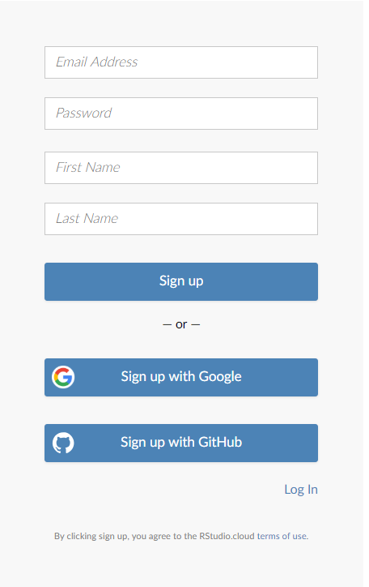
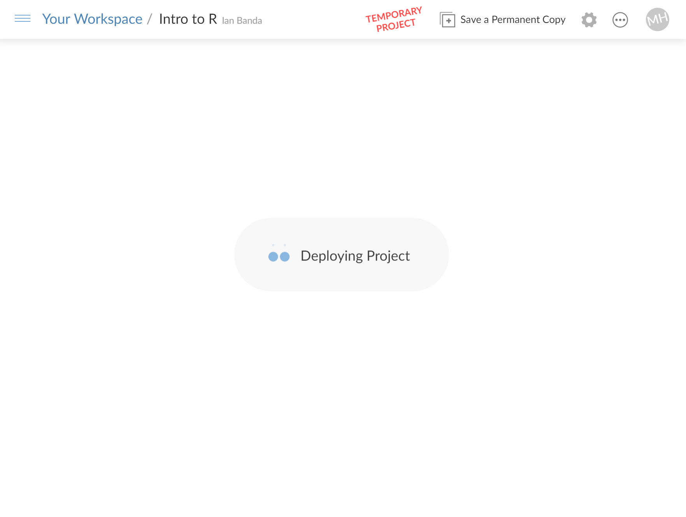
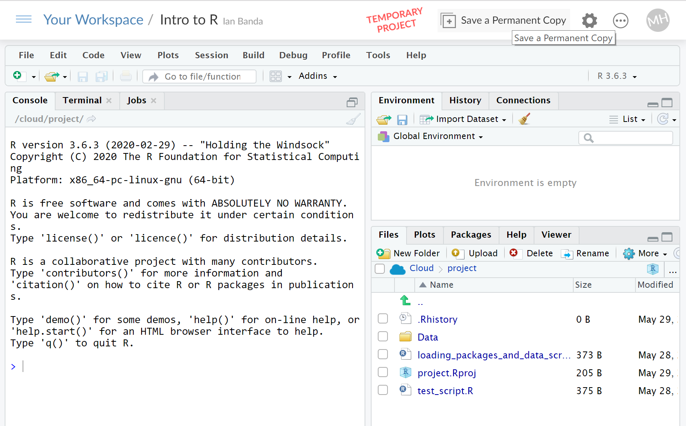

```{r, echo=FALSE}
htmltools::img(src = knitr::image_uri("../Images/LATree.PNG"),
               alt = 'logo', 
               style = 'position:absolute; top:0; right:0; padding:10px; width:200px;')
```


```{r setup, include=FALSE}
knitr::opts_chunk$set(echo = TRUE)
```

<br>

***

<br>


# What is R Studio Cloud

If you are having issues installing p R Studio or are having issues with installing package as a back up we will prompt you to use R Studio Cloud. This should be only be used as a temporary measure while you wait to desktop version installed.

RStudio Cloud is a hosted version of RStudio in the cloud that makes it easy for professionals, hobbyists, trainers, teachers and students to do, share, teach and learn data science using R.

Create your analyses using RStudio directly from your browser - there is no software to install and nothing to configure on your computer.

***
<br>

# Set Up

You will be sent a link to a created project, firstly you will need to register for an account, click on the link below.

[R Studio Cloud Sign up](https://login.rstudio.cloud/register)

Which will look like below, **Please sign in your personal email address**.

<br>

***



***

<br>

Once signed up, it will take a while to load.You will see the message “Deploying Project” for a couple of minutes while it creates your Workspace.

<br>

***



***

<br>

A project has been already created called **Intro to R**.


When you access a project created by someone else, RStudio Cloud automatically creates a temporary copy of the original project for you. You can play with and make edits to it, but none of your changes will be reflected in the original. 

Save a copy of the project for yourself by pressing the **Save a Permanent Copy button**. Which is in the top right corner.

<br>

Then you will end up with something that looks like the image below, feel free to amend some settings as outlined in **Chapter 1 Getting Started with R section 2.2**.

<br>



<br>


