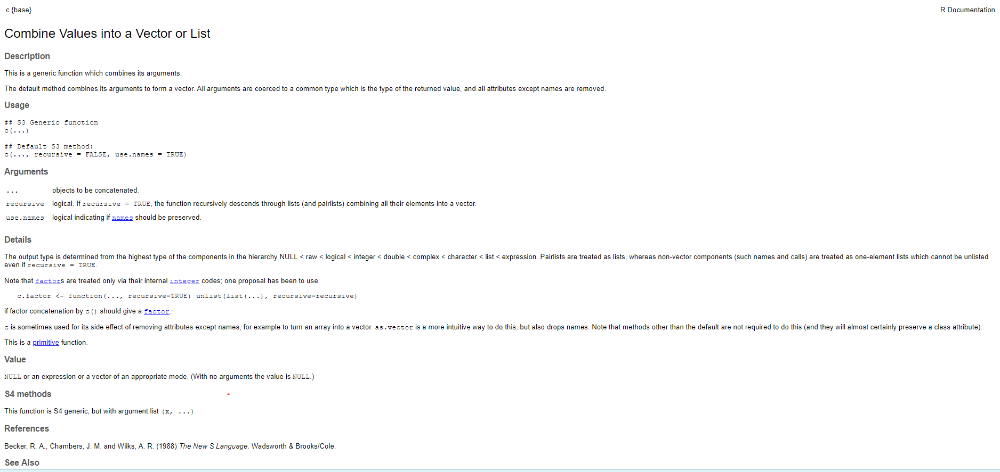

```{r, echo=FALSE}
htmltools::img(src = knitr::image_uri("../Images/LATree.PNG"),
               alt = 'logo', 
               style = 'position:absolute; top:0; right:0; padding:10px; width:200px;')
```

```{r setup, include=FALSE}
knitr::opts_chunk$set(echo = TRUE)
```

<br>

***
# Data Structures{-}

***

# Learning Objectives

<br>

**The goal of this session is to:**

* Be familiar with data structures in R.
* Understand how vectors operate.
* Be familiar with lists.
* Be familiar with data frames and tibbles.

***

<br>

# Data Structures

We do not work with single data values, we often work with a combination or collection of data.

R organises these in certain structures, and stores this data so that  we can manipulate and work with it.

Data structures we will be looking at include vectors, lists, and data frames. 

***

<br>

# Vectors


Now it's time to almost forget everything you've just learned... In R the most fundamental object is a vector. To the extent all the data types we have seen so far have all been vectors. This is because R is a `"vectorised"` language. This is a really powerful concept that may seem foreign right now, but it should make more sense as we move on.


In the previous section we looked at data types, where we said we could assign a name to a value.

here `my_friends` is assigned to the value `ian`

```{r}
#To assign a variable
my_friends <- "ian"

```

Suppose you wanted to store more than one value (more friends) other than `"ian"`. e.g "jonathon", "hannah", "mike", "almas".


```{r, eval=FALSE}


my_friends <- "ian", "jonathon", "hannah", "mike", "almas"

my_friends <- ("ian", "jonathon", "hannah", "mike", "almas")


```

You will get the error below,

>**Error: unexpected ',' in "my_friends <- "ian","**


Which brings us to the **`c()`** function.

***

<br>


## The c() Function {.tabset .tabset-fade}


The code above will not work, which is where the `c()` function comes in. 


### **Exercise** {-}


1. Use the help section in R to find out what the `c()` function does.

```{r, eval=F}

c()

```

2. Use the examples at the bottom of the help section to figure out how store mutliple values within the same data structure.

```{r, eval=FALSE}
my_friends <- "ian", "jonathon", "hannah", "mike", "almas"
```


***

<br>


### **Show Answer** {-}

The **`c()`** function is used for creating a vector in R - it stands for `combine`

```{r, eval=FALSE}

#To acces the R help documentation

?c()

# or

help(c)

```

<br>

\

<br>

I can use the **`c`** function to store multiple items in a single variable, note that elements are separated by commas.
```{r}
#creating a vector
my_friends <- c("ian", "jonathon", "hannah", "mike", "almas")

#To display the data
my_friends
```

***

## Vector Definition

A `vector` is a one-dimensional ordered collection of elements, **all of the same type**. 

It is the basic data structure in R with a lot of useful properties.

Since R insists all elements in a vector have to be of the same type we then can have types of vectors. These are:

* Logical vector - contains only logical values.
* Numerical vector - contains only numerical values.
* Character vector - contains only character values. 

There are more types of vectors, but for the purpose of our learning these  are sufficient.

***

<br>


## Creating Vectors 

There are several different ways of creating a vector. You can create a vector by using:

- The combine function **c()**.

- The sequence function **seq()**.

- The **colon** to create a vector of consecutive numbers.

- The **vector()** function.

```{r}
# Creating a vector using the combine function
sample_vector <- c(1, 2, 3, 4, 5)

# To display the created vector
sample_vector  

```

```{r}

# Creating a vector using the sequence function,

#Here I am specifying the parameters, from, to and  by and the arguments 2, 6 and 2
sequence_vector <- seq(from = 2, to = 6, by = 2)

# To display the created vector
sequence_vector

```

```{r}
# Creating a vector using a colon
colon_vector <- 6:10

# To display the created vector
colon_vector

```

```{r}
# Creating a vector using the vector function
# Here we can specify what type of vector by specifying the mode 
# and the how long by specifying the length

#Here I am specifying 2 parameters, mode and length and 2 arguements
#'logical' and 7

example_vector <- vector(mode = 'logical', length = 7)

# To display the created vector
example_vector

```


Play around with the `mode` and `length` parameters. (Try: mode = `'integer'`, `'double'` or `'character'`).
<br>

***

<br>


### Exercise{.tabset .tabset-fade}


#### **Exercise** {-}


1. In your script leave yourself a comment to remind you that this exercise is about vectors.


2. Create two vectors, one with numeric data and one with character data, e.g favourite_movies and lucky_numbers, see my examples below (but feel free to be creative here!)


3. Now combine the two vectors to create a new vector, e.g movies_and_numbers, see my example below.


4. Then find out what type of vector your new vector is, use **typeof()**.


```{r, eval=FALSE}

# Creating a character vector
favourite_movies <- c("Frozen", "The Lion King", "Moana", "The Dark Knight") 


# Creating a numerical vector  
lucky_numbers <- c(7, 12, 15, 1) 


# Combining the two vectors into a new vector
movies_and_numbers <- c(favourite_movies, lucky_numbers)

```

***


<br>


#### **Show Answer**{-}


```{r}
# This exercise is about vectors
favourite_movies <- c("Frozen", "The Lion King", "Moana", "The Dark Knight") 

# To display the data
favourite_movies
  
lucky_numbers <- c(7, 12, 15, 1)  

# To display the data
lucky_numbers


# combining the 2 vectors
movies_and_numbers <- c(favourite_movies, lucky_numbers)

# checking the type of vector
typeof(movies_and_numbers)

```

We can see below that our new vector is a character vector; as vectors are supposed to be of the same data type, R will automatically convert the data of the 2 vectors to be the same. 

> **This is known as coercion.**

***

<br>


## Vectorised Language


Vectors aren't just containers for homogeneous data (data of the same type). 

> **As R is a vectorised language, this means operations are applied to each element of the vector automatically, without the need to loop through the vector.** 

Since all the objects we have seen so far (`numeric`, `logical` and `character`) have all been secretly vectors, that means all the operations we have performed so far have been vectorised operations! 

The operations will scale to a larger sized vector, rather than the individual elements we have worked with thus far. 

Let's explore!

```{r}
# To display the vector
sample_vector


# To display the vector
colon_vector

# Adding vectors

vector_addition <- sample_vector + colon_vector

# To display the vector
vector_addition

# Multiplying vectors (element wise, dot product)

vector_multiplication <- sample_vector * colon_vector

# To display the vector
vector_multiplication

# To display the vector
sample_vector

#Multiplying a vector with a value
sample_vector * 3

```

***

<br>


### Exercise{.tabset .tabset-fade}


#### **Exercise** {-}


1. Try and add `sample_vector` and `sequence_vector`.

```{r}
# To display the vector
sample_vector


# To display the vector
sequence_vector
```


2. Can you figure out what has happened?


***

<br>

#### **Show Answer**{-}

1. Try and add `sample_vector` and `sequence_vector`.

```{r}

# To display the vector
sample_vector


# To display the vector
sequence_vector


# Adding two vectors of different lengths
vector_after_addition <- sample_vector + sequence_vector

# To display the vector
vector_after_addition  

```

When we try to add vectors of different lengths R gives a warning message as the longer object length is not a multiple of the shorter object length.

As we can see R has recycled the elements in the shorter vector, wrapped them around to reach the length of the longer one.

When applying arithmetic to two vectors their lengths should either be equal, or the length of the longer one a multiple of the length of the shorter one.


> **All of the operations we have seen above were performed in an element-wise manner. This means the operation was performed on each respective element from each vector. In R this is implemented with a lot of flexibility. We could perform operations with vectors of different sizes. Other languages may not have the same flexibility and will give you an error.**

***

<br>

## Indexing a Vector 

Elements in a vector can be selected using `[ ]`. 

> **We are going to use indexes, which are the position of each element within the vector.** 

Note that R indexes start at 1 (not 0 like other languages).

As an example, going back to my favourite movies, to pick the second item in the list, I would simply use the square brackets and reference **2** as shown below.

```{r}
# To display the vector
favourite_movies
```


```{r}
# Selecting the second element in the vector
favourite_movies[2] 
```

We can also index (select) multiple elements:

```{r}
# Selecting multiple items, from the second to
#  the fourth item
favourite_movies[2:4] 
```

The `2:4` is a sequence vector which we put into the square brackets as the indexes we want.

Or even index using another vector:

```{r}
# Selecting multiple items, using a vector
# Selecting the first, third and fourth item
favourite_movies[c(1,3,4)] 
```

Above we have selected the 1st, 3rd and 4th elements from `favourite_movies` in that order.

***

<br>


### Exercise{.tabset .tabset-fade}


#### **Exercise**{-}


1. Create another vector containing days of the week (Monday - Sunday).

2. Select the third day of the week.

3. Select the week days.

4. Select Tuesday and Thursday.

***

<br>

#### **Show Answer**{-}

1. Create another vector containing days of the week (Monday - Sunday).

2. Select the third day of the week.

3. Select the week days.

4. Select Tuesday and Thursday.

```{r}
#Creating a vector
days_of_the_week <- c("Monday","Tuesday",
                      "Wednesday","Thursday",
                      "Friday","Saturday",
                      "Sunday")


#Selecting the 3rd day
days_of_the_week[3]


#Selecting the week days
days_of_the_week[1:5]

#Selecting Tuesday and Thursday
days_of_the_week[c(2,4)] 
# Here we create a selection 
# vector inside the [].
```

***


<br>

# Lists 

***

## Definition

Lists are similar data structure to vectors in that they are an ordered collection of elements. They differ to vectors because their elements can be of any type, including lists themselves!

So why do you need lists? A list in R is like a to-do list: the different items on that list most likely differ in length, characteristic, type of activity etc. It enables you to gather a variety of objects under one name in an ordered way.


***


<br>


## Creating Lists

Similar to vectors, to create a list we have to use a function which returns a list. In this case, the name of the function is more fitting than **`c()`** for vectors. 

To create a list we will use the **`list()`** function.


```{r}
# Creating a list
list(1,4,'character',5)
```
As you can see above, our numeric values remain numeric, and character string value remained a character. 

We could even have a vector inside our list too:

```{r}
# Creating a list and assigning it to list_example
my_first_list_example <- list(1:10, "above is a vector going from 1 to 10")


# To Display the list
my_first_list_example
```
Lists are really useful, flexible data structures. Their elements can be any object we've seen so far and any object you might ever see - including functions!

***

<br>

### Exercise{.tabset .tabset-fade}


#### **Exercise**{-}


1. Referring to our previous exercise where we created the vectors below, create a list with the same contents as the two vectors, I have named my list, `my_list_of_movies_and_numbers`.

```{r, eval=FALSE}

# Character vector
favourite_movies <- c("Frozen", "The Lion King", "Moana", "The Dark Knight") 


# Numeric vector  
lucky_numbers <- c(7, 12, 15, 1) 

# Creating a list
my_list_of_movies_and_numbers <- list() 

```

***

<br>


#### **Show Answer**{-}

1. Referring to our previous exercise where we created the vectors below, create a list with the same contents as the two vectors, I have named my list, `my_list_of_movies_and_numbers`, see my example below.

```{r}
# Creating a list
my_list_of_movies_and_numbers <- list(7, 12, 15, 1, "Frozen", 
                                      "The Lion King", "Moana", "The Dark Knight") 
# To Display the list
my_list_of_movies_and_numbers
```


***

<br>


## Indexing a List {.tabset .tabset-fade}

To access an element from the list, we have to use square brackets containing the index of the element we are after, just like for vectors. 

Indexing with a single square bracket always returns a list, whereas indexing with a double square bracket returns the item directly in whatever datatype is appropriate (often a vector).


```{r}
# To display the list
my_list_of_movies_and_numbers
```

For example, compare the output of:

```{r}
# To display an element in the list as a list
my_list_of_movies_and_numbers[1]
```

with the output of:

```{r}
# To display an element in the list
my_list_of_movies_and_numbers[[1]]
```

***

<br>

 

#### **Chained Indexing**{-}


Like we said that lists can contain anything.

If the element we select is another data structure, then we can also immediately index the selected data structure by using chained indexing.

Below am creating a list of my 2 vectors, named it `list_of_vectors`.

```{r}
# Character vector
favourite_movies <- c("Frozen", "The Lion King", "Moana", "The Dark Knight") 

# Numeric vector  
lucky_numbers <- c(7, 12, 15, 1) 

# Creating a list of the 2 vectors
list_of_vectors <- list(favourite_movies, lucky_numbers)

# To display the list
list_of_vectors
```

So if I wanted to select the 4th item from `favourite_movies`, I would type the code below,


```{r}
# Selecting the fourth item from the first vector within the list
list_of_vectors[[1]][4]
```


This effectively pulls out the vector stored in the first position in the list, and further indexes the item in the 4th position in that vector.

***


<br>


## Named Lists

In R certain data structures have an attribute called `names`. They allow us to label (or name) each element held by a data structure. 

We can do this by using the `names()` function. The `names()` function allows us to get or set the name attribute of a data structure.

To get the `names` attribute just call the function on the data structure: `names(a_data_structure)`

To set the `names` attribute we simply use the assign operator in conjunction with the get method above: `names(a_data_structure) <-`. Typically, character vectors with meaningful names are assigned to the names attribute. 

Let's look at an example.

```{r}
# Suppose we have the following list:
# Creating a list with multiple items
list_example <- list(3:5, "ONS", c(FALSE, FALSE, TRUE), 26L)

# To display the list
list_example
```

<br>

What happens if we call `names` on `list_example`?

```{r}
# Finding out the names of our items in the list
names(list_example)
```

We could attach a name (or label) to each element in this list via the following assignment:

```{r}
# Adding names to our items in the list
names(list_example)<- c("double_vector", "character", "logical_vector", "integer")

# To display the list
list_example
```
To confirm our assignment, let's call `names` on `list2` again:

```{r}
# Finding out the names of our items in the list
names(list_example)
```
The above now displays the name associated with each element on top of the element.


On the surface, naming elements may not seem immediately useful, but this introduces a new bit of functionality. We can now index our data structure by the `names` associated to each element.


```{r}
# Selecting an item from a list
list_example["integer"]
```
We could have equivalently named our list on creation:


```{r}
# Creating a list and naming the contents
list_example <- list(numeric_vector = 3:5, 
              character = "ONS",
              logical_vector = c(FALSE, FALSE, TRUE), 
              integer = 26L)

# To display the list
list_example
```

Since lists can hold other data structures, including vectors and other lists, they can then have an interesting tree like structure which we can observe using the structure function, `str()` function.

```{r}
# Checking the structure of our list using the 
# str() function
str(list_example)
```


***

<br>

### Exercise{.tabset .tabset-fade}


#### **Exercise**{-}


1. Create the list below.

```{r}
# Creating a list with multiple items
chocolate <- list(brand = "celebrations", 
                  chocolate_bar = c("mars", "milky way", "bounty", "twix"), 
                  rating = c("worst",  "terrible", "awful", "nice", "best"))
```

2. Find out the names of the list, using the `names()` function.

3. Check the structure using the `str()` function.

4. Select chocolate bars.

5. Select your favourite chocolate from the options.


***

<br>


#### **Show Answer**{-}

1. Create the list below.

2. Find out the names of the list, using the `names()` function.

3. Check the structure using the `str()` function.

4. Select chocolate bars.

5. Select your favourite chocolate from the options.

```{r}
# Creating a list with multiple items
chocolate <- list(brand = "celebrations", 
                  chocolate_bar = c("mars", "milky way", "bounty", "twix"), 
                  rating = c("worst",  "terrible", "awful", "nice", "best"))


# Finding the names 
names(chocolate)

# Checking the structure
str(chocolate)


# Select chocolate bars
chocolate[2]

# Select my favourite chocolate bar
chocolate[[2]][3]
```

***

<br>


## Adding Elements to a List

Similar to vectors again, to add an element, we can either index to a blank space in the list or use the `append()` function:

```{r}
# Adding a new item to a list
my_first_list_example[3] <- "new"

# To display the list
my_first_list_example

```
```{r}
# To display the list
list_example

# Combining the two lists using the append() function
append(my_first_list_example, list_example)

```


***

<br>


### Exercise{.tabset .tabset-fade}


#### **Exercise**{-}


1. Using the list we created above `chocolate`, add item called price.

```{r, eval=FALSE}
# Creating a list with multiple items
chocolate <- list(brand = "celebrations", 
                  chocolate_bar = c("mars", "milky way", "bounty", "twix"), 
                  rating = c("worst",  "terrible", "awful", "nice", "best"))
```


2. Add a new chocolate bar.

***

<br>

#### **Show Answer**{-}

1. Using the list we created above `chocolate`, add item called price.


2. Add a new chocolate bar.

```{r}
#To display the list
chocolate


# Updating the list by adding price
chocolate[[4]] <- (price = "price")

chocolate


# Updating the list using the list using append
chocolate <- append(chocolate, "price")

chocolate

# Adding an item with list contained in a list
chocolate[[2]][5] <- "turkish delight"

chocolate
```

***

<br>


***

# Data Frames and Tibbles {.tabset .tabset-fade}
Data frames are like the tables we are used to from Excel and other programs.

* Can hold variables of different types
* Columns are variables 
* Rows are observations

In the next session we are going to use special type of data frame called a **tibble**.

They are becoming a standard way to work with data, they are very useful when working with large data sets.

`Tibbles` are data frames, but they tweak some older behaviours to make life a little easier. R is an old language, and some things that were useful 10 or 20 years ago now get in your way. 


 
**The key benefits of tibbles are:**

* In addition to its name, each column reports its type, a nice feature borrowed from `str()`.

* The dimensions of the tibble are shown at the top.

* Tibbles have a refined print method that shows only the first 10 rows, and all the columns that fit on screen. This     makes it much easier to work with large data.


Below is an example of a what a data frame and tibble look like, I have used the same dataset.

<br>

## Data Frame {-}
```{r} 
# To display the dataframe
iris
```


<br>


## Tibble {-}


```{r echo=FALSE, message=FALSE, warning=FALSE}

library(tibble)

as_tibble(iris)
```
***

<br>


# Summary-Data Structures{-}

<br>

> **We have covered a lot material in R and yet there is still so much more to cover in terms of functionality, as R has so much to offer. By no means are you expected to remember all the above, but as we move forward, it is important you remain aware of:**


* How to create a vector using `c()` function.

* All elements in the vector must be of the same type and R **WILL** force that on you.

* The different types of vectors: Double, Integer, Logical, Character.

* We can find out what type of by using the `typeof()` function. 

* We can convert from on type of vector to another using `as.` functions. 

* Vectors are the most fundamental object type available in R as it is a vectorised language.

* All operations can be applied to their respective vector type.

* Lists are similar to vectors but can store a mixture of data types and objects.

* We can name (or label) list elements for meaningful indexing.

* Be familiar with data frames and tibbles.


<br>


> **We could carry on exploring all the functionality available through vectors and lists but I would encourage you to explore them yourself. Particularly when you have your own niche problem to solve!** 


***

<br>


# Next Chapter{-}


<br>


***

**In the next chapter we will look at Packages and Importing Data**

***