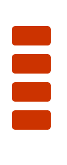
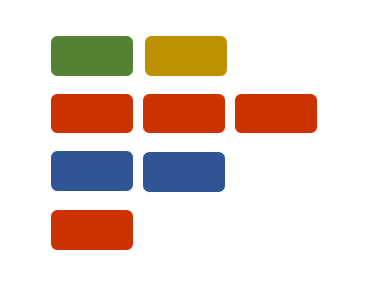
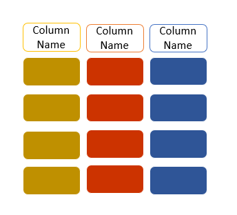

```{r, echo=FALSE}
htmltools::img(src = knitr::image_uri("../Images/LATree.PNG"),
               alt = 'logo', 
               style = 'position:absolute; top:0; right:0; padding:10px; width:200px;')
```

```{r setup, include=FALSE}
knitr::opts_chunk$set(echo = TRUE)
```

<br>

***
# Data Structures{-}

***

# Learning Objectives

<br>

**The goal of this session is to:**

* Be familiar with data structures in R.
* Understand how vectors operate.
* Be familiar with lists.
* Be familiar with data frames and tibbles.

***

<br>

# Data Structures

We do not work with single data values, we often work with a combination or collection of data.

R organises these in certain structures, and stores this data so that  we can manipulate and work with it.

Data structures we will be looking at include vectors, lists, and data frames. 

***

<br>

# Vectors

In the previous section we looked at data types, where we said we could assign a name to a value.

here `my_friends` is assigned to the value `ian`

```{r}
# To assign a variable

my_friends <- "ian"

```

Suppose you wanted to store more than one value (more friends) other than `"ian"`. e.g "jonathon", "hannah", "mike", "almas".


```{r, eval=FALSE}
# PLEASE NOTE THIS CODE WILL NOT WORK

my_friends <- "ian", "jonathon", "hannah", "mike", "almas"

my_friends <- ("ian", "jonathon", "hannah", "mike", "almas")


```

You will get the error below,

>**Error: unexpected ',' in "my_friends <- "ian","**


Which brings us to the **`c()`** function.

***

<br>


## The c() Function {.tabset .tabset-fade}


The code above will not work, which is where the `c()` function comes in. 


### **Exercise** {-}


1. Use the help section in R to find out what the `c()` function does.

```{r, eval=F}
# The c() function

c()

```

2. Use the examples at the bottom of the help section to figure out how store mutliple values within the same data structure.


***

<br>


### **Show Answer** {-}


1. Use the help section in R to find out what the `c()` function does.

The **`c()`** function is used for creating a vector in R - it stands for `combine`

```{r, eval=FALSE}

#To acces the R help documentation

?c()

# or

help(c)

```

<br>

\


<br>

I can use the **`c`** function to store multiple items in a single variable, note that elements are separated by commas.
```{r}
# Creating a vector

my_friends <- c("ian", "jonathon", "hannah", "mike", "almas")

# To display the data

my_friends

```

***

## Vector Definition

Vectors are probably simplest and  the most used commonly used data structure in R. 

A vector is a collection of values that are all of the same type (numbers, characters, etc.).

It is the basic data structure in R with a lot of useful properties.

Vectors are particularly important as most of the functions you will write will work with vectors.

Since R insists all elements in a vector have to be of the same type we then can have types of vectors. These are:

* Logical vector - contains only logical values.
* Numerical vector - contains only numerical values.
* Character vector - contains only character values. 

There are more types of vectors, but for the purpose of our learning these  are sufficient.



***

<br>


## Creating Vectors 

There are several different ways of creating a vector. You can create a vector by using:

- The combine function **c()**.

- The sequence function **seq()**.

- The **colon** to create a vector of consecutive numbers.


### Combine function{-}


```{r}
# Creating a vector using the combine function

sample_vector <- c(1, 2, 3, 4, 5)

# To display the created vector

sample_vector  

```

### Sequence function{-}

A sequence of values from a value (from), to another value (to), by a step value (by) could be generated as a vector using the function seq().

Here I am specifying the arguments, `from`, `to` and  `by` and with the values 2, 6 and 2.

```{r}

# Creating a vector using the sequence function,

#Here I am specifying the parameters, `from`, `to` and  `by` and the arguments 2, 6 and 2.

sequence_vector <- seq(from = 2, to = 6, by = 2)

# To display the created vector

sequence_vector

```

### Colon{-}

A range of values (i.e., consecutive values) could be generated as a vector using a colon (:) in R.

```{r}
# Creating a vector using a colon

colon_vector <- 6:10

# To display the created vector

colon_vector

```


***

<br>


### Exercise{.tabset .tabset-fade}


#### **Exercise** {-}


1. In your script leave yourself a comment to remind you that this exercise is about vectors.


2. Create two vectors, one with numeric data and one with character data, e.g favourite_movies and lucky_numbers, see my examples below (but feel free to be creative here!)


3. Now combine the two vectors to create a new vector, e.g movies_and_numbers, see my example below.


4. Then find out what type of vector your new vector is, use **typeof()**.


```{r, eval=FALSE}

# Creating a character vector

favourite_movies <- c("Frozen", "The Lion King", "Moana", "The Dark Knight") 


# Creating a numerical vector 

lucky_numbers <- c(7, 12, 15, 1) 


# Combining the two vectors into a new vector

movies_and_numbers <- c(favourite_movies, lucky_numbers)

```

***


<br>


#### **Show Answer**{-}

1. In your script leave yourself a comment to remind you that this exercise is about vectors.

<br>


2. Create two vectors, one with numeric data and one with character data, e.g favourite_movies and lucky_numbers. 


```{r}
# This exercise is about vectors


# Creating a character vector

favourite_movies <- c("Frozen", "The Lion King", "Moana", "The Dark Knight") 

# To display the data

favourite_movies

# Creating a numerical vector 
  
lucky_numbers <- c(7, 12, 15, 1)  

# To display the data

lucky_numbers

```

<br>

3. Now combine the two vectors to create a new vector, e.g movies_and_numbers.

```{r}
# Combining the 2 vectors

movies_and_numbers <- c(favourite_movies, lucky_numbers)

```

<br>

4. Then find out what type of vector your new vector is, use **typeof()**.

```{r}
# Checking the type of vector

typeof(movies_and_numbers)

```

We can see below that our new vector is a character vector; as vectors are supposed to be of the same data type, R will automatically convert the data of the 2 vectors to be the same. 


> **This is known as coercion.**

***

<br>


## Vectorised Language


Vectors aren't just containers for homogeneous data (data of the same type). 

> **As R is a vectorised language, this means operations are applied to each element of the vector automatically, without the need to loop through the vector.** 

Since all the objects we have seen so far (`numeric`, `logical` and `character`) have all been secretly vectors, that means all the operations we have performed so far have been vectorised operations! 

The operations will scale to a larger sized vector, rather than the individual elements we have worked with thus far. 

Let's explore!

```{r}
# To display the vector

sample_vector


# To display the vector

colon_vector

# Adding vectors

vector_addition <- sample_vector + colon_vector

# To display the vector

vector_addition

# Multiplying vectors (element wise, dot product)

vector_multiplication <- sample_vector * colon_vector

# To display the vector

vector_multiplication

# To display the vector

sample_vector

#Multiplying a vector with a value

sample_vector * 3

```

***

<br>


### Exercise{.tabset .tabset-fade}


#### **Exercise** {-}


1. Try and add `sample_vector` and `sequence_vector`.

```{r}
# To display the vector

sample_vector


# To display the vector

sequence_vector
```

<br>

2. Can you figure out what has happened?

***

<br>

#### **Show Answer**{-}

1. Try and add `sample_vector` and `sequence_vector`.

```{r}

# To display the vector

sample_vector


# To display the vector

sequence_vector


# Adding two vectors of different lengths

vector_after_addition <- sample_vector + sequence_vector

# To display the vector

vector_after_addition  

```

<br>

2. Can you figure out what has happened?

When we try to add vectors of different lengths R gives a warning message as the longer object length is not a multiple of the shorter object length.

As we can see R has recycled the elements in the shorter vector, wrapped them around to reach the length of the longer one.

When applying arithmetic to two vectors their lengths should either be equal, or the length of the longer one a multiple of the length of the shorter one.


> **All of the operations we have seen above were performed in an element-wise manner. This means the operation was performed on each respective element from each vector. In R this is implemented with a lot of flexibility. We could perform operations with vectors of different sizes. Other languages may not have the same flexibility and will give you an error.**

***

<br>

## Indexing a Vector 

Elements in a vector can be selected using `[ ]`. 

> **We are going to use indexes, which are the position of each element within the vector.** 

Note that R indexes start at 1 (not 0 like other languages).

As an example, going back to my favourite movies, to pick the second item in the list, I would simply use the square brackets and reference **2** as shown below.

```{r}
# To display the vector

favourite_movies
```


```{r}
# Selecting the second element in the vector

favourite_movies[2] 
```

We can also index (select) multiple elements:

```{r}
# Selecting multiple items, from the second to
# the fourth item

favourite_movies[2:4] 
```

The `2:4` is a sequence vector which we put into the square brackets as the indexes we want.

Or even index using another vector:

```{r}
# Selecting multiple items, using a vector
# Selecting the first, third and fourth item

favourite_movies[c(1,3,4)] 
```

Above we have selected the 1st, 3rd and 4th elements from `favourite_movies` in that order.

***

<br>


### Exercise{.tabset .tabset-fade}


#### **Exercise**{-}


1. Create another vector containing days of the week (Monday - Sunday).

2. Select the third day of the week.

3. Select the week days.

4. Select Tuesday and Thursday

<br>


**Extension Exercise**

1. What happens when you do this?

```{r, eval=FALSE}

# Find out what the code below does

days_of_the_week[3] <- "Wensday"


# Find out what the code below does

days_of_the_week[c(-6,-7)]

# Find out what the code below does

days_of_the_week[8]

```


***

<br>

#### **Show Answer**{-}

1. Create another vector containing days of the week (Monday - Sunday), assign it the name days_of_the_week.

```{r}
# Creating a vector

days_of_the_week <- c("Monday","Tuesday",
                      "Wednesday","Thursday",
                      "Friday","Saturday",
                      "Sunday")

```

<br>

2. Select the third day of the week.

```{r}
# Selecting the 3rd day

days_of_the_week[3]

```

<br>

3. Select the week days.

```{r}

# Selecting the week days

days_of_the_week[1:5]
```

<br>

4. Select Tuesday and Thursday.

Here we create a selection vector inside the [].

```{r}
# Selecting Tuesday and Thursday
# Here we create a selection 
# vector inside the [].

days_of_the_week[c(2,4)] 

```

<br>

**Extension Exercise**

1. What happens when you do this?

```{r}

# Modify the third element of the vector
# This will change the third element in our vector

days_of_the_week[3] <- "Wensday"

# To display the vector to see the changes
days_of_the_week


# Deleting elements of a vector
# This will delete the chosen elements 

week_days <- days_of_the_week[c(-6,-7)]

# To display the vector to see the changes

week_days


# If an index is out-of-range, a missing value will be reported via the symbol NA.
# We will look at these more in the next chapter

days_of_the_week[8]

```


***


<br>

# Lists 

***

## Definition

Lists are similar data structure to vectors in that they are an ordered collection of elements. They differ to vectors because their elements can be of any type, including lists themselves!

So why do you need lists? 

A list in R is like a to-do list: the different items on that list most likely differ in length, characteristic, type of activity etc. It enables you to gather a variety of objects under one name in an ordered way.


If you are going to use some modelling functions (like t.test() for the t test or lm() for linear models) you will notice that they produce lists as their return values.




***

<br>

## Manipulating lists

***

### Creating Lists

Similar to vectors, to create a list we have to use a function which returns a list. In this case, the name of the function is more fitting than **`c()`** for vectors. 

To create a list we will use the **`list()`** function.

Each of the contents will appear on a new line. Before each content will be its index number in double square brackets, as in [[1]], [[1]], 

Index numbers simply represent the order in which each item is stored in the list.

As you can see we have various items of within our list and they all keep their data type.


```{r}
# Creating a list

shopping_list <- list(c("apples", "bananas", "strawberries"), 
                      c(5,10,15), 
                      20.2)

# To Display the list

shopping_list
```
Lists are really useful, flexible data structures. Their elements can be any object we've seen so far and any object you might ever see - including functions!


***

<br>

### Naming List Elements

In R certain data structures have an attribute called names. They allow us to label (or name) each element held by a data structure.

The list elements can be given names and they can be accessed using these names.
```{r}
# Creating a list and naming the elements

shopping_list <- list(fruits = c("apples", "bananas", "strawberries"), 
                      amounts = c(5,10,15), 
                      total_price = 20.2)

# To display the list

shopping_list

```


The above now displays the name associated with each element on top of the element.

<br>

We can also name our list using the **`names()`** function. This function allows us to get or set the name attribute of a data structure.

```{r}

# To display the names of our list

names(shopping_list)

# Adding names to our items in the list

names(shopping_list)<- c("favourite_fruits", "amount_of_fruit", "total_price_of_shopping")

# To display the list

shopping_list
```

<br>


As demonstrated above, lists can hold all kinds of data structures, including vectors and other lists, they can then have an interesting tree like structure which we can observe using the structure function, **`str()`** function.


The structure function will return the contents stored in the list, as well as stating the data type of each item, for example, character, numeric, vector, etc.


```{r}
# Checking the structure of our list using the 
# str() function

str(shopping_list)
```

***

<br>

### Indexing a list

To access an element from the list, we have to use square brackets containing the index of the element we are after, just like for vectors.

You can select components using their name in `[[ ]]` or `$` sign (if you have a named list).

```{r}

# Selecting items in a list using the $ symbol

shopping_list$favourite_fruits

# Selecting items in a list using the name
# for named lists

shopping_list[["favourite_fruits"]]

# Selecting items in a list using the index position

shopping_list[[1]]

```

<br>

To return a single element or multiple elements you need to specify both the `component [[]]` and the `element[]`.These components are all vectors, and you can access an element within a vector the usual way.

```{r}
# Selecting items in a list using the $ symbol

shopping_list$favourite_fruits[1]

# Selecting items in a list using the name
# for named lists

shopping_list[["favourite_fruits"]][1]

# Selecting items in a list using the index position

shopping_list[[1]][1]

```
***

<br>

### Adding Elements to a List

Similar to vectors again, to add an element, we can either index to a blank space in the list or use the append() function:

```{r}

# To display the list

shopping_list

```

```{r}
# Adding an item to a list by position

shopping_list$best_biscuits <- "custard creams"


# To display the list

shopping_list

```

```{r}
# Adding an item to a list using the append function

shopping_list <- append(shopping_list, "milk")

# To display the list

shopping_list
```


<br>

### Exercise{.tabset .tabset-fade}


#### **Exercise**{-}


1. Create the list below.

```{r}
# Creating a list with multiple items

chocolate <- list(brand = "celebrations", 
                  chocolate_bar = c("mars", "milky way", "bounty", "twix", "maltesers"), 
                  rating = c("worst",  "terrible", "awful", "nice", "best"))
```

2. Find out the names of the list, using the `names()` function.

3. Check the structure using the `str()` function.

4. Select chocolate bars.

5. Add an item called price.

<br>


##### **Extension Exercise**{-}


1. Select your favourite chocolate from the options.


2. Add a new chocolate bar.


***

<br>


#### **Show Answer**{-}

1. Create the list below.

```{r}

# Creating a named list with multiple items

chocolate <- list(brand = "celebrations", 
                  chocolate_bar = c("mars", "milky way", "bounty", "twix", "maltesers"), 
                  rating = c("worst",  "terrible", "awful", "nice", "best"))
```

<br>

2. Find out the names of the list, using the `names()` function.

```{r}
# Finding the names 

names(chocolate)


```

<br>

3. Check the structure using the `str()` function.

```{r}
# Checking the structure

str(chocolate)

```

<br>

4. Select chocolate bars.

```{r}
# Select chocolate bars

chocolate$chocolate_bar

```

<br>

5. Add item called price.

```{r}
# Updating the list by adding price

chocolate$cost <- "price"

# To display the list

chocolate


```


<br>

##### **Extension Exercise**{-}

1. Select your favourite chocolate from the options.

```{r}
# Select my favourite chocolate bar

chocolate$chocolate_bar[3]

chocolate[["chocolate_bar"]][3]


chocolate[[2]][3]

```


<br>

2. Add a new chocolate bar.

```{r}

chocolate$chocolate_bar[5]<- "turkish delight"

# To display the list

chocolate

```


***

<br>


# Data Frames and Tibbles {.tabset .tabset-fade}
Data frames are like the tables we are used to from Excel and other programs.
They are collections of vectors. What we learnt about vectors will pay off even more when we start working with data frames.

* Can hold variables of different types
* Columns are variables 
* Rows are observations




In the next session we are going to use special type of data frame called a **tibble**.

They are becoming a standard way to work with data, they are very useful when working with large data sets.

`Tibbles` are data frames, but they tweak some older behaviours to make life a little easier. R is an old language, and some things that were useful 10 or 20 years ago now get in your way. 


 
**The key benefits of tibbles are:**

* In addition to its name, each column reports its type, a nice feature borrowed from `str()`.

* The dimensions of the tibble are shown at the top.

* Tibbles have a refined print method that shows only the first 10 rows, and all the columns that fit on screen. This     makes it much easier to work with large data.


Below is an example of a what a data frame and tibble look like, I have used the same dataset.

iris data set gives the measurements in centimeters of the variables sepal length, sepal width, petal length and petal width, respectively, for 50 flowers from each of 3 species of iris. The species are Iris setosa, versicolor, and virginica.

<br>

## Data Frame {-}
```{r echo=FALSE, message=FALSE, warning=FALSE} 
library(palmerpenguins)


# To display the dataframe

as.data.frame(penguins)
```


<br>


## Tibble {-}


```{r echo=FALSE, message=FALSE, warning=FALSE}

library(tibble)

penguins
```
***

<br>


# Summary-Data Structures{-}

<br>

> **We have covered a lot material in R and yet there is still so much more to cover in terms of functionality, as R has so much to offer. By no means are you expected to remember all the above, but as we move forward, it is important you remain aware of:**


* How to create a vector using `c()` function.

* All elements in the vector must be of the same type and R **WILL** force that on you.

* The different types of vectors: Double, Integer, Logical, Character.

* We can find out what type of by using the `typeof()` function. 

* We can convert from on type of vector to another using `as.` functions. 

* Vectors are the most fundamental object type available in R as it is a vectorised language.

* All operations can be applied to their respective vector type.

* Lists are similar to vectors but can store a mixture of data types and objects.

* We can name (or label) list elements for meaningful indexing.

* Be familiar with data frames and tibbles.


<br>


> **We could carry on exploring all the functionality available through vectors and lists but I would encourage you to explore them yourself. Particularly when you have your own niche problem to solve!** 


***

<br>


# Next Chapter{-}


<br>


***

**In the next chapter we will look at Importing and Exporting Data**

***