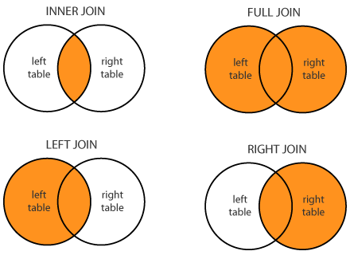
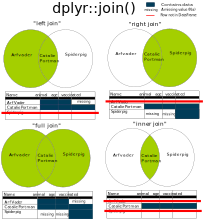

```{r setup, include = FALSE}
knitr::opts_chunk$set(echo = TRUE)
```
```{r, echo = FALSE}
htmltools::img(src = knitr::image_uri("../Images/LATree.PNG"),
               alt = 'logo', 
               style = 'position:absolute; top:0; right:0; padding:10px; width:200px;')
```

<br>

***
# Working with Data frames{-}

***

# Learning Objectives

<br>

**The goals of this chapter are to:**


* Understand the importance of clean variable names.

* Be able to clean column names using `janitor`or `gsub`.

* Be able to sort data.

* Be able to `select` data.

* Be able to `filter` data.

* Be able to use the `mutate` function and use the pipe operator.

* Be able to join data.

***

<br>

# Exercise {.tabset .tabset-fade}


## **Exercise**{-}


1. Before we begin, could you load the packages below,

   - `tidyverse`

   - `janitor`


2. Read in the file **`titanic.csv`** and assign it to `titanic`

***

<br>

## **Hint**{-}


The code below demonstrates how you can load a package.

```{r eval = FALSE}
# loading a package

library(package_name)
```


The code below demonstrates how you can read csv data.

```{r, eval = FALSE}
# Importing csv data

dataframe_name <- readr::read_csv(file_path)
```

***

<br>

## **Show Answer**{-}

```{r echo = TRUE, message = FALSE, warning = FALSE}
# Load packages

library(tidyverse)
library(janitor)


# Importing CSV data using readr package and read_csv function
# Specifying missing values by adding a vector, 
# na = c() of what should be 
# classed as missing values

titanic <- readr::read_csv("../Data/titanic.csv", 
                           na = c("", " ", "NULL"))
```

***

<br>

# Column Names

In the previous section we looked at reading data into R and also inspecting it. 

In this section we are going to look at how to manipulate it.

In the previous session we stated that every column in a data frame is a variable and it is good practice to not have spaces within variable names, as spaces makes it harder for us to call on the variables when we need to use them.

***


For example if we wanted to pick the `name of Passenger` column from the titanic dataset. 


>**The code below will not work!** 


```{r, eval = FALSE}

# Selecting data using the $ symbol
# note this WILL NOT WORK because of the blank spaces

titanic$name of Passenger
```


To get around this we enclose `name of passenger` with back ticks like the code below - this is the key above the tab key on the left hand side of your keyboard.


```{r, eval = FALSE}

# Selecting data using the $ symbol
# note this now works because of the back ticks

titanic$`name Of Passenger`

```


If your column names have spaces and you don't get rid of them, you must use backticks.


However its good practise to remove spaces and symbols.


We can see the column names by using the  `names()` function to access the `name` attribute of the data.

```{r}
# Getting the column names using the names function

names(titanic)
```

As we can see our column names have spaces and some start with capital letters and some with small letters, we can clean the names using the either the `janitor package` or `gsub`.

***


## Cleaning Column Names {.tabset .tabset-fade}


### **janitor Package**{-}

The `janitor` package offers many functions used to manipulate data, for example removing empty rows and columns, finding duplicates within a data frame. In this session we will use the library to to clean our data set names.

We can clean the names of our dataset with the **`clean_names()`** function as shown below.

We are overwriting the original Titanic data frame with a version with the column names cleaned.

```{r}

# Cleaning the column names using the janitor
# package and the clean_names() function.
# This will put all names in lower case letters and 
# replace blank spaces with underscores.

titanic <- janitor::clean_names(titanic)

# Getting the column names of the dataset

names(titanic)
```


`clean_names()` removes spaces, symbols, changes characters to lower case and makes all columns start with letters.


This is the default setting, other options we could use are:

```{r, eval = F}

# other options on the cases we can specify
# within the clean_names function

"snake", "lower_camel", "upper_camel", 

"screaming_snake", "lower_upper", "upper_lower", 

"all_caps", "small_camel", "big_camel", "mixed"

```


Which can be put inside the `clean_names()` function as shown below:


```{r, eval = F}
# Specifying the case within the clean_names function

janitor::clean_names(titanic, case = "snake")
```

***

<br>

 
### **gsub**{-}

We can also do this using the function **`gsub()`**. 

Here this is used on the column names, but it can also be used on the contents of text columns too.


The code below replaces any instance of the characters within the first set of quotes, with the contents of the second set of quotes.

For example, the output of `gsub(" ", "_", "piece of text")` would be `piece_of_text`.


```{r, eval = F}
# We can apply different substitution to the names of our columns.

names(titanic) <- gsub(" ", "_", names(titanic))

names(titanic) <- gsub("," , "", names(titanic))

names(titanic) <- gsub("-" , "_", names(titanic))
```


The `tolower()` function changes a string of characters to lower case.


```{r, eval = F}
# We can lower case the names of the data frame.

names(titanic) <- tolower(names(titanic)) 
```


We can also rename column names. The first argument is the data frame to be changed, the second is the column and what it will be changed to.


```{r, eval = F}
# Renaming a column using the package dplyr
# using the rename() function
# here we are renaming age_of_passenger with age

titanic <- dplyr::rename(titanic, age_of_passenger = age)
```

We can also use it on full columns.
 
```{r, eval = F}
# Selecting the name of passenger column using the $ symbol
# Using the tolower function 
# This lower cases all records in the column we have chosen.

titanic$name_of_passenger <- tolower(titanic$name_of_passenger) 


```

***

<br>

# dplyr


This is one of the most powerful tools in the *tidyverse*, which makes data manipulation simple and code easy to read.

We are going to look at the following concepts,

1. arrange/sort
2. select
3. filter
4. mutate
5. joining data


`dplyr` functions (verbs) all have the same structure.


```{r, eval = F}
# This is the format they follow.

verb(data, more information)
```

***

<br>

 \


<br>


## Arrange

Our data is displayed in the same order as the source data.

We may want to sort our data, based on specific columns, to do this we use the function **`arrange()`**.


>**`arrange()` lets you sort data by a variable.**

We can sort the column `fare` into ascending order with the code below.


```{r}
# We input the data we want to sort, 
# and what we are going to sort it by.

titanic_sorted <- dplyr::arrange(.data = titanic,
                                  fare)

# This shows us some of the sorted data.

head(titanic_sorted$fare)

# This shows us some of the unsorted data.

head(titanic$fare)
```

`.data` is the argument name for the data argument in `dplyr`.


It is optional, but can help us read the code more effectively.

<br>

If we don't specify how we are sorting, the default is to sort in *ascending* order.


To sort in descending order, we use the code below:

We input the data we want to sort, and how we are going to sort it, by specifying **`desc()`**.

```{r}
# We input the data we want to sort, 
# and what we are going to sort it by.

titanic_sorted <- dplyr::arrange(.data = titanic,
                                  desc(fare))

# This shows us some of the sorted data.

head(titanic_sorted$fare)


# This shows us some of the unsorted data.

head(titanic$fare)
```

<br>

## Exercise{.tabset .tabset-fade}


### **Exercise**{-}

If you haven't cleaned your column names using janitor as in the previous section, do that now!

1. Can you sort the titanic data set by age *and* fare.

2. Can you sort the titanic data set by age *and* fare in *descending* order for both variables.

***

<br>

### **Hint**{-}


1. Can you sort the titanic data set by age *and* fare.


```{r, eval = FALSE}
# Sort the titanic data based on two variables.

titanic_sorted <- dplyr::arrange(.data = dataset,
                                  first_variable,
                                  second_variable)
```

2. Can you sort the titanic data set by age *and* fare in descending order for both variables.

To sort both descending order we have to use the **`desc()`** function.

***

<br>


### **Show Answer**{-}

1. Can you sort the titanic data set by age *and* fare.


```{r}
# Sort the titanic data based on two variables.

titanic_sorted <- dplyr::arrange(.data = titanic,
                                  age_of_passenger,
                                  fare)
```

When sorting by multiple variables, R will sort the data by the first column specified - `age` - first and then will sort by `fare`.

<br>

```{r echo = FALSE, message = FALSE, warning = FALSE}

# To display just part of the dataset

library(kableExtra)

library(dplyr)

titanic_sorted %>%
  select(age_of_passenger, fare, everything()) %>% 
  kable() %>% 
  kable_styling(bootstrap_options = c("striped", "hover", "condensed")) %>% 
  scroll_box(width = "100", height = "500px")
```

<br>

2. Can you sort the titanic data set by age *and* fare in descending order for both variables.

To sort both descending order we have to use **`desc()`** around each column name.

If you only had one `desc` on the `age_of_passenger`, it will show `age_of_passenger` in descending order, but fare in ascending.


```{r}

# Sorting both variables in descending order.

titanic_sorted <- dplyr::arrange(.data = titanic,
                                  desc(age_of_passenger),
                                  desc(fare))
```


<br>


```{r echo = FALSE, message = FALSE, warning = FALSE}

# To display just part of the dataset

library(kableExtra)

library(dplyr)

titanic_sorted %>%
  select(age_of_passenger, fare, everything()) %>% 
  kable() %>% 
  kable_styling(bootstrap_options = c("striped", "hover", "condensed")) %>% 
  scroll_box(width = "100", height = "500px")
```

<br>

***

<br>


## Select

Sometimes we will want to work with smaller “cut down” Data Frames that contain fewer columns.

**`select()`** allows us to pick entire columns from our data.


Previously we selected columns using the `$` symbol and the indexing operator `[]`.


We will opt to use `dplyr` functions which allow us to keep our code efficient and readable even with complex queries.


The **`dplyr::select()`** function, in its simplest form, takes two parameters. 

The first, like all `tidyverse` functions, being the tibble we are interested in, and the second being the column name.


```{r}
# Selecting data

titanic_one_variable <- dplyr::select(.data = titanic, 
                                      name_of_passenger)
# To display the data

titanic_one_variable
```

<br>

This has returned the `name_of_passenger` column from `titanic` in the form of a tibble. 

If we want to select multiple columns, we have to first collect the column names together using a character vector, and then pass that as our second parameters. 

```{r}
# Selecting data

titanic_three_variables <- dplyr::select(.data = titanic,
                                         c("name_of_passenger", 
                                           "age_of_passenger",
                                           "pclass"))

# To display the data

titanic_three_variables
```


<br>

The real power of the `select()` function comes from its flexibility.


For example, suppose we wanted to select all columns excluding `name`, `age` and `pclass`. We could tediously type all the columns names we need, or instead:


```{r}
# Selecting data

titanic_minus_three_variables <- dplyr::select(.data = titanic, 
                                               -c("name_of_passenger", 
                                                  "age_of_passenger", 
                                                  "pclass"))

# To display the data

titanic_minus_three_variables
```

<br>

```{r, echo = FALSE, message = FALSE, warning = FALSE,eval=FALSE}

titanic_minus_three_variables %>%
  kable() %>% 
  kable_styling(bootstrap_options = c("striped", "hover", "condensed")) %>% 
  scroll_box(width = "100", height = "300px")
```


We can use the `-` to exclude sets of columns.

We can also select the columns using numbers, positive or negative, to drop.


For example the code below will select the first 4 columns and then column 7.


```{r}
# We can both use regular sequences with ":" 
# and specific numbers.

titanic_number_select <- dplyr::select(.data = titanic, 
                                       c(1:4, 7))

# To display the data

titanic_number_select
```


<br>


```{r, echo = FALSE, message = FALSE, warning = FALSE, eval=FALSE}

titanic_number_select %>%
  kable() %>% 
  kable_styling(bootstrap_options = c("striped", "hover", "condensed")) %>% 
  scroll_box(width = "100", height = "300px")
```

<br>

In this example we select all columns, except column 2.


```{r}
# The negative indicates which columns we do not want.

titanic_number_select <- dplyr::select(.data = titanic, 
                                       c(-2))

# To display the data

titanic_number_select
```

<br>

```{r, echo = FALSE, message = FALSE, warning = FALSE, eval=FALSE}

titanic_number_select %>%
  kable() %>% 
  kable_styling(bootstrap_options = c("striped", "hover", "condensed")) %>% 
  scroll_box(width = "100", height = "300px")
```

<br>

This flexibility is further enhanced by the `select helper` functions. These are functions which allow you select columns based on their names.


* `starts_with(match)`: Starts with a prefix.
* `ends_with(match)`: Ends with a suffix.
* `contains(match)`: Contains a literal string.
* `matches(match)`: Matches a [regular expression](https://www.regular-expressions.info/quickstart.html).
* `num_range(num_vector)`: Selects columns which matches a numeric range with a prefix e.g. "col1", "col2",          "col3",...
* `one_of(char_vector)`: Selects columns which are in the given character vector.
* `everything()`: Selects all variables.
* `last_col()` gives the last column 


<br>

These functions are passed after the first parameter. e.g.

```{r}
# Selecting columns

titanic_starts_with <- dplyr::select(.data = titanic, 
                                     starts_with("s"))

# To Display the data

titanic_starts_with
```

```{r, echo = FALSE, message = FALSE, warning = FALSE, eval=FALSE}

titanic_starts_with %>%
  kable() %>% 
  kable_styling(bootstrap_options = c("striped", "hover", "condensed")) %>% 
  scroll_box(height = "300px")
```

<br>


It is important to note, all `tidyverse` functions work on and return a copy of the altered data. More often than not, the returned object is another `tibble`, even if it's a single column. 


<br>

## Exercise{.tabset .tabset-fade}


### **Exercise**{-}


1. Can you select from the titanic data set, the second, third and fourth columns?


2. Can you select the columns, `pclass`, `survived`, `name_of_passenger`, `sex_of_passenger`, `age_of_passenger` and `embarked`?


3. Can you select just the last column?


4. Can you select the columns that end in the word "passenger"?


5. Can you select, `name_of_passenger`, `age_of_passenger` and then every other column?

***

<br>


### **Hint**{-}

1. Can you select from the titanic data set, the second, third and fourth columns?

Selecting the second, third and fourth column.

Remember we can select by position or by name.


```{r, eval = FALSE}

# Selecting data
# You will need to specify the columns 
# within the c() function

titanic_select_exercise <- dplyr::select(.data = titanic, 
                                          c())
```

2. Can you select the columns, `pclass`, `survived`, `name_of_passenger`, `sex_of_passenger`, `age_of_passenger` and `embarked`?


```{r, eval = F}
# Selecting data
# You will need to specify the columns 
# within the c() function

titanic_select_exercise <- dplyr::select(.data = titanic, 
                                          c())
```

3. Can you select just the last column?

Remember we can select by position or by name. HINT: `embarked` is the last column.


4. Can you select the columns that end in the word "passenger"?

You might want to use something that helps you select the words of the columns, by what those columns `ends_with()`.


5. Can you select, `name_of_passenger`, `age_of_passenger` and everything else


This is a great way to reorder the columns, if you wanted to set 2 columns to be next to each other.

When you select columns, its places them in the order that we select them, HINT You might want to select something that helps you select all the columns.


***

<br>

### **Show Answer**{-}


1. Can you select from the titanic data set, the second, third and fourth columns?

Selecting the second, third and fourth column.

```{r}
# Selecting data

titanic_select_exercise <- dplyr::select(.data = titanic, 
                                          c(2:3, 4))

# Alternative

titanic_select_exercise <-  dplyr::select(.data = titanic, 
                                          c(survived, 
                                            name_of_passenger,
                                            sex_of_passenger))

# To display the data

titanic_select_exercise

names(titanic_select_exercise)
```


<br>

2. Can you select the columns, `pclass`, `survived`, `name_of_passenger`, `sex_of_passenger`, `age_of_passenger` and `embarked`?

Selecting the columns, pclass, survived, name_of_passenger, sex_of_passenger, age_of_passenger and embarked.

```{r}
# Selecting data

titanic_select_exercise <- dplyr::select(.data = titanic, 
                                          c(1:5, embarked))

# Alternative

titanic_select_exercise <- dplyr::select(.data = titanic, 
                                          c(1:5, last_col()))

# To display the data

titanic_select_exercise

names(titanic_select_exercise)
```

3. Can you select just the last column?

```{r}
# Selecting data

titanic_select_exercise <- dplyr::select(.data = titanic,
                                         last_col()) 

#To display the data
titanic_select_exercise

names(titanic_select_exercise)

```

<br>

4. Can you select the columns that end in the word "passenger"?

You could also type the column names.

```{r}

# Selecting data

titanic_select_exercise <- dplyr::select(.data = titanic,
                                         ends_with("passenger")) 


#To display the data

titanic_select_exercise

names(titanic_select_exercise)
```


<br>


5. Can you select, `name_of_passenger`, `age_of_passenger` and everything else

This is a great way to reorder the columns, if you wanted to set 2 columns to be next to each other.

```{r}

# Selecting data

titanic_select_exercise <- dplyr::select(.data = titanic,
                                         c(name_of_passenger,
                                           age_of_passenger, 
                                           everything()))

# Alternative

titanic_select_exercise <- dplyr::select(.data = titanic,
                                         name_of_passenger, 
                                         age_of_passenger,
                                         everything())


#To display the data

titanic_select_exercise

names(titanic_select_exercise)
```

***

<br>

## Filter

**`filter()`** allows us to pick specific entries (rows) which satisfy a given logical condition.


A conditional statement returns `TRUE` if the condition is met. To create a logical condition, we have to use the logical operators.

<br>


Logical Operator| Description
:--------------:|:------------:
        <       | Less Than
       <=       | Less Than or Equal To
       \>       | Greater Than
       >=       | Greater Than or Equal To
    ==          | Equal To
       !=       | Not Equal To
       \|       | Or
        &       | And
        !       | Not
      any()     | Checks if any value in a logical vector are TRUE
      all()     | Checks if all values in a logical vector are TRUE
      is.na()   | Is NA?
      between() | Is between 2 numbers
      near()    | Safe way to compare floating point numbers

      
<br>


      
>**Note: The `!` allows us to flip or invert an expression. Basically, if an expression returns `[TRUE, TRUE, FALSE]`, the same expression with a `!` in front of it will return `[FALSE, FALSE, TRUE]`.**


>**Note: `==` is used to test equality and `=` is used to define values to pass into functions.**

***

<br>


### Single Conditional Filtering


We can filter out a new data set where `pclass` is equal to 2.

This is referred to as single conditional filtering as we only have one condition.


```{r}
# Select passengers (rows) who were in class (pclass) 2.

secondclass <- dplyr::filter(.data = titanic, 
                             pclass == 2)

#To display the data

secondclass
```


<br>

>**A quick way to check that the filter worked is to look at all the unique values, in the data set above, using the `unique()` function.**


Note here am using the `$` to select the column pclass.


```{r}
# Returns the set of unique values in the data set.
# finding out how many uniques values 
# are in the titanic dataset pclass column

unique(titanic$pclass)


# finding out how many uniques values 
# are in the secondclass dataset pclass column

unique(secondclass$pclass)
```

We can see that on the original dataset the titanic, we have three(1,2,3) different unique values in the pclass column and in our new filtered dataset we have one unique value (2).


Another example, we can filter out the passengers who paid more than 200.


```{r}
# Select passengers who paid more than 200

fare_more_than_200 <-  dplyr::filter(.data = titanic, 
                                     fare > 200)

#To display the data

fare_more_than_200

# finding out how many uniques values 
# are in the faremorethan200 dataset fare column

unique(fare_more_than_200$fare)

```


<br>

### Exercise{.tabset .tabset-fade}


#### **Exercise**{-}

1. Show the row for the passenger named: 'Birkeland, Mr. Hans Martin Monsen'


2. How many passengers in the dataset are male?


3. How many passengers are under 18 years of age?


4. What proportion of passenger in the dataset survived?

***

<br>


#### **Hint**{-}


1. Show the row for the passenger named: 'Birkeland, Mr. Hans Martin Monsen'


Remember R is case sensitive and character data needs to have speech marks.


```{r, eval = FALSE}
# filtering the dataset by name_of_passenger

titanic_filter_exercise <- dplyr::filter(data, 
                                          condition)

# To display the data

titanic_filter_exercise
```


2. How many passengers in the dataset are male?

First filter the data.

Then find out the number of rows using **`nrow()`**.


```{r, eval = F}
# showing the number of rows in our new filtered dataset

nrow(titanic_filter_exercise)
```


3. How many passengers are under 18 years of age?

First filter the data.

Then find out the number of rows using **`nrow()`**.


4. What proportion of passenger in the dataset survived?

First filter the data - passengers which survived are those with a `1` in  the `survived` column.

Then find out the number of rows using **`nrow()`**.

Then calculate the percentage using the formula nrow(filtered data)/nrow(full data)*100.

```{r, eval = FALSE}

# calculating the percentage, by dividing the total number 
# of rows in new filtered dataset by the total number 
# of rows in fulldataset then multiplied by 100

percentage_of_passengers_survived <- nrow(titanic_filter_exercise)
                                     /nrow(titanic)*100

# To display the data

percentage_of_passengers_survived
```

***

<br>

#### **Show Answer**{-}


1. Show the row for the passenger named: 'Birkeland, Mr. Hans Martin Monsen'


```{r}
# filtering the dataset by name_of_passenger

titanic_filter_exercise <- dplyr::filter(.data = titanic, 
                                         name_of_passenger 
                                         == 'Birkeland, Mr. Hans Martin Monsen')

# To display the data

titanic_filter_exercise
```

<br>

2. How many passengers in the dataset are male?


```{r}
# filtering the dataset by sex_of_passenger

titanic_filter_exercise <- dplyr::filter(.data = titanic, 
                                         sex_of_passenger
                                         == 'male')

# To display the data

titanic_filter_exercise

# showing the number of rows in our new filtered dataset

nrow(titanic_filter_exercise)
```

<br>

3. How many passengers are under 18 years of age?


```{r}
# filtering the dataset by age_of_passenger

titanic_filter_exercise <- dplyr::filter(.data = titanic, 
                                        age_of_passenger
                                        < 18)

# To display the data

titanic_filter_exercise

# showing the number of rows in our new filtered dataset
nrow(titanic_filter_exercise)
```

<br>

4. What proportion of passenger in the dataset survived?


```{r}
# filtering the dataset by survived
titanic_filter_exercise <- dplyr::filter(.data = titanic, 
                                          survived == 1)


#To display the data
titanic_filter_exercise


# showing the number of rows in our new filtered dataset
nrow(titanic_filter_exercise)

# calculating the percentage, by dividing the total 
# number of rows in new filtered dataset by the total 
# number of rows in fulldataset then multiplied by 100
percentage_of_passengers_survived <- nrow(titanic_filter_exercise)/nrow(titanic)*100

# To display the data
percentage_of_passengers_survived
```

<br>


### Multiple Conditional Filtering 


So far, we've only filtered according to individual conditions set on a single column, but there is no reason we can't use multiple conditions to filter by several conditions and/or columns at once. However, we do need to think about how the conditions relate to each other, as we have two options to establish these relationships.

* **and** relationships are given by the **&** symbol. This implies both/all conditions must be met for a row to evaluate to `TRUE`.
* **or** relationships are given by the **|** symbol. This implies that if _any_ of the conditions can be met a given row evaluates to `TRUE`.

You can think of **`between()`** as being special version of multiple condition filters. **`between()`** is an **and** condition - greater than (or equal to) the lower bound **and** less than (or equal to) the upper bound.

R also implements a multiple 'or' condition in the form `%in%`, where any rows that have a value occurring in a given vector will be included in the output tibble.

Let's look at some examples:
```{r}
# Select passengers who were in class 1 AND female

titanic_filter_example <- dplyr::filter(.data = titanic, 
                                        pclass == 1 
                                        & sex_of_passenger == "female")

```

```{r, echo = FALSE, message = FALSE, warning = FALSE}

titanic_filter_example %>%
  kable() %>% 
  kable_styling(bootstrap_options = c("striped", "hover", "condensed")) %>% 
  scroll_box(width = "100", height = "300px")
```
<br>

```{r}
# Select passengers who were female OR children (under 18)

titanic_filter_example <- dplyr::filter(.data = titanic, 
                                        sex_of_passenger == "female" 
                                        | age_of_passenger < 18)

```

```{r, echo = FALSE, message = FALSE, warning = FALSE}

titanic_filter_example %>%
  kable() %>% 
  kable_styling(bootstrap_options = c("striped", "hover", "condensed")) %>% 
  scroll_box(width = "100", height = "300px")
```

<br>

```{r}
# Select passengers who paid more than 100 
# but less than 250 for their fare.

titanic_filter_example <- dplyr::filter(.data = titanic, 
                                        between(fare, 100, 250))
```


<br>

```{r, echo = FALSE, message = FALSE, warning = FALSE}

titanic_filter_example %>%
  kable() %>% 
  kable_styling(bootstrap_options = c("striped", "hover", "condensed")) %>% 
  scroll_box(width = "100", height = "300px")
```

<br>

```{r}
# Select passengers who embarked 
# in Southampton or Cherbourg.
# A more compact method of looking 
# for a set of specific values.

titanic_filter_example <- dplyr::filter(.data = titanic,
                                        embarked %in% c('S','C'))
```

<br>

```{r, echo = FALSE, message = FALSE, warning = FALSE}

titanic_filter_example %>%
  kable() %>% 
  kable_styling(bootstrap_options = c("striped", "hover", "condensed")) %>% 
  scroll_box(width = "100", height = "300px")
```

<br>

### Exercise{.tabset .tabset-fade}


#### **Exercise**{-}

1. Select passengers who are in classes 2 and 3, what percentage of passengers is this?

2. How many passengers do not have siblings or spouses ('sibsp'), or parents or children ('parch') on the boat?

3. What proportion of passengers who 'embarked' in Cherbourg ('C') or Queenstown ('Q') survived? 

***

<br>

#### **Hint**{-}

1. Select passengers who are in classes 2 and 3, what percentage of passengers is this?


The & (Shift and 7) symbol indicates an AND relationship.

```{r, eval = FALSE}
# filtering the dataset on multiple conditions

titanic_filter_exercise <- dplyr::filter(data,
                                         condition)

# calculating the percentage, by dividing 
# the total number of rows in new filtered dataset 
# by the total number of rows in fulldataset 
# then multiplied by 100

nrow(titanic_filter_exercise) / nrow(titanic) * 100 
```

2. How many passengers who do not have siblings or spouses ('sibsp'), or parents or children ('parch') on the boat?

The & (Shift and 7) symbol indicates an AND relationship, and should be used to filter off the two columns listed - both values should be zero. 


3. What proportion of passengers who 'embarked' in Cherbourg ('C') or Queenstown ('Q') survived? 

We need to find the passengers who embarked in those two cities, and then the amount of them that survived. 

```{r, eval = FALSE}

nrow(survived) / nrow(embarked_cherbourg_and_queenstown)
```

***

<br>

#### **Show Answer**{-}

1. Select passengers who are in classes 2 and 3, what percentage of passengers is this?

```{r}
# filtering the dataset on multiple conditions
# The | idicates one condition or the other must be TRUE.

titanic_filter_exercise <- dplyr::filter(.data = titanic, 
                                         pclass == 2 | pclass == 3)

#To display the data

titanic_filter_exercise

# calculating the percentage, by dividing the total 
# number of rows in new filtered dataset 
# by the total number of rows in fulldataset then multiplied by 100

nrow(titanic_filter_exercise) / nrow(titanic) * 100 
```


<br>

2. How many passengers who do not have siblings or spouses ('sibsp'), or parents or children ('parch') on the boat?

```{r}
# filtering the dataset on multiple conditions

titanic_filter_exercise <- dplyr::filter(.data = titanic,
                                         sibsp == 0 & parch == 0)

# showing the number of rows in the filtered dataset

nrow(titanic_filter_exercise)
```

<br>

```{r, echo = FALSE, message = FALSE, warning = FALSE}

titanic_filter_exercise %>%
  kable() %>% 
  kable_styling(bootstrap_options = c("striped", "hover", "condensed")) %>% 
  scroll_box(width = "100", height = "300px")
```

<br>

3. What proportion of passengers who 'embarked' in Cherbourg ('C') or Queenstown ('Q') survived? 

```{r}
# filtering the dataset on multiple conditions to find the embarked passengers

embarked_cherbourg_and_queenstown <- dplyr::filter(.data = titanic,
                                                   embarked == 'C' | embarked == 'Q')

# filtering the dataset a single condition to find the survivors

survived <- dplyr::filter(embarked_cherbourg_and_queenstown, 
                          survived == 1)

# showing the number of rows in the filtered dataset

nrow(survived) / nrow(embarked_cherbourg_and_queenstown) * 100

```

<br>

```{r, echo = FALSE, message = FALSE, warning = FALSE}

survived %>%
  kable() %>% 
  kable_styling(bootstrap_options = c("striped", "hover", "condensed")) %>% 
  scroll_box(width = "100", height = "300px")
```

<br>

***

<br>

## Generating New Variables

To create a new variable, or a new column, in our `tibble` we will use the **`dplyr::mutate()`** function.

Code to create a new column follows the pattern below, where we state the name of the new column and the use the = to state what we want to be in that column.

```{r, eval = F}
# generating new variables

data_frame_name <- dplyr::mutate(data_frame,
                                 name_of_new_column = contents of new column)
```


<br>


### Constant Value Variables

The simplest example would be adding a constant value to each row in our `tibble`. 

```{r}
# generating new variables

mutate_example <- dplyr::mutate(.data = titanic, 
                                string_twos = "two")

```
```{r, echo = FALSE, message = FALSE, warning = FALSE}

mutate_example %>%
  kable() %>% 
  kable_styling(bootstrap_options = c("striped", "hover", "condensed")) %>% 
  scroll_box(width = "100", height = "300px")
```


<br>

### Creating Variables Based on Existing Columns

We can perform mathematical operations and even functions on existing columns in the **`mutate()`** function using column names.

Let's look at some examples:

We can capitalise the sex column.

```{r}
# Capitalise sex column

mutate_example <- dplyr::mutate(.data = titanic,
                                sex_of_passenger = stringr::str_to_upper(sex_of_passenger))

```
```{r, echo = FALSE, message = FALSE, warning = FALSE}

mutate_example %>%
  kable() %>% 
  kable_styling(bootstrap_options = c("striped", "hover", "condensed")) %>% 
  scroll_box(width = "100", height = "300px")
```
<br>

Another example is creating the family size of the person.

This is the number of siblings or spouses on board (sibsp), the number of parents or children on board (parch), plus 1 (the person themselves).

```{r}
# Determining family size on board

mutate_example <- dplyr::mutate(.data = titanic,
                                family_size = parch + sibsp + 1)
```
```{r, echo = FALSE, message = FALSE, warning = FALSE}

mutate_example %>%
  kable() %>% 
  kable_styling(bootstrap_options = c("striped", "hover", "condensed")) %>% 
  scroll_box(width = "100", height = "300px")
```


<br>

As well as mathematical operators and functions we can use conditionals. 
```{r}
# Creating a logical column which is TRUE 
# if passenger is female, false otherwise.

mutate_example <- dplyr::mutate(.data = titanic,
                                is_female = (sex_of_passenger == "female"))


```
```{r, echo = FALSE, message = FALSE, warning = FALSE}

mutate_example %>%
  kable() %>% 
  kable_styling(bootstrap_options = c("striped", "hover", "condensed")) %>% 
  scroll_box(width = "100", height = "300px")
```

<br>

The key note from this being, with **`mutate()`**, we can do almost anything to every row in our data frame. 

There are some functions which work with **`mutate()`** and enable us to perform more complicated tasks. **`recode()`** lets us map one value to another throughout the entire column e.g.:

```{r, eval = FALSE}
# Recoding variables

dplyr::recode(.data = titanic$survived, 
              '1' = TRUE, '0' = FALSE)
```

To do this in the context of an entire `tibble` we have to use **`recode()`** with **`mutate()`**.
```{r}
# Generating new variables

recode_example <- dplyr::mutate(.data = titanic,
                                survived_logical = recode(survived, '1' = TRUE, '0' = FALSE))
```

<br>

```{r, echo = FALSE, message = FALSE, warning = FALSE}

recode_example %>%
  kable() %>% 
  kable_styling(bootstrap_options = c("striped", "hover", "condensed")) %>% 
  scroll_box(width = "100", height = "300px")
```


<br>

### Exercise{.tabset .tabset-fade}


#### **Exercise**{-}

1. Create a logical variable called 'child', it should have the value `TRUE` when the passenger is under 18 and `FALSE` otherwise.


***

<br>

#### **Hint**{-}

1. Create a logical variable called 'child', it should have the value `TRUE` when the passenger is under 18 and `FALSE` otherwise.

```{r, eval = FALSE}
# Generating new variables

titanic_mutate_exercise <- dplyr::mutate(data,
                                         new column name = content of new column)
```


***

<br>

#### **Show Answer**{-}

1. Create a logical variable called 'child', it should have the value `TRUE` when the passenger is under 18 and `FALSE` otherwise.

```{r}
# Generating new variables

titanic_mutate_exercise <- dplyr::mutate(.data = titanic,
                                         child = age_of_passenger < 18)

```

```{r, echo = FALSE, message = FALSE, warning = FALSE}

titanic_mutate_exercise %>%
  kable() %>% 
  kable_styling(bootstrap_options = c("striped", "hover", "condensed")) %>% 
  scroll_box(width = "100", height = "300px")
```

***

<br>

### Deleting data

We can also use the **`mutate()`** function to delete data.

In the above exercise, we added a new column called `child` to our titanic data set.

We can quickly see the names of our data set using the the **`names()`** function.

```{r}
# Generating new variables

titanic_mutate_exercise <- dplyr::mutate(.data = titanic,
                                         child = age_of_passenger < 18)
# To display the column names

names(titanic_mutate_exercise)
```
We can delete the column using the code below.

We take the titanic data set and set equal the column we want to delete to `NULL`.

```{r}
# Setting a column = NULL effectively removes it.

titanic_mutate_exercise <- dplyr::mutate(.data = titanic_mutate_exercise, 
                                         child = NULL)

# finding out the names of the columns in the dataset

names(titanic_mutate_exercise)
```

Alternatively, this will work too.

```{r, eval = F}

# selecting a column using the $ sign and assigning 
# it to NULL

titanic_mutate_exercise$child <- NULL
```

<br>

***

<br>

## The Pipe Operator **`%>%`**


The Pipe Operator **`%>%`** makes it possible to chain a sequence of functions. 

In R code **`%>%`** can be read as "AND THEN". It takes the output of one action "AND THEN" uses that as the input of the next action. Where an action could be calling a variable, a function or anything else that returns some information. 

The short cut for this operator is CTL + SHIFT + M

Up until now if we wanted to perform a sequence of actions on data, we'd have do something along the lines of:

```{r}
# filtering the titanic dataset

filter_male <- dplyr::filter(.data = titanic, 
                             sex_of_passenger == 'male')

# Adding a new column adult men to the filtered data

mutate_age <- dplyr::mutate(.data = filter_male, 
                            adult_men = age_of_passenger > 18)

# Sorting the data with the new added column

arrange_fare <- dplyr::arrange(.data = mutate_age, 
                               desc(fare)) 

# filtering the sorted data with the new column

filter_adult_men <- dplyr::filter(.data = arrange_fare,
                                  adult_men == TRUE)


```

<br>

```{r, echo = FALSE, message = FALSE, warning = FALSE}

filter_adult_men %>%
  kable() %>% 
  kable_styling(bootstrap_options = c("striped", "hover", "condensed")) %>% 
  scroll_box(width = "100", height = "300px")
```

<br>


With the pipe operator, this simplifies to:

```{r}
# Chaining dplyr commands

filter_adult_men <- titanic %>% 
  
  dplyr::filter(sex_of_passenger == 'male') %>% 
  
  dplyr::mutate(adult_men = age_of_passenger > 18) %>% 
  
  dplyr::arrange(desc(fare)) %>% 
  
  dplyr::filter(adult_men == TRUE)
```


```{r, echo = FALSE, message = FALSE, warning = FALSE, eval=FALSE}

filter_adult_men %>%
  kable() %>% 
  kable_styling(bootstrap_options = c("striped", "hover", "condensed")) %>% 
  scroll_box(width = "100", height = "300px")
```

<br>

>**Notice how the `mutate()`, `arrange()` and `filter()` functions don't use the .data argument as it is being piped in from the previous command!**


As you can see the pipe operator helps us:

* Structure the sequence of our data operations from left to right, as opposed to from inside to out.
* Avoid nested function calls and make code more "readable".
* Reduce the need for local variables.
* Make it easy to add steps anywhere in the sequence of operations.


The pipe operator functionality comes from the `magrittr` package. Its implementation is designed for `tidyverse`, but it also works in some cases outside the `tidyverse`.


The pipe function is one of the most powerful features of the `tidyverse`. In fact, having a standardised chain of processing actions is called "a pipeline". Making pipelines for data manipulation is great, because you can apply that pipeline to any incoming data with a given formatting and have your output in a friendly format.

<br>

### Exercise{.tabset .tabset-fade}

#### **Exercise**{-}

Lets practice piping a few `dplyr` functions.


1. Can you use at least 2 `dplyr` commands within a pipe? 

***

<br>

#### **Hint**{-}

Here are some of the dplyr commands you can use.

```{r, eval = FALSE}

dataframe_name <- titanic %>%
  
  dplyr::filter() %>%
  
  dplyr::mutate() %>%
  
  dplyr::select() %>%
  
  dplyr::arrange()
```

***

<br>


#### **Show Answer**{-}

```{r}
# Chaining dplyr commands using the %>%

age_survived_fare <- titanic %>%
  
  dplyr::filter(survived == 1) %>%
  
  dplyr::mutate(rounded_fare = (round(fare))) %>%
  
  dplyr::mutate(rounded_age = (round(age_of_passenger))) %>%
  
  dplyr::select(c(name_of_passenger, rounded_age, rounded_fare)) %>%
  
  dplyr::arrange(desc(rounded_age))


#To display the data

age_survived_fare
```


***

<br>

## Joining Data

Often all the data you need to answer a question are not contained within a single dataset, but across several. Datasets can be joined, or 'merged', to allow data to be analysed together, but only **if the two datasets share a common reference or identifier.**

Linking data come in a number of forms and are commonly referred to as 'indexical' data. Some examples include:

* Your NHS number, allowing data linkage across the NHS for primary, secondary, tertiary care episodes and prescribing.
* Any account number (e.g. banking, utilities, travel card, council tax etc.) can acts as a point of linkage between different sets of data.
* Your email, phone number, social media handles etc.
* Your address can also act as a spatial reference, linking you to your neighbourhood, local services etc

***

<br>

### Different ways to Join

In R we use a group of `join` functions. These are prefixed by the type of join we choose to implement.

Once you have established that two `tibbles` share a reference that will permit a join to be conducted, you will see:

* `inner_join` - Only rows with reference values that appear in both `tibbles` are merged.
* `left_join` - All data from the 'left' `tibble` is retained, and any matching rows are merged from the 'right' `tibble`.
* `right_join` - All data from the right and anything that matches from the left. Effectively, the reverse of 'Left'.
* `full_join` - All data from the left and right `tibble` is retained, matched up where possible.

This can be easier to understand graphically:

<br>

<br>




<br>


Lets load our data for the example.

Load the 2 datasets as below, `joining_data1.csv` assigned to `joining_data_one` and `joining_data2.csv` assigned to `joining_data_two`.

```{r message = FALSE, warning = FALSE}

# Read in data

joining_data_one <- readr::read_csv("../Data/joining_data1.csv")

joining_data_two <- readr::read_csv("../Data/joining_data2.csv") 
                           
                           
```


<br>

Let’s have a look at the two `joining_data` data frames.

In `joining_data1` we have the columns **name, animal and age.**

In `joining_data2` we have the columns **name and vaccinated.**


```{r}
# To display the data

joining_data_one

# To display the data

joining_data_two
```

<br>

"Arf Vader" only appears in `joining_data1` and "Spiderpig" only appears in `joining_data2`. The remainder of the animals appear in both data frames.

These two data frames have a column in common that we could use to join them on - **name**.

I’m going to say that `joining_data1` is my “left” data frame, and that `joining_data2` is my “right” data frame.

For this I’m going to highlight the position of three animal names. As we mentioned earlier:

* "Arf Vader" is only in `joining_data1`, our “left” data frame.

* "Spiderpig" is only in `joining_data2`, our “right” data frame. 

* "Catalie Portman" is in both `joining_data1` and `joining_data2` and will represent values in *BOTH* data frames.


<br>

<br>



<br>

<br>

As you can see "left" and "right" merges take the data from that data frame and any matches from the other. 

This means that in our "left" join:

"Arf Vader" is included because he has data in the "left" data frame. 

"Arf Vader" has missing values for `vaccinated`, as he isn’t in that data frame.

"Catalie Portman" has data in all columns, as she appears in both the "left" and "right".

"Spiderpig" doesn’t have any data in this one. We’re only taking data from the "left", and he’s only in the "right".

Let’s look at how we do this "left" merge in code. We’re going to use the function **`left_join()`**.


```{r}

# The first data frame is the one on the left.

join_left <- dplyr::left_join(joining_data_one,
                              joining_data_two,
                              by = "name")
# To display the data

join_left

```

If you dont specify which column to join by, `R` will look to match by any column that matches.

If we're joining on more than one column we can specify using the parameter `by = c(vector))`.

This is shown below.

```{r, eval = F}

# Joining using multiple columns

join_left <- dplyr::left_join(joining_data_one, 
                              joining_data_two,
                              by = c("column name", "column name"))


```

<br>

### Exercise {.tabset .tabset-fade}

#### **Exercise**{-}

1. Read in the following datasets

   * `joining_exercise1.csv` as `marvel_left`.
   
   * `joining_exercise2.csv` as `marvel_right`.
   
<br>

2. Using `marvel_right` and `marvel_left` perform a `full_join()` using the column `name`.

<br>

3. Using `marvel_left` and `marvel_righ`t perform a "left" join.

   * Join on *BOTH* the column containing `names` and the column containing `years`.
  
   * Note that the names of these columns may not be the same in both data frames.

   * Use the help function to explore solutions to this.

***

<br>
   

#### **Hint**{-}

1. Read in the following datasets

   * `joining_exercise1.csv` as `marvel_left`.
   
   * `joining_exercise2.csv` as `marvel_right`.
   
<br>


```{r, eval = FALSE}

# Read in data

marvel_left <- readr::read_csv("file path")


marvel_right <- readr::read_csv("file path")

```

<br>

2. Using `marvel_right` and `marvel_left` perform a `full_join()` using the column `name`.


```{r,eval = F}
# Joining data

marvel_full_join <- dplyr::full_join(dataframe, 
                                     dataframe,
                                     by = column)
                                                                          

```

<br>

3. Using `marvel_left` and `marvel_right` perform a "left" join.

   * Join on *BOTH* the column containing `names` and the column containing `years`.
  
   * Note that the names of these columns may not be the same in both data frames.

   * Use the help function to explore solutions to this.
  
  
```{r, eval = F}
 
# We can join two columns that are named differently.

marvel_left_join <- dplyr::left_join(dataframe,
                                     dataframe, 
                                     by = c(columns))


```

***

<br>

#### **Show Answer**{-}


1. Read in the following datasets

   * `joining_exercise1.csv` as `marvel_left`.
   
   * `joining_exercise2.csv` as `marvel_right`.
   
<br>


```{r}

# Read in data


marvel_left <- readr::read_csv("../Data/joining_exercise1.csv")

# To display the data

marvel_left

# Read in data

marvel_right <- readr::read_csv("../Data/joining_exercise2.csv")


# To display the data

marvel_right

```


<br>

2. Using `marvel_right` and `marvel_left` perform a `full_join()` using the column `name`.

```{r}
# Joining Data, full join

marvel_full_join <- full_join(marvel_left, marvel_right, by = "name")
                                                                          

# To display the data

marvel_full_join
```

<br>

3. Using `marvel_left` and `marvel_righ`t perform a "left" join.

   * Join on *BOTH* the column containing `names` and the column containing `years`.
  
   * Note that the names of these columns may not be the same in both data frames.

   * Use the help function to explore solutions to this.
  
```{r}
# We can join two columns that are named differently.

marvel_left_join <- left_join(marvel_left, marvel_right, by = c("name", "year"="release_year"))

# To display the data

marvel_left_join
``` 

***

<br>

### bind_rows()

Another common way in which datasets are combined is by binding them. Unlike the join function, the binding functions do not try to match by a variable, but instead simply combine datasets by appending one set of data to the bottom of the other. If the datasets don’t match by the appropriate dimensions, one obtains an error.

This is where we can add data on to the bottom of an existing data frame, If you have two (or more) data frames that share the same data structure.

You can use the **`bind_rows()**` function.


For example, looking at the 2 data frames below;

```{r include=FALSE}
# Read in data

joining_data_three <- readr::read_csv("../Data/union_data.csv")
```


```{r}
# To display the data

joining_data_one

# To display the data

joining_data_three

```

<br>

We can use the **`bind_rows()`** function, which will simply merge two data frames into one by appending the rows.

```{r}
# Combining 2 dataframes using bind_rows() function

binded_rows_data <- dplyr::bind_rows(joining_data_one, joining_data_three)

# To display the data
binded_rows_data

# Alternatively you could write this code using a %>%
# This would be useful if you were chaining with other commands

binded_rows_data <- joining_data_one %>% 
  dplyr::bind_rows(joining_data_three)

```

<br>

We can see our new additions - Andy Warhowl, Voldetort and Repecka here now.

Here we’re assigning the output to a new Data Frame – `binded_rows_data.

Another function useful function is  **`union()`** which will merge the data from both data frames but keep only the distinct (unique) rows. That means, any duplicated rows that exist in the target data frames are not going to be brought over to the current data frame


<br>

# Summary - Working with Data frames{-}

* You should now be able to import data into R

* Understand the importance of clean column names

* Manipulate data frames to extract information from them by:
    + Selecting columns,
    + Filtering rows,
    + Generating new variables,
    + Sorting Data
    + Joining Data


***

<br>

# Next Chapter{-}

***

**In the next chapter we will look at Summary Statistics and Aggregation.**

***