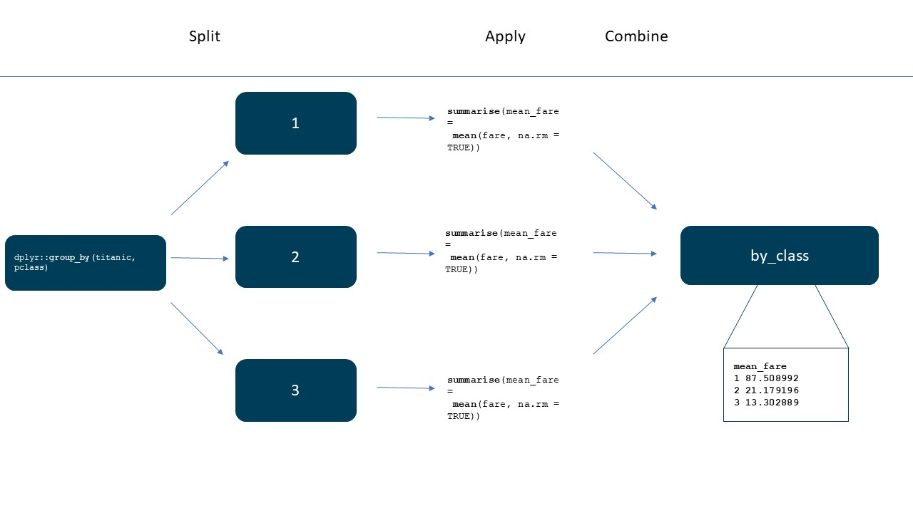

```{r, setup, include=FALSE}

# Working directory set to the Intro to R Refresh document so file paths can just
# be "Data/file.csv" etc
# n.b doesn't affect file paths for ![] imgs

knitr::opts_knit$set(root.dir = '..')
```

<hr style="width:100%;height:4px;border-width:0;color:gray;background-color:#dd4814; opacity:1"> 
```{r, echo=FALSE}
htmltools::img(src = knitr::image_uri("images/AF_DSC_banner.png"),
               alt = 'Learning Academy, Analysis Function and Data Science Campus Logos', 
               style="vertical-align:middle")

```
<hr style="width:100%;height:4px;border-width:0;color:gray;background-color:#dd4814; opacity:1"> 

<!--- Date course last updated and a contact for any help needed. --->
<center> Course Release: June 2021 | <a href="mailto:Data.Science.Campus.Faculty@ons.gov.uk?subject=Help with course Intro to R">Need help? Contact the team.</a></center>


<br>

***
# Summary Statistics and Aggregation{-}

***

# Learning Objectives

<br>

**The goal of this chapter is to:**


* Describe numeric and categorical data

* Aggregate data


***

<br>

## Packages and Data 

We will use the titanic dataset in this chapter with cleaned names via janitor.

```{r message=FALSE, warning=FALSE, include=FALSE}

library(kableExtra)
```

```{r message = FALSE, warning = FALSE, include = TRUE}

# Load in packages

library(tidyverse)
library(janitor)

# Prepare the dataset

titanic <- readr::read_csv("Data/titanic.csv", 
                           na = c("*", ".", "", "NULL"))

titanic <- janitor::clean_names(titanic)


```

<br>

```{r echo=FALSE}

titanic %>% 
  kable() %>% 
   kable_styling(bootstrap_options = c("striped", "hover", "condensed")) %>%
  scroll_box(width = "100", height = "500px")
 
```

<br>


***

<br>

# Descriptive Statistics

There are two broad types of data in our `tibble` at the moment that we want to look at - numerical data (i.e. ints and doubles) and text data (i.e. character strings).

In this section, we will explore some basic single variable descriptive statistics.

***

<br>

## Descriptive Statistics for Numerical Data
Let's start with the numerical data, because that's the easiest to work with. The `dplyr::summarise()` function allows us to create one or more scalar variables summarising the variables of an existing `tibble`.  

The useful functions that we can use with `dplyr::summarise()`:

* `mean()` - The average (arithmetic mean) data value in the given column.
* `median()` - The middle value of an ordered vector of values.
* `sd()` - The standard deviation (spread) of values in the given column.
* `quantile()` - Produces sample quantiles corresponding to the given proportions (between 0 and 1). 
* `min()` - The smallest value in the given column.
* `max()` - The maximum data value recorded.
* `dplyr::n()` - Counts the number of entries (rows).
* `dplyr::n_distinct()` - Counts the number of unique entries for a given variable.

<br>

Base R does not provide a function for finding the mode.

We would have to use a package to calculate the mode or write our own function.

The function `mfv()`, for most frequent value, in the `modeest` package can be used to find the statistical mode.

There are plenty more we could use, but this, like the rest of the course, is intended to give you a taste of what's possible. 

Let's look at some examples:
```{r}

# Calculating the mean of the column fare 
# in the titanic dataset

titanic %>% 
dplyr::summarise(mean(fare))
```

<br>

>**This highlights an important point, any operation applied to a column containing one or more `NA` values produces `NA`.** 

Most functions in R, for best practice reasons, propagate `NA` values, requiring us to set the common parameter `na.rm` to `TRUE`. 

This will omit any `NA` values in our calculation and produce a more meaningful result, albeit on a subset of observed data. The intention here is that R wants the analyst to know `NA` values are present in the data and deal with them directly.


```{r}
# Calculating the mean of the column fare 
# in the titanic dataset
# Setting na.rm=TRUE to remove missing values
# from calculation

titanic %>% 
dplyr::summarise(mean(fare, na.rm = TRUE))

```

`na.rm = TRUE` removes the missing values from the calculation of the mean, they still exist in the data. 

<br>

To assign this a meaningful column name, we'd pass a keyword argument in `summarise()`.

```{r}
# Calculating the mean of the column fare 
# in the titanic dataset
# Setting na.rm=TRUE to remove missing values
# from calculation
# setting the name mean_fare for our result

titanic %>% 
dplyr::summarise(mean_fare = mean(fare, na.rm = TRUE))

```

<br>

`summarise()` is effectively computing out statistics and wrapping the result in a `tibble`. 

If we didn't care about the `tibble` output we could simply compute using base R syntax:


```{r}
# Calculating the mean of the column fare 
# in the titanic dataset
# Setting na.rm=TRUE to remove missing values
# from calculation

mean(titanic$fare, na.rm = TRUE)

```

<br>

Like we saw with `mutate()` and other functions, we can compute multiple statistics through `summarise()`.

```{r}
# Calculating muiltiple summary statisitcs within
# the summarise function

my_summary_stats <-titanic %>% 
                 dplyr::summarise(median_fare = median(fare, na.rm = TRUE),
                                  mean_fare = mean(fare, na.rm = TRUE),
                                  sd_fare = sd(fare, na.rm = TRUE),
                                  median_age = median(age_of_passenger, na.rm = TRUE),
                                  mean_age = mean(age_of_passenger, na.rm = TRUE),
                                  sd_age = sd(age_of_passenger, na.rm = TRUE))

# To display the data
my_summary_stats
```


<br>

The structure of our output above is not ideal. 

We could restructure it using the `tidyr` functions: **`pivot_wider()`**, *`separate()`* and **`pivot_longer()`**. This is slightly advanced for what we have covered so far, but examples have been added to the additional materials document for those keen to know.

>**Code show below to demonstrate, refer to additional material for more details as tidyr is not covered in this course**

```{r}
# to demonstrate pivot longer
# the code below is just to demonstrate 
# what it does, please refer to additional material for more info

my_summary_stats %>% 
tidyr::pivot_longer(cols = median_fare:sd_age,
                    names_to = "statistic",
                    values_to = "value")
```


We can also calculate `quantiles` within the summarise function, as shown below;

```{r}
# Calculating the quantiles from the
# fare column in the titanic dataset

titanic %>% 
dplyr::summarise(fare_quantiles = quantile(fare,na.rm = TRUE))

```

<br>

We can also specify as below,

```{r}
# Calculating the quantiles from the
# fare column in the titanic dataset
# by specifying which points to display

titanic %>% 
dplyr::summarise(fare_quantiles = quantile(fare,
                                           probs = c(0, 0.2, 0.4, 0.6, 0.8, 1),
                                           na.rm = TRUE))
```

***

<br>

## Describing Text (or Categorical) Data 


Simple statistics on qualitative data include:

* `dplyr::distinct()` - Which will list all the unique values in a given column. 

* `dplyr::count()` - Displays the number of occurrences of each unique entry in a given column.


Descriptive statistics below are for qualitative data, they don't work very well if every value in a field is a different piece of text!

```{r}
# Calculating a frequency table for the number
# of passengers and sorting in descending order

titanic %>% 
dplyr::count(name_of_passenger, sort = TRUE)

```

<br>

Compared to:

```{r}

# Calculating the  frequency  table  for the number 
# of passengers based on where they embarked
# and sorting in descending order

titanic %>% 
dplyr::count(embarked, sort = TRUE)

```

<br>

Another example

```{r}
# Select only unique/distinct rows from a tibble
 
titanic %>% 
dplyr::distinct(embarked)
```


<br>

## Exercise {.tabset .tabset-fade}


### **Exercise**{-}

1. How old is the oldest passenger in the dataset?

2. How many men and women are in the dataset?


***

<br>

### **Hint**{-}

1. How old is the oldest passenger in the dataset?

```{r, eval=FALSE}

# max gives you the highest value

oldest_passenger <- max(data)

```

<br>

2. How many men and women are in the dataset?

```{r, eval=FALSE}

# Count gives a frequency
# PLEASE NOTE, count doesnt have a .data argument

number_of_men_and_women <- data %>% 
                    dplyr::count(columns)

```


***

<br>

### **Show Answer**{-}

1. How old is the oldest passenger in the dataset?

```{r}
# Calculating the highest values in the 
# age_of_passenger column

oldest_passenger <- max(titanic$age_of_passenger, 
                              na.rm = TRUE)

# To Display the data

oldest_passenger
```

2. How many men and women are in the dataset?

```{r}
# Calculating a frequency count of the
# sex_of_passenger column

number_of_men_and_women <- titanic %>% 
                     dplyr::count(sex_of_passenger)

# To Display the data

number_of_men_and_women
```


<br>


***

<br>

# Aggregation


Aggregation means grouping data together by a particular grouping variable and producing a summary of one or more columns for that grouping variable.

We'll use the **`dplyr::group_by()`** function.

This function can be really useful, especially when your data are disaggregate - e.g. data about individual units of people or things. 

**`group_by()`** allows you to aggregate by a categorical variable and then summarise numerical data into a new `tibble`. It works on a principle known as 'split-summarise-combine':

* Split - a `tibble` is divided into a set of smaller `tibbles` based on the grouping variable.

* Summarise - an aggregation is applied to each of the groups to create a single row for each group in the original `tibble`.

* Combine - bring together the aggregated `tibble` rows into a final new `tibble`.

<br>

\

<br>

Let's walk through what that might look like for the `titanic` `tibble`:

* Firstly, we decide to **split** the data by the `'pclass'`. This divides the `titanic` `tibble` into effectively three separate `tibbles`, one for first, one for second and one for third class.

* Secondly, we **summarise** the `tibble` using a chosen aggregation function. You can either produce an aggregate statistic for all columns, or you can select specific columns on which to do the aggregation. 

* Finally, we get a **combined** `tibble` that contains the new aggregate statistics.

Let's look at that in code:

```{r}

# Grouped tibble by pclass

by_class <- titanic %>% 
            dplyr::group_by(pclass)

```

<br>

```{r echo=FALSE}

by_class %>% 
  kable() %>% 
   kable_styling(bootstrap_options = c("striped", "hover", "condensed")) %>%
  scroll_box(width = "100", height = "500px")
 
```

<br>

Now let's find out the mean fare paid by each class

```{r}
# calculating the mean from the fare column in the grouped 
# dataset


by_class <- titanic %>% 
            dplyr::group_by(pclass) %>% 
            dplyr::summarise(mean_fare = mean(fare, na.rm = TRUE))

# To display the data

by_class
```

<br>

**`group_by()`** is a powerful tool, particularly when you are working with any kind of hierarchical data where you might want to know something aggregate about the groups within the data, for instance:

* individuals nested in households.

* employees nested in firms.

* small area geographies (e.g. wards, output areas, postcodes etc.) nested in larger geographies (e.g. districts, counties etc.)

* countries nested in supra-national entities or, demographic, cultural and socio-economic classes.

* individuals by age, sex, ethnicity, religion etc.

* employees by grade or occupational social class.


>**We can also aggregate according to more complicated groupings**

Here we are grouping by 2 columns `"pclass"` and `"embarked"`.

```{r}
# Group by pclass and embarked. Then find the average fare 
# paid by each group.

by_class_embarked <- titanic %>% 
                     dplyr::group_by(pclass, embarked) %>% 
                     dplyr::summarise(mean = mean(fare, na.rm = TRUE))


# To display the data

by_class_embarked

```

```{r echo=FALSE, eval=FALSE}

by_class_embarked %>% 
  kable() %>% 
  kable_styling(bootstrap_options = c("striped", "hover", "condensed")) %>%
  scroll_box(width = "100", height = "500px")
 
 
```

<br>

Suppose with the above, the `NA` values bother us. To remove them we can add some code to our pipeline to handle this. We can use the **`drop_na()`** function from the tidyr package.

Here I have added some extra summary statistics as well, i.e standard deviation and a count.

```{r}
# Calculating the median fare
# dropping missing values using drop_na from tidyr package
# grouping by pclass and emabrked
# summarising by showing the median and standard deviation
# and a frequency count

median_sd_fare <- titanic %>%
               tidyr::drop_na(embarked) %>%
               dplyr::group_by(pclass, embarked) %>%
               dplyr::summarise(median_fare= median(fare, na.rm = TRUE),
                                sd_fare = sd(fare, na.rm = TRUE),
                                number_of_passengers = n())

# To display the data

median_sd_fare


```

<br>


I plan on presenting this data, so I want something more meaningful in place than "C", "Q" and "S".

```{r}

# Calculating the median fare
# dropping missing values using drop_na from tidyr package
# using mutate to recode the variables "C","Q" and "S"
# grouping by pclass and emabrked
# summarising by shwoing the median fare and 
# standard deviation and a frequency count

median_sd_fare <- titanic %>%
               tidyr::drop_na(embarked) %>% 
               dplyr::mutate(embarked = recode(embarked, 
                                               "C" = "Cherbourg", 
                                               "Q" = "Queenstown", 
                                               "S" = "Southampton")) %>%
               dplyr::group_by(pclass, embarked) %>%
               dplyr::summarise(median_fare= median(fare, na.rm = TRUE),
                                sd_fare = sd(fare, na.rm = TRUE),
                                number_of_passengers = n())

#To display the data

median_sd_fare

```

<br>

We can simply visualise our data in a chart. (We are not covering how to plot here.)

<br>


```{r message=FALSE, warning=FALSE, include=FALSE}

test_theme <- theme_bw() +
  # grid elements
  theme(
        panel.grid.major = element_line(color = "#BEBEBE"), # Adding major grid
        panel.grid.minor = element_blank(), # Removing minor grid lines
        panel.border = element_blank(), # Remove panel border
        axis.line = element_blank(), # Remove axis lines
        axis.ticks = element_blank(), # 
        # Add axis line
        #axis.line = element_line(colour = "black", # Colour to black
                                 #size = 0.5), # Set thicness
        
        # Text elements
        # Title
        plot.title = element_text(size = 16, # Set font size
                                  face = "bold", # Bold typeface
                                  hjust = 0, # Left align
                                  vjust = 2), # Raise slightly
        # Subtitle
        plot.subtitle = element_text(size = 14, # Font Size
                                     margin = margin(t = 10) # Margin for plot text
        ), 
        # Caption
        plot.caption = element_text(size = 9, # Font size
                                    hjust = 1), # Right align 
        # Axis titles
        axis.title = element_text(size = 12), # Font size
        
        # Axis text
        axis.text = element_text(size = 12), # Font size
        
        # Margin for axis text
        axis.text.x = element_text(margin = margin(t = 5,
                                                   b = 10)
                                 
        ),
        legend.key = element_blank()  
  )


median_fare2 <- median_sd_fare %>% 
    dplyr::mutate(pclass = recode(pclass, 
                           "1" = "First Class", 
                           "2" = "Second Class", 
                           "3" = "Third Class")
                ) 

```


```{r, echo=FALSE}


ggplot2::ggplot(median_fare2,
       aes(x = pclass,
           y = number_of_passengers))+
  geom_col(key_glyph = draw_key_dotplot,position="dodge",aes(fill=embarked)) + 
  #new_theme +
  scale_fill_manual(
    values = c("#27a0cc", "#118c7b", "#206095"),
    labels = c("Southampton", "Queenstown", "Cherbourg"))+
   #custom_theme+
  #new_theme + # best practice theme
 test_theme +
  theme(
    legend.position = "bottom", # ammending theme
    #axis.title = element_text(hjust = 1), # align axis text
    panel.grid.major.x = element_blank(),
    legend.title = element_blank()
  ) + # remove major gridlines on y axis
  labs(
    title = "Passenger Distribution By Port and Class", # labels
    x = "Class",
    y = "Number of Passengers"
  )
```


<br>

## Exercise {.tabset .tabset-fade}


### **Exercise**{-}

1. What is the average fare paid by men and women?


2. What is the median fare paid by men and women in each different class?


<hr style="width:100%;height:4px;border-width:0;color:gray;background-color:#dd4814; opacity:1"> 

<br>

### **Hint**{-}

1. What is the average fare paid by men and women?

```{r, eval=FALSE}
# Calculating the average fare
# Grouping by sex_of_passenger
# summary showing the mean fare

average_fare <- titanic %>% 
                dplyr::group_by() %>% 
                dplyr::summarise()

```

<br>

2. What is the median fare paid by men and women in each different class?

```{r}
# Calculating the median fare
# Grouping by sex_of_passenger and pclass
# summary showing the mean fare

median_fare <- titanic %>%
               dplyr::group_by() %>%
               dplyr::summarise()

```


<hr style="width:100%;height:4px;border-width:0;color:gray;background-color:#dd4814; opacity:1"> 

<br>

### **Show Answer**{-}

1. What is the average fare paid by men and women?

```{r}
# Calculating the average fare
# Grouping by sex_of_passenger
# summary showing the mean fare

average_fare <- titanic %>% 
                dplyr::group_by(sex_of_passenger) %>% 
                dplyr::summarise(mean_fare = mean(fare, na.rm = TRUE))

#To display the data

average_fare
```

<br>

2. What is the median fare paid by men and women in each different class?

```{r}
# Calculating the median fare
# Grouping by sex_of_passenger and pclass
# summary showing the mean fare
median_fare <- titanic %>%
               dplyr::group_by(sex_of_passenger, pclass) %>%
               dplyr::summarise(median_fare = median(fare, na.rm = TRUE))

#To display the data
median_fare
```


<hr style="width:100%;height:4px;border-width:0;color:gray;background-color:#dd4814; opacity:1"> 

<br>


# Summary - Summary Statistics and Aggregation{-}

<br>

## Reminder of Learning Objectives{-}

**You should now be able to**


* Understand how to obtain summary statistics.

* Be able to use R functions to obtain descriptive statistics.

* Be able to aggregate data in a data frame.

<hr style="width:100%;height:4px;border-width:0;color:gray;background-color:#dd4814; opacity:1"> 

<br>

# End of Course

***

You have now completed Introduction to R. 

Please complete the anonymous [Post-Course Survey on the Learning Hub](https://learninghub.ons.gov.uk/mod/feedback/complete.php?id=1371&courseid).

Have a look at our other courses on our [Learning Hub dashboard](https://learninghub.ons.gov.uk/totara/dashboard/index.php?id=6) to find out how to further your learning. 

***


