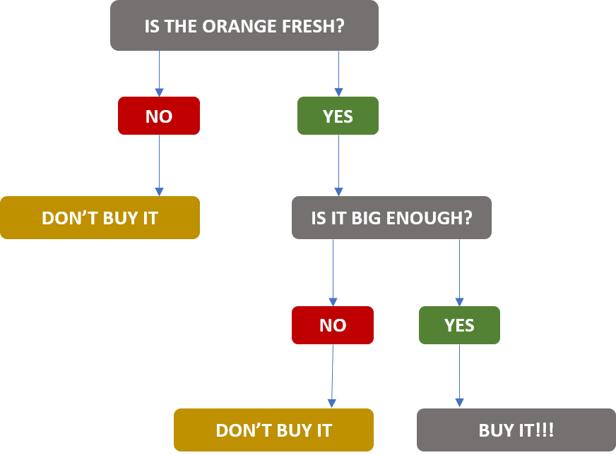
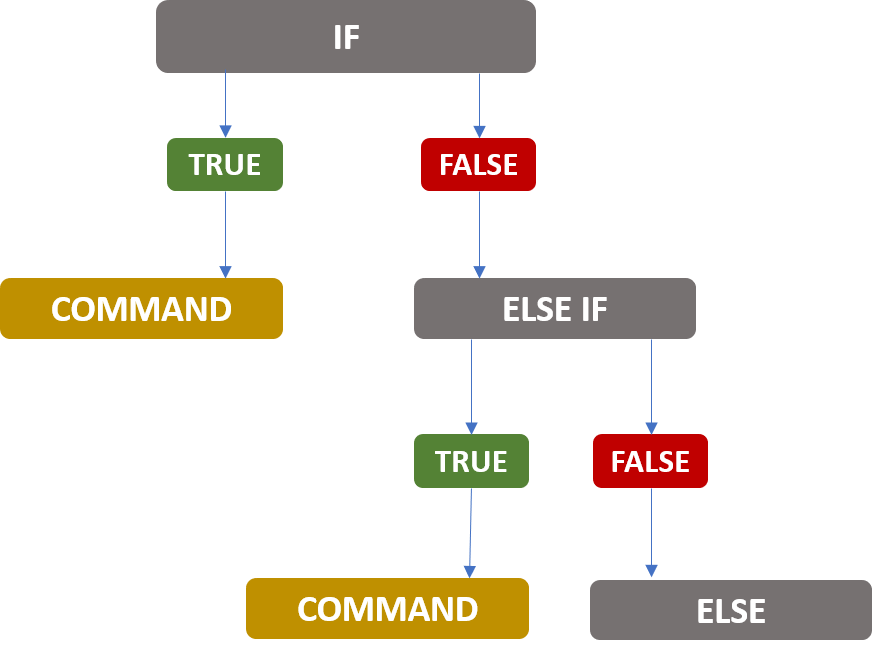

```{r setup, include=FALSE}
knitr::opts_chunk$set(echo = TRUE)
```

<!-- Sorry for changing, the alignment and interference with the title when I knitted was upsetting me -JM -->

```{r, echo=FALSE}
htmltools::img(src = knitr::image_uri("../Images/LATree.png"), 
               alt = 'Learning academy logo', 
               style = 'position:absolute; top:0; right:0; padding:10px; width:200px;')
```

<br>

```{r message=FALSE, warning=FALSE, include=FALSE}

library(kableExtra)

```


## Initial Exercise: Loading Packages {.tabset .tabset-fade -}

### **Exercise**{-}

1. Before we begin, could you load the packages below,

   - `tidyverse`

   - `janitor`


2. Read in the file **`titanic.csv`** and assign it to `titanic`

***


### **Hint**{-}

The code below demonstrates how you can load a package.

```{r eval = FALSE}
# loading a package

library(package_name)
```

The code below demonstrates how you can read csv data.

```{r, eval = FALSE}
# Importing csv data

dataframe_name <- readr::read_csv(file_path)
```

***

### **Show Answer**{-}

```{r echo = TRUE, message = FALSE, warning = FALSE}
# Load packages

library(tidyverse)
library(janitor)


# Importing CSV data using readr package and read_csv function
# Specifying missing values by adding a vector, 
# na = c() of what should be 
# classed as missing values

titanic <- readr::read_csv("../Data/titanic.csv", 
                           na = c("", " ", "NULL"))


# Clean column names
titanic <- clean_names(titanic)


# To Inspect the data
dplyr::glimpse(titanic)


```
<br>

We can see these these are columns,

* **Pclass**: Passenger’s class, 1 = 1st (Upper), 2 = 2nd(Middle), 3 = 3rd(Lower)
* **Survived**: Survived (1) or died (0), 0 = No, 1 = Yes
* **Name**: Passenger’s name
* **Sex**: Passenger’s sex
* **Age**: Passenger’s age
* **SibSp**: Number of siblings/spouses aboard
* **Parch**: Number of parents/children aboard
* **Ticket**: Ticket number
* **Fare**: Fare
* **Cabin**: Cabin number
* **Embarked**: Port of embarkation, C = Cherbourg, Q = Queenstown, S = Southampton


We can see more details on the [Data Dictionary](https://www.kaggle.com/c/titanic/data)

***

<br>


# Control Flow and Functions {-}

***

# Learning Objectives

**The goal of this chapter is to:**

* Understand the programming concept of Loops.
* Utilise loops and understand their place in R.
* Be able to use conditional statements: *if*, *else* and *else if*.
* Be familiar with *else_if()* and *case_when()* from `dplyr`.
* Know what functions are and why they are useful.
* Be able to distinguish between a function's parameters and arguments.
    * Including different types of arguments
* Understand the idea of 'scope'.
    * i.e. Global scope vs Local scope
* Be able to write and apply user defined functions.
* Be able to apply functions to `vector` and `tibble` objects.

***

# Programming Basics

We use R because it's great for data analysis, data visualization communicating results. However, R is not just a data analysis environment but a programming language. Advanced R programmers can develop complex packages and even improve R itself.

In this chapter, we introduce three key programming concepts: **loops, conditional statements, and functions**. These are not just key building blocks for advanced programming, but are sometimes useful during data analysis.

***

<br>


# Loops

Loops are a fundamental concept in traditional programming languages. 

A loop is a way to repeat a number of commands until a given condition is met.

This repetition of code is called **iteration**.

A repetitive action could be "create several similar plots".

Within a loop, any other code can be run to produce anything we want such as plots, models, reports, and datasets.

Since R is a vectorised language, loops are not as prominently used in R as in Python or other programming languages. Despite this, they are a key part of programming in general and can save you a large amount of time and typing in certain cases.

They allow you to automate parts of your code that are in need of repetition.

Similar to how functions help make our code more abstract and general, loops perform a similar purpose. We are essentially simplifying a specific case of code to a more general case.

We are going to look at `for` loops first. 

***

<br>

## For Loops

These are the most common type of loop, and the only one we are going to discuss in this course. For reference, the other type is a `while` loop which can do the same things, but in a slightly different way.

For loops follow the basic structure below.

<!-- Have removed a comment about efficiency as I don't believe it is true. Happy to discuss -JM -->
```{r, eval=FALSE}

# Basic Structure of a loop

# Creating the loop
for (each_item in my_iterable) { 
  
  output <- commands
  
}

```

<br>


* We start the loop with the word `for`,

* Followed by `()` brackets where we first specify an index variable, `i` is commonly used but it can be anything that you want. Remember, we want to use clear and descriptive variable names. This is a place holder and corresponds to each different element as we move through the loop,

* Then the word `in`.

* Then specify an iterable. This could be a `vector`, a `list`, a `dataframe` etc. An iterable is any object that can be iterated through, one element at a time. 

* Followed by the `{}` curly brackets, which will have our commands within, these could be multiple lines of code.

***

<br>

### Example

Let's look at an example.

We start by creating an iterable, I have created a vector with the numbers **0 through 5**.


```{r}
# Creating a vector

example_vector <- c(0, 1, 2, 3, 4, 5)

```

We can then create our loop which doubles every value and prints it out.

```{r}
# Creating the loop

for (each_number in example_vector) {
  
  # Print the value at each step
  print(each_number * 2)
  
  }

```

<br>

\


<br>

***

In the above example we simply printed our results in the console, if we wanted to store our result, we can simply create a data structure of our choice and use the append function, as shown below.


The keyword `for` is followed by a variable that refers to each item in my iterable. I’ve called this variable **`each_number`**. It is good to be clear and explicit when naming variables, so they explain what the variable is. 

The keyword `in` is followed by the iterable I want to loop over - `example_vector`.

The output of my command is appended to `result`. The command here is to multiply each number in `example_vector` by 2. The **`append()`** function simply adds an element to the end of a vector. We first specify the vector we want to add to which is `result` and then specify the values that we want to add to it. Within the function this is set to the parameter `values`.


```{r}
# Create an empty output
# Which we will fill when the loop runs

result <- c()

# Creating the loop

for (each_number in example_vector) {
  
  # Print the value at each step
  print(each_number * 2)
  
  result <- append(result, values = each_number * 2)
  
}

# To display the data

result

```

***

<br>


Although it is useful to know how to use loops in R, it is often faster to accomplish the same thing using vectorised operations in R. 

We already saw examples in the Vector Arithmetic section. A vectorised function is a function that will apply the same operation on each element of the vectors.

For example:

```{r}
# Creating a vector

example_vector <- 1:5

# Using a sqrt() function on our vector

sqrt(example_vector)
```

<br>

To make this calculation, there is no need for a loop. However, not all functions work this way. 

While there are many functions out there that vectorise particular calculations, there are still some tasks that cannot be vectorised. This is where iteration becomes useful. While we should always be looking to vectorise calculations, we can take comfort knowing that we have a back up tool to use just in case it fails us.

We also have while loops, which are used to loop until a specific condition is met. 

You can a find a tutorial on them here: [While Loop](https://www.datamentor.io/r-programming/while-loop/).

<br>

### Exercise: For loops{.tabset .tabset-fade}


#### **Exercise**{-}

1. You are given a vector of measurements that are grams (g). 

   For this exercise, we want to convert all of these measurements to kilograms (kg). 

   **For reference, 1kg is equal to 1000 grams.**

   Using a for loop, create and append to a new vector called **kilograms** that contains the values converted to kilograms.

```{r}
# Vector 

grams <- c(100000, 7899900, 967312, 49185, 6100)
```


***

<br>


#### **Hint**{-}

1. You are given a vector of measurements that are grams (g). 

   For this exercise, we want to convert all of these measurements to kilograms (kg). 

   **For reference, 1kg is the same as 1000 grams.**

   Using a for loop, create and append to a new vector called **kilograms** that contains the values converted to kilograms.

```{r,eval=FALSE}

# PLEASE NOTE: THIS IS NOT CODE
# it shows the necessary steps

# Starting vector

grams <- c(100000, 7899900, 967312, 49185, 6100)

# Empty vector for result storage

kilograms <- c()

# For loop

for (each_number in vector) {
  
     convert to kilograms
  
     append result to kilograms
}


# To display the data

kilograms
```


***

<br>


#### **Show Answer**{-}

1. You are given a vector of measurements that are grams (g). 

   For this exercise, we want to convert all of these measurements to kilograms (kg). 

   **For reference, 1kg is the same as 1000 grams.**

   Using a for loop, create and append to a new vector called **kilograms** that contains the values converted to kilograms.

```{r}

# Starting vector

grams <- c(100000, 7899900, 967312, 49185, 6100)

# Empty vector for result storage

kilograms <- c()

# For loop

for (measurement in grams) {
    # Converting grams to kg
    converted_kilogram <- measurement / 1000 
  
    # Appending to kilo_grams result vector
    kilograms <- append(kilograms, values = converted_kilogram) 
  
}

# To display the data

kilograms
```

<br>


### Extension Exercise Loops{.tabset .tabset-fade}


#### **Exercise**{-}

1. Complete the code below, Use a for loop to load all the files in the data folder. Some steps have been given to you already.

* We have loaded the packages tidyverse and fs

* We then use the function `fs::dir_ls()` which will give a list of all the file paths in the data folder, we have    assgined this to `file paths`.

* We have created an empty list called `my_datasets` which we fill with out datasets after the loop runs.

* Your task is to create a for loop to loop through the `file_paths` and store each dataset as an element in the list `my_datasets`


```{r}
# Loading packages

library(tidyverse) # For loading data and manipulation of data
library(fs) # File system


# Get a list of the file paths
file_paths <- fs::dir_ls("../Data") 

# Display the file paths
file_paths

# Create a list to store all the dataframes
my_datasets <- list()
```
***

<br>

#### **Hint**{-}

1. Complete the code below, Use a for loop to load all the files in the data folder. Some steps have been given to you already.

* We have loaded the packages tidyverse and fs

* We then use the function `fs::dir_ls()` which will give a list of all the file paths in the data folder, we have    assgined this to `file paths`.

* We have created an empty list called `my_datasets` which we fill with out datasets after the loop runs.

* Your task is to create a for loop to loop through the `file_paths` and store each dataset as an element in the list `my_datasets`


```{r, eval=FALSE}
# Loading packages

library(tidyverse) # For loading data and manipulation of data
library(fs) # File system


# Get a list of the file paths
file_paths <- fs::dir_ls("../Data") 

# Display the file paths
file_paths

# Create a list to store all the dataframes
my_datasets <- list()


# Loop through file paths and store in the list

for (each_file_path in file_paths){
  
  # adding a new element in the my datasets list
  my_datasets <- command 
  }

```

***

<br>

#### **Show Answer**{-}

1. Complete the code below, Use a for loop to load all the files in the data folder. Some steps have been given to you already.

* We have loaded the packages tidyverse and fs

* We then use the function `fs::dir_ls()` which will give a list of all the file paths in the data folder, we have    assgined this to `file paths`.

* We have created an empty list called `my_datasets` which we fill with out datasets after the loop runs.

* Your task is to create a for loop to loop through the `file_paths` and store each dataset as an element in the list `my_datasets`


```{r message=FALSE, warning=FALSE}
library(tidyverse) # For loading data and manipulation of data
library(fs) # File system


# Get a list of the file paths
file_paths <- fs::dir_ls("../Data") 

# Display the file paths
file_paths

# Create a list to store all the dataframes
my_datasets <- list()

# Loop through file paths and store in the list

for (each_file_path in file_paths){
  
  # adding a new element in the my datasets list
  my_datasets[[each_file_path]] <- readr::read_csv(file = file_paths[[each_file_path]])
}

# To display the list of dataframes
dplyr::glimpse(my_datasets)

```

If you want the datasets to be displayed as separate datasets in the environment window, you can use the `list2env()`, here we specify the list `my_datasets` and the argument `envir=.GlobalEnv`.

```{r}
# To display in environment as separate datasets
list2env(my_datasets,envir=.GlobalEnv)
```

Like we said lists are the not the only way to do this, other options would be to use the `lapply()` or the `purrr::map()` function.

To use either of these functions all we need is to provide the file path list and then the function we want to run on the list.

>**Please note that when we use the function inside lapply or map we dont include the brackets as we are not passing any inputs into the function, hence we read_csv instead of read_csv(), so lapply/map is the function and read_csv is like an input/argument**

```{r, eval=FALSE}
# Using lapply to load multiple files
my_datasets <- lapply(file_paths, read_csv)
 
 
# Using lapply to load multiple files
my_datasets <- purrr::map(file_paths, read_csv)
```

As you can see that we can we achieve the same result as the loop

***

<br>

# Conditional Statements

***

## If, else if, else

A conditional statement will check whether a statement is `TRUE` or `FALSE`.

If a criteria is met, we may want to run different code than if it is not met.

This is useful if we want a function or code block to run only when our data meets certain conditions; this is termed `control flow`.

Control flow is something we do in everyday life. 

For example when we go shopping and choose fruits, we normally want to buy the ones that look juicy and healthy and avoid the ones that look rotten or bruised. 

As we pick up our fruit and inspect it, we are actually using control flow.

<br>

\

<br>


In order to move through this decision process, we need to answer either "Yes" or "No" to each question.

A series of "Yes" answers will lead us to buy an orange that matches our set criteria.

This links in with the logical or Boolean data types that we covered in **Chapter One, Getting Started With R**,  as our logical statement has to be either `TRUE` or `FALSE`. 

To evaluate these we use comparison operators which we used in **Chapter 4 Working With Dataframes** where we used the `filter()` function.

These comparison and logical operators allow us to control the flow of our code.

<br>

**Comparison Operators.**

| Operator | Description | 
| ------ |:------| 
|   ==   | equal to | 
|  !=    | not equal to |   
| <      | less than|
| >      | greater than |
| <=     | less than or equal to|
| >=     | greater than or equal to|


<br>


**Logical Operators.**

| Operator| Description| 
| ------  |:------:| 
|   &     | And | 
|   \|    | Or |
|    !    | Not|


<br>

<br>

| Condition 1 | Condition 2  | & (AND) Equates to |  &#124; (OR) Equates to |
|:-----------:|:------------:|:------------------:|:------------------:|
|     True    |     True     |        True        |        True        |
|     True    |     False    |        False       |        True        |
|    False    |     True     |        False       |        True        |
|    False    |     False    |        False       |        False       | 


<br>

Our example above shows that we can make a decision by answering "Yes" or "No" at two key points. But often this will not be the case - we might have only a single question, or we might want to add some more branches to our responses.

R allows us to have complete control over our statement by using the `if`, `else if`, and `else` keywords.

We always first put an:

- `if` statement

then an optional number (0 to many) of:

- `else if` statements

then finally an optional singular:

- `else` statement


`if`, `else if` and `else` are not loops, but fall under the category of control flow.

These take a conditional argument, and if that is met (evaluates to `TRUE`) then the associated action is completed.

If the condition is not met it will move to the next statement and try to evaluate it; if that condition is met the associated action will be completed.

Finally, if none of the conditions are met, the `else` condition's associated actions are run.

We separate out out different command blocks relating to each condition using curly brackets `{}` around the corresponding block of code.

```{r, eval=FALSE}

if (first condition) { 
  
  Commands - executed if the first condition is true
  
} else if (second condition) { 
  
  Commands - executed if the first condition is false and the second condition is true
  
} else {
  
  Commands - executed if all conditions are false
  
}
```

> **It’s important that the `else if` keyword comes on the same line as the closing bracket of the previous part of the control structure.**

<br>

\

<br>

Let's look at an example.

We can just have an `if` and an `else` - `else if` statements are optional (as is the final `else` statement!)

```{r}

height <- 5

if (height == 5) { 
  
  print("We're the same height")
  
} else {
  
  print("Your height is different")
  
}

```

<br>

Remember our `if`, `else if` and `else` statements take a condition so we need a double equals sign `==` for checking equivalence.

If the first criteria isn’t met it will move to the else statement and action that.

We can add in more choices using an `else if` statement.

```{r}

height <- 7

if (height == 5) { 
  
  print("Your height is 5")
  
} else if (height == 7) { 
  
  print("We are the same height")
 
} else {
  
  print("Your height is not 5 or 7")
  
}

```


<br>


Within our condition we can use the logical operators too: `&` (and); `|` (or), in order to make more complex conditions.


Here we want the action to happen if the value is greater than 7 and less than 10.

```{r}

height <- 9

if (height == 5) { 
  
  print("Your height is 5")
  
} else if (height > 7 & height < 10) { 
  
  print("You're height is between 7 and 10")
  
} else {
  
  print("Your height is different")
  
}

```


<br>

It’s important to know how the `if`, `else if`, `else` works.

Below we have two options for when the value is 5. However it will only print out “We’re the same height!” as when a condition is met, the code associated with it is run, and R stops evaluating the rest of the conditionals.

In this code the block `print("Wow, it's still 5!")` will never run. If the height is equal to `5`, the first `if` condition will run, and then the logic stops.

Try changing the value stored in `height` to see the other results.


```{r}
height <- 5

if (height == 5) { 
  
  print("We're the same height")
  
} else if (height > 7 & height < 10) { 
  
  print("You're tall!")
  
} else if (height == 5) {
  
  print("Wow, it's still 5!")
  
} else {
  
  print("Your height is different")
  
}
```


>**A good practical example of if and else statements can be seen here [PHE](https://github.com/publichealthengland/excess-deaths/blob/master/R/function_visualisations.R)**

***

<br>

## Loops and Conditional Statements

We can combine a `loop` with `if else` statements.

* We have a vector, with values from `1-7` and assign it to `number_of_takeaways_ordered`.

* And a `for` loop with an `if` and `else` statement which shows that if you order more than `2` takeaways a week it will print `"too many"` and if you order less than two it prints `"enough"`.

```{r}

number_of_takeaways_ordered <- c(1, 2, 3, 4, 5, 6, 7)

for (number in number_of_takeaways_ordered) { 
  
  print(number)
  
  if (number > 3) { 
    
    print("too many")
    
  } else { 
    
  print("enough")

# We have a loop, and else if statements, which means we 
# need to careful about our closing brackets!
  }
}

```

***

<br>


### Exercise: FizzBuzz{.tabset .tabset-fade}


#### **Exercise**{-}

1. Can you write a loop with an `if`, `else if` and `else` statement, that loops through the numbers from 1 to 30.

   If the number is a multiple of both 3 and 5, print "FizzBuzz".

   If the number is a multiple of 3, print the word "Fizz".

   If the number is a multiple of 5, print the word "Buzz".

   For all other values print the number.

Note: You can use the modulus operator for this - this is the **`%%`** in R, and shows us our remainder.

For example checking if something is divisible by 3 we can do:

```{r}
# Example of Modulo
# Returns FALSE (10 / 3 has a remainder of 1 - so does not have a remainder of 0)

10 %% 3 == 0

```

```{r}
# Second example of Modulo
# Returns TRUE (9 / 3 has a remainder of 0)

9 %% 3 == 0

```

***

<br>


#### **Hint**{-}

1. Can you write a loop with an `if`, `else if` and `else` statement, that loops through the numbers from 1 to 30.

   If the number is a multiple of both 3 and 5, print "FizzBuzz".

   If the number is a multiple of 3, print the word "Fizz".

   If the number is a multiple of 5, print the word "Buzz".

   For all other values print the number.

```{r, eval=FALSE}

for (each number in vector) { 
  
  if (first conditions) {
    
    output
    
  } else if (second condition) {
    
    output
    
  } else if (third condition) { 
    
    output
    
  } else {
    
    print(each number)
    
  }
  
}

```

***

<br>

#### **Show Answer**{-}

1. Can you write a loop with an `if`, `else if` and `else` statement, that loops through the numbers from 1 to 30.

   If the number is a multiple of both 3 and 5, print "FizzBuzz".

   If the number is a multiple of 3, print the word "Fizz".

   If the number is a multiple of 5, print the word "Buzz".

   For all other values print the number.


<!-- If it is not best practice to use `i` as an interator, should we be showing an example of it? -JM-->
```{r}

# Creating a loop with an with an `if`, `else if` and `else` statement

for (each_number in 1:30) { 
  
  if (each_number %% 3 == 0 & each_number %% 5 == 0) {
    
    print("FizzBuzz")
    
  } else if (each_number %% 3 == 0) {
    
    print("Fizz")
    
  } else if (each_number %% 5 == 0) { 
    
    print("Buzz")
    
  } else {
    
    print(each_number)
    
  }
  
}

# We have a loop, and else if statements, which means we 
# need to careful about our closing brackets!

```


***

<br>


## dplyr if_else()

We have seen how we can use the `if` statement to create branching paths in our code.

A singular if statement is useful if we need to perform different code based on a single condition, but it's not useful in cases where there are a lot of values that need comparison, such as in a tibble.

`dplyr` has a function called `if_else()`

The `if_else()` function is designed to be used with multiple values, like with a vector or a column in a tibble.

Lets look at the help information on the function to see what arguments we can specify.

> **I would strongly advise to look at the R help documentation when you come across a function you have not used before.**

```{r}
library(dplyr)

# Looking at the help documentation

?dplyr::if_else

```

Looking at help documentation for the function, we can see that it needs **3 main arguments**.

1. **condition**.
A statement (e.g. comparison operator) that evaluates to `TRUE` or `FALSE`. Instead of passing it a single value, you need to give it a specific column in the data.

2. **true**
The value that the new column should take if the comparison operator is `TRUE`. This can be anything that we specify. 

3. **false**
The value that the new column should take if the comparison operator is `FALSE`. Like the second argument, it can be anything you specify.

<br>


Lets look at an example.

We will use the Titanic dataset, lets see if there is any missing values in our dataset.

Here I am using the base R function `anyNA`, which will return `TRUE` if there are any missing values and `FALSE` if there are no missing values.

```{r}

# Checks if there are missing values in our data

anyNA(titanic)

```

Now that we know they are missing values in the data, we can use the `colSums()` function or the `summary()` function to see how many missing values we have.

```{r}

# Here I am using the colSums() function, which gives the sum of columns
# Inside the function, I am using the is.na() function which checks if 
# the data is a missing value

colSums(is.na(titanic))


# Summary of our data
# This is showing summary data for the age_of_passenger column
# Part of the summary data shows number of missing values.

summary(titanic$age_of_passenger)


```

We can see that the column `age_of_passenger` has 267 missing values.

We can impute (populate) our missing values using the dplyr `if_else` function. 

Here we are going to use the mean value for `age_of_passenger`.

> **Please refer to the Editing and Imputation Course for details on how to best impute your missing data, this is for demonstration purposes only.** 

<!-- Nice -JM -->

<br>

As we saw in **Chapter Four - Working with Dataframes**, the mutate() function from the dplyr package is useful in creating a new variable. 

We don't necessarily want to change the original column so we instead create a new column which contains the age data, but with the missing values imputed.

Here my new column name is **imputed_age_of_passenger**.

The `if_else()` function takes that single comparison operator **condition = is.na(age_of_passenger)** and vectorizes it.


```{r}
# Dealing with missing values
# if the value is missing we can fill it
# if not we can use the original value

imputed_titanic <- titanic %>%
                # New column name                        
  dplyr::mutate(imputed_age_of_passenger = 
                  dplyr::if_else(condition = is.na(age_of_passenger), # Condition to be met
                                 true = mean(age_of_passenger, na.rm = TRUE), #response if true
                                 false = age_of_passenger # response if false
                                )
               )

# To display the resulting number of missing values
colSums(is.na(imputed_titanic))

```

<br>

***

<br>

## dplyr case_when()

So far we have looked at `else if` to add more options to an if statement.

We have also used the the `if_else()` function, but it works best with simpler conditions that evaluate to `TRUE` or `FALSE`.

We can put multiple `if_else()` commands inside each other, but this makes code hard to read and is not recommended.

If we are dealing with multiple complex conditions dplyr also has a function called `case_when()`

You can think of the `case_when()` function as a generalisation of the `if_else()` function, which incorporates more branches.

This command takes multiple conditions and tests them in order.

`case_when()` takes a conditional command in the same format as the first command in `if_else()`, however only the action for if the condition is true is given, separated with a tilde **~**.

Lets look at an example.

Consider you wanted to add in a new column in the titanic dataset of the Countries in which the passengers embarked.

So those who embarked in

* "S" (Southampton) it should say England

* "C" (Cherbourg) should say France

* "Q" (Queenstown) should say Ireland


```{r}
# Here I am using case_when within the mutate function as I want to create a new column within my dataset
# My new column name is country_embarked
# To use case_when(), you specify the condition first
# Then the ~ tilde for the action when the condition is met
# We can also specify what we want to occur if none of the conditions match - the TRUE value

case_when_example <- titanic %>% 
  dplyr::mutate(
    country_embarked = dplyr::case_when( 
                     # condition        # action
                      embarked == "S"  ~ "England",
                      embarked == "C" ~ "France",
                      embarked == "Q" ~ "Ireland",
                     # This is what is going to happen if none of the set
                     # conditions are met
                      TRUE ~ "Unknown") 
  )

```
<!-- love seeing this in action, is it worth mentioning the similarity with recode() in this example -JM -->

```{r echo = FALSE, message = FALSE, warning = FALSE}

# To display just part of the dataset


case_when_example %>%
  select(embarked, country_embarked, everything()) %>% 
  kable() %>% 
  kable_styling(bootstrap_options = c("striped", "hover", "condensed")) %>% 
  scroll_box(width = "100", height = "500px")
```


<br>


`case_when()` statements are two-sided formulas where the left-hand side is a logical condition and the right-hand side is the value to assign when that test is `TRUE`, with the two sides separated by a **~**.

Values that are never matched by any of the logical test's within the statement get a default replacement value: NA. 

To keep these values from getting NAs, include a final catch-all test and replacement. This is done by putting `TRUE` on the left-hand side and the catch-all value on the right.

The left-hand side must evaluate to a logical vector. 

The right-hand side does not need to be logical but it must evaluate to the same type of vector.

<br>

You could also use the recode function here from **Chapter 4 Working with DataFrames, Section 4.6.2**

***

<br>

### Exercise: Case When{.tabset .tabset-fade}

#### **Exercise**{-}

1. Use the `case_when()` function to create a new column in the titanic dataset called **fare_level**. 

This new column should have 5 levels total:

* If fare is less than 100, fare_level should be "cheap"
* Between 100 and 200: "middling"
* Between 200 and 300: "expensive"
* Greater than or equal to 300: "very expensive"
* Otherwise : "unknown"

  

<br>


#### **Hint**{-}

1. Use the case_when() function to create a new column in the titanic dataset called **fare_level**. 

This new column should have 5 levels total:

* If fare is less than 100, fare_level should be "cheap"
* Between 100 and 200: "middling"
* Between 200 and 300: "expensive"
* Greater than or equal to 300: "very expensive"
* Otherwise : "unknown"

Assign your tibble to the variable **titanic_fare_level**.

```{r, eval=FALSE}
# PLEASE NOTE: THIS IS NOT REAL CODE
# The example hint shows the structure of a case_when() 
# FOR MORE INFORMATION USE THE R HELP DOCUMENTATION
# ?casewhen


titanic_fare_level <- titanic %>% 
  mutate(
    fare_level = case_when(
      condition ~ action,
      condition ~ action,
      condition ~ action
      )
    )

# To display the Data

titanic_fare_level

```


<br>


#### **Show Answer**{-}

1. Use the case_when() function to create a new column in the titanic dataset called **fare_level**. 

This new column should have 4 levels total:

* If fare is less than 100, fare_level should be "cheap"
* Between 100 and 200: "middling"
* Between 200 and 300: "expensive"
* Greater than or equal to 300: "very expensive"

Assign your tibble to the variable **titanic_fare_level**.

```{r}
# Using case_when
# Here I am using the between function from dplyr 
# To specify the ranges using dplyr's between function


titanic_fare_level <- titanic %>% 
  dplyr::mutate(
    fare_level = dplyr::case_when(
      fare < 100 ~ "cheap",
      fare >= 100 & fare < 200 ~ "middling",
      fare >= 200 & fare < 300 ~ "expensive",
      fare >= 300 ~ "very expensive",
      TRUE ~ "unknown")
    )

```


```{r echo = FALSE, message = FALSE, warning = FALSE}

# To display just part of the dataset

titanic_fare_level %>%
  select(fare_level, fare, everything()) %>% 
  kable() %>% 
  kable_styling(bootstrap_options = c("striped", "hover", "condensed")) %>% 
  scroll_box(width = "100", height = "500px")

```
<br>

I can do a count of my data, we can see below that we have one unknown level.

Can you take a guess why?

```{r}
# Geting a count of the levels created
# Notice we have 1 unknown value
# This is because we have 1 missing value in the fare column
# Which we used to create the levels

titanic_fare_level %>% 
  count(fare_level, sort = TRUE)
```


<br>


### Extension Exercise Case When{.tabset .tabset-fade}

#### **Exercise**{-}


Building on from the earlier exercise when we imputed missing values using the mean value of the of the age_of_passenger column.

Use the case_when function to create a new column in the titanic dataset called **imputed_age_of_passenger**.

In this column we should have,

* wherever the value of the sex_of_passenger is "male" and age of passenger value is missing the imputed value should be the mean age_of_passenger of only the male passengers.

* wherever the value sex_of_passenger is "female" and age of passenger value is missing the imputed value should be imputed with the mean age_of_passenger of only the female passengers.

* otherwise, take the value of the age_of_passenger.

As a guide the mean value for female passenger is 28.6 and for male passengers is 30.5.


***

<br>


#### **Hint**{-}

Building on from the earlier exercise when we imputed missing values using the mean value of the of the age_of_passenger column.

Use the case_when function to create a new column in the titanic dataset called **imputed_age_of_passenger**.

In this column we should have,

* wherever the value of the sex_of_passenger is "male" and age of passenger value is missing the imputed value should be the mean age_of_passenger of only the male passengers.

* wherever the value sex_of_passenger is "female" and age of passenger value is missing the imputed value should be imputed with the mean age_of_passenger of only the female passengers.

* otherwise, take the value of the age_of_passenger.

As a guide the mean value for female passenger is 28.6 and for male passengers is 30.5.

```{r,eval=FALSE}

# Please NOTE, this is not code, shows the steps required 

Calculate the mean values for male and female passengers

# Use case_when within a mutate to add the new column

titanic_imputed_mean_values <- titanic %>% 
  dplyr::mutate(imputed_age_of_passenger = dplyr::case_when(
            condtion ~ value,
            condition ~ value
            TRUE ~ value)
  )


```


***

<br>


#### **Show Answer**{-}

Building on from the earlier exercise when we imputed missing values using the mean value of the of the age_of_passenger column.

Use the case_when function to create a new column in the titanic dataset called **imputed_age_of_passenger**.

In this column we should have,

* wherever the value of the sex_of_passenger is "male" and age of passenger value is missing the imputed value should be the mean age_of_passenger of only the male passengers.

* wherever the value sex_of_passenger is "female" and age of passenger value is missing the imputed value should be imputed with the mean age_of_passenger of only the female passengers.

* otherwise, take the value of the age_of_passenger.

As a guide the mean value for female passenger is 28.6 and for male passengers is 30.5.


```{r}
# Calculating the mean value for male passengers
# Here I am assigning the value to male_passenger_mean_age
# Firstly filtering the titanic data for male passengers
# Then using the pull function to pull out a a single variable/vector
# Then calculating the mean of the age excluding missing values

male_passenger_mean_age <- titanic %>% 
  dplyr::filter(sex_of_passenger == "male") %>%
  dplyr::pull(age_of_passenger) %>% 
  mean(na.rm = TRUE)

# Calculating the mean value for female passengers
# Here I am assigning the value to female_passenger_mean_age
# firstly filtering the titanic data for female passengers 
# Then calculating the mean of the age excluding missing values

female_passenger_mean_age <- titanic %>% 
  dplyr::filter(sex_of_passenger == "female") %>%
  dplyr::pull(age_of_passenger) %>% 
  mean(na.rm = TRUE)

# Using case_when
# Here I am assigning it to titanic_imputed_mean_values
# using mutate to assign the new column
# case_when() specified inside the mutate function

titanic_imputed_mean_values <- titanic %>% 
  dplyr::mutate(imputed_age_of_passenger = dplyr::case_when(
            sex_of_passenger == "male" & is.na(age_of_passenger) ~ male_passenger_mean_age,
            sex_of_passenger == "female" & is.na(age_of_passenger) ~ female_passenger_mean_age,
            TRUE ~ age_of_passenger)
  )


```

<br>

```{r echo = FALSE, message = FALSE, warning = FALSE}


titanic_imputed_mean_values %>%
  select(sex_of_passenger,age_of_passenger, imputed_age_of_passenger, everything()) %>% 
  kable() %>% 
  kable_styling(bootstrap_options = c("striped", "hover", "condensed")) %>% 
  scroll_box(width = "100", height = "500px")

```

***
<br>


# Functions

A function is a bit of code which, when called, performs a task. It can take various inputs, called arguments, and return outputs.

Base R includes numerous built-in functions and there are thousands more R functions in packages available on CRAN and elsewhere.

We have previously used ready-made functions (from Base R or from packages), e.g. **`mutate()`**, **`help()`**,**`round()`**,**`clean_names()`**, **`mean()`**.

We can also write your own functions, called “user-defined functions”.

***

<br>

## Why we use functions

* They make code shorter and easier to understand.

* They make it easier to update code, as we only need to change one place.

* Functions allow us to easily repeat similar tasks.

* They help reduce errors caused from copying and pasting code multiple times.

Up until now we've been writing code line by line and running it sequentially. As effective as this has been, things can get messy as we scale up to larger problems.

We can avoid messy code by organising it into chunks of reusable code called functions. This allows us to create blocks of code dedicated to performing a specific procedure or task. We can then 'call' this function to perform its specific task as and when needed. Understanding why and how to write functions is an important part of writing code that is consistent, readable and reproducible.


In addition to this, we use functions to do everything in R - from making a vector to creating models and plots. Having more hands on experience with functions can give you a greater appreciation for how the functions, we heavily depend on, are implemented.

<!--This description is really good -JM -->

We can take one complicated operation and wrap it up inside a function and use it wherever we need. 

For example, take the `mean()` function from base R that calculates the average value of a given vector — we could write out the average calculation by hand:

```{r}

# Creating a vector
numbers <- 1:19

# Calculating the mean 
# Here I am using the sum function and the length function
mean_numbers <- sum(numbers) / length(numbers)

# To Display the data
mean_numbers

# Using the mean function
mean(numbers)

```

Nothing stops us from writing out `sum(numbers) / length(numbers)` every time we need to calculate an average.

Using the mean function is much easier.

Another example here is in **Chapter Four - Working with Data Frames** when we cleaned our column names, it was much easier to use the `janitor::clean_names()` function than to run the multiple lines of code using `gsub()`

***

<br>


## Types of Functions

In R we have three types of functions:

1. **'Predefined' Functions**

   We have already used several of these, such as **`c()`**, **`round()`**, **`print()`**, etc. These functions, like the name suggests are built into R and are always available as we have seen by pressing tab in the console. 

2. **'User-defined' Functions** 

   These are functions created by us to carry out a specific task. Declared using `function()`.
   
   
3. **Anonymous Functions**  

   Still user defined - generally one line functions used within a larger piece of code, they have name, but still do specific tasks.


In this section we’re going to focus on User Defined functions.

***

<br>
    
## How to write a function

The basic structure of a function looks like this:

```{r, eval=FALSE}
# Basic structure of a function

function_name <- function(input) { 
  
  statements of what the function is doing
  
  return(the function output)
  
}

```

<br>

>**In R, we use a function to make a function!**

We use **`function()`** to create a function and assign it to the object `function_name`.

In the same way we use the **`list()`** function to create and return a list object, the **`function()`** function will create and return a function object.

The code for the task you want your function to perform goes inside the curly brackets {}, and any objects you wish the function to work on go inside the parenthesis ().

The **`return()`** function will return whatever value is after it. When this is executed the function will stop at that line and return the given value. 

>**No code after the return statement will be executed**

Note that the keyword return is not necessary; but any function without a `return` statement will return the final variable called - this is functionally the same as using a return statement, but more implicit and therefore less clear. If we do not give a variable to be returned, or state one at the end of our function we will get no value returned from our function. This could be useful in some cases, for example if you just want to print out some results to the console, or display a graph, without returning any data.

***

<br>

## Example of a basic function

```{r}
# Here is a simple function to add together two values and return the sum.

sum_two_values <- function(value_1, value_2) { 
  
  result <- value_1 + value_2
  
  return(result)
  
}

```

Our new function **`sum_two_values()`** will exist in our global environment which can be seen in the panel on the right hand side.

<br>

### Calling Functions

Calling user defined functions works the same way as calling the built-in functions we've used so far. 

Simply, type the function name followed by parentheses containing any required arguments.

```{r}
# I can now run my function

sum_two_values(value_1 = 1, value_2 = 2)

# Calling the function by itself prints the result to the console
# Alternatively the result can be saved as a new variable

result <- sum_two_values(value_1 = 3, value_2 = 4)

#To display the data

result

```

>**TIP - If you have written a chunk of code that you want to turn into a function, highlight the code chunk and press `Ctrl + ALt + x` on windows  or `control + option X` on a Mac.
A pop up will appear that will ask you to select a function name and the inputs and code structure needed to turn your code into a function will be added automatically.**


***

<br>

## Exercise: Basic Functions{.tabset .tabset-fade}

### **Exercise** {-}

1. The **`range()`** in R, doesn't show the difference between the highest value and the lowest value, but rather shows the highest value and lowest values, can you create a function called **`range_difference()`** which returns the difference between the highest value and the lowest value?

```{r}
# Creating a vector

age_vector <- c(10, 23, 30, 50)

# Calling the range function on the vector

range(age_vector)

```

<br>

2. Write a function which:

   **Converts from Fahrenheit to degrees Celsius using the equation below.**
   

$$C=\frac{5}{9}(F - 32)$$

Check it performs how you expect using the examples:

* `fahrenheit_to_degrees_celsius(32)` returns:
    + [1] 0

* `fahrenheit_to_degrees_celsius(11)` returns:
    + [1] -11.7

* `fahrenheit_to_degrees_celsius(81.3)` returns: 
    + [1] 27.4
    

***

<br>

### **Hint**{-}

1. The **`range()`** in R, doesn't show the difference between the highest value and the lowest value, but rather shows the highest value and lowest values, can you create a function called **`range_difference()`** which returns the difference between the highest value and the lowest value?

```{r, eval=FALSE}
# Creating my function

range_difference <-  function(input){
  
  commands
  
  return(result)

}

# Running the base R range function

range(input)

# Running my custom range function

my_range(input)
```


<br>

2. Write a function which:

   **Converts from Fahrenheit to degrees Celsius using the equation below.**

$$C=\frac{5}{9}(F-32)$$

```{r, eval=FALSE}

# Creating our function

fahrenheit_to_degrees_celsius <- function(input) {
  
  commands
  
  return(celsius)
}

# Calling our function

fahrenheit_to_degrees_celsius(32)
```

***

<br>

### **Show Answer**{-}

1. The **`range()`** in R, doesn't show the difference between the highest value and the lowest value, but rather shows the highest value and lowest values, can you create a function called **`range_difference()`** which returns the difference between the highest value and the lowest value?

```{r}
# Creating my function

range_difference <-  function(age_vector){
  
  result <- max(age_vector) - min(age_vector) 
  
  return(result)

}

# Running the base R range function

range(age_vector)

# Running my custom range function

range_difference(age_vector)
```


<br>

2. Write a function which:

   **Converts from Fahrenheit to degrees Celsius using the equation below.**


$$C=\frac{5}{9}(F-32)$$

```{r}

# Creating our function

fahrenheit_to_degrees_celsius <- function(fahrenheit) {
  
  celsius <- (5 / 9) * (fahrenheit - 32)
  
  return(celsius)
}

# Calling our function

fahrenheit_to_degrees_celsius(32)
```

***

<br>

## Scope

It’s important to notice here that the variables I create within my functions are not available outside of my function.

In R storage is broken down into environments and then scopes. Most of the time you'll be working in the global environment (right-hand panel).

In the global environment, there are two types of scopes, _global_ and _local_. Variables that have _global_ scope are visible everywhere - in every function, loop, conditional, basically every part of the code (after they have been declared). However, variables that have _local_ scope are only visible inside their specific area and hence can only be used within that local scope.

When we create a new function we effectively create a new local scope – so the variables we declare within our functions are only available within that local scope.

Here is a classical example to demonstrate this.

```{r}

# Creating a function

scope_function <- function() {
  
  z <- 10
  
  paste("This is z inside the function: ", z)
  
}

# Calling a function

scope_function()

```

```{r, eval=FALSE}
# To display the result
# This will not work as z does not exist outside the function

print(z)

```

***

<br>

## Arguments

In short, arguments are things you pass to a function, when you call it, to enable the function to perform it’s task.


### Types of Arguments

***

#### Required Arguments{-}

Like the name suggests, these are arguments which are required by a function and must be passed in the correct order.

``` {r}
# Creating our function

arithmetic <- function(a, b) {
  
  return ((a ^ b) / b)
  
}

# Calling our function

arithmetic(a = 4, b = 9)
```

`a` and `b` are both required arguments. We would get a missing error if we did not pass both arguments. 

***

#### Default arguments{-}

This is where, in the function declaration, the value of the parameter is pre-set. The function will retain this value unless it is changed when the function is called.
    
```{r}
# Creating our function

arithmetic <- function(a, b = 1) {
  
  return ((a ^ b) / b)
  
}

# Calling our function

arithmetic(a = 5)


# Calling our function overwriting the default value for b

arithmetic(a = 5, b = 2)

```
    
In the first example above the function will take `a = 5` and use the default value `b = 1`. Whereas, in the second example, we overwrite `b = 1` by passing the argument `2`.

***

#### Dot-dot-dot arguments{-}

This is also known as the ellipsis argument.

You will often see in list of arguments a function takes, in the documentation, this `...`. This is a special argument which captures any number of arguments that aren't otherwise matched. 


Sometimes being able to pass an arbitrary number of arguments can be useful, especially when another function is called within a wrapper function. This requires the ellipsis construct, ..., which is designed to pass a variable number of arguments to a function. Here’s an example:

```{r}

# This function produces a plot of x vs y

plot_x_and_y <- function(x, y, ...) {
  
  plot(x, y, ...)
  
}

# Creating Vectors

x <- 1:10

y <- (1:10) * 2


# The function can be called with only the required arguments:

plot_x_and_y(x, y)


# Or the function can be called with any optional arguments accepted by the plot function:
# col to change the colour
# type to change the style of the line here "s" is for steps
# xlab to change the label for x axis
# ylab to change the lable for the y axis

plot_x_and_y(x, y, col = 'red', 
                   type = 's', 
                   xlab = "This is my X label",  
                   ylab = "This is my Y label")

```


**

<br>

## Functions Extension

### Descriptive Statistics Example

For example if you wanted get the summary statistics below; We could use the summarise function.

* `min()`
* `max()`
* `mean()`
* `length()`
* `sd()` 

```{r}
# Using Summarise function to get descriptive statistics
# We first specify our dataset using the .data arguement
# The using the descriptive statisitcs functions
# Also specify na.rm = TRUE to not include missing values 
# within the calculations of the descriptive statistics

summarise(.data = titanic, minimum = min(age_of_passenger, na.rm = TRUE),
                           maximum = max(age_of_passenger, na.rm = TRUE),
                           mean = mean(age_of_passenger, na.rm = TRUE),
                           length = length(age_of_passenger),
                           standard_deviation = sd(age_of_passenger, na.rm = TRUE)
                           )


```

<br>

If we wanted the same descriptive statistics for a different column we could copy and paste the code about and change the column name.

```{r}
# Using Summarise function to get descriptive statistics
# We first specify our dataset using the .data arguement
# The using the descriptive statisitcs functions
# Also specify na.rm = TRUE to not include missing values 
# within the calculations of the descriptive statistics

summarise(.data = titanic, minimum = min(fare, na.rm = TRUE),
                           maximum = max(fare, na.rm = TRUE),
                           mean = mean(age_of_passenger, na.rm = TRUE),
                           length = length(fare),
                           standard_deviation = sd(fare, na.rm = TRUE)
                           )

```


<br>

If we we wanted another column we could keep on copying and pasting, copying and pasting but this is not recommended as its not efficient and could lead to errors as above.

>**Did you notice the error?**

<br>

To prevent this issue we can write our own function which will combine all these descriptive statistics into one function.

* Our function name is descriptive_statistics()

* Our input will be column, which will be the column that we are interested is seeing the descriptive statistics for.

* My statements are the calculations for the descriptive statistics

* My return value will be a tibble of the descriptive statistics.


```{r}
# Creating my function

descriptive_statistics <- function(column){
  
  # Create an object "my_minimum" which contains the min of column
  column_minimum <- min(column, na.rm = TRUE)
  
  # Create an object "my_maximum" which contains the max of column
  column_maximum <- max(column, na.rm = TRUE)
  
  # Create an object "my_mean" which contains the mean of column
  column_mean <- mean(column, na.rm = TRUE)
  
  # Create an object "my_length" which contains the length of column
  column_length <- length(column)
  
  # Create an object "my_standard_deviation" which contains the sd of  column
  column_standard_deviation <- sd(column, na.rm = TRUE)
  
 # Combine the objects created into a tibble
 return(tibble(column_minimum,
               column_maximum,
               column_mean,
               column_length,
               column_standard_deviation)
   )
}
```


We can now use our function on different columns, without needing to copy and paste our code. Once we are confident that are function works well, we can use it multiple times safe knowing it will do exactly what we want.

```{r}
# Calling our function
# Here we can use it on different columns

descriptive_statistics(titanic$parch)

descriptive_statistics(titanic$sibsp)
```

***

<br>

### Applying Functions using `purrr`

Often when working with data, we want to manipulate multiple columns of data at once.

As an example using our `descriptive_statistics()` on mutliple columns at the same time - how would we achieve this? 

***

### Functionals in R

In R, functionals are functions which take a function is as an input and returns a vector (or similar) as output.

R being a functional programming language is packed with functionals. We will introduce the following:

* `purrr::map()`
* `purrr::modify()`

There are functionals in base R as well such as: `apply`, `sapply`, `lapply`, etc which are worth experimenting with as well. We will continue with our tidyverse theme and demonstrate the `purrr` equivalents. 

`map()` and `modify()` will take a function in as an argument and apply it to every element of the given collection (e.g. vector, list).

As an example we can use the `typeof()` function to see the data types of each of our columns in the titanic dataset.


```{r}
purrr::map(titanic, typeof)
```

In that example we used a built-in function `typeof`. 

All the functionals listed above also work with user defined functions. We can even apply this using our pipe operators.


```{r}
titanic %>% 
  dplyr::select(age_of_passenger,fare) %>% 
  purrr::map(descriptive_statistics)
```

***

### `map` vs `modify`

There is not a lot of difference between `map` and `modify`. `map` will return a list by default, whereas, `modify` always returns the same type as the input object.

```{r}
purrr::map(titanic, typeof)
```
```{r}
purrr::modify(titanic, typeof)
```
As you can see, their difference sounds subtle but the effects are not.

What you prefer as an output will determine which of these you would choose to use.

***

<br>


# Summary - Control Flow and Functions

***

## Reminder of Learning Objectives{-}

<br>

**You should now:**

* Understand the programming concept of Loops.
* Utilise loops and understand their place in R.
* Be able to use conditional statements: *if*, *else* and *else if*.
* Be familiar with *else_if()* and *case_when()* from `dplyr`.
* Know what functions are and why they are useful.
* Be able to distinguish between a function's parameters and arguments.
    * Including different types of arguments
* Understand the idea of 'scope'.
    * i.e. Global scope vs Local scope
* Be able to write and apply user defined functions.
* Be able to apply functions to `vector` and `tibble` objects.

***
