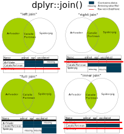

```{r setup, include=FALSE}
knitr::opts_chunk$set(echo = TRUE)
```
```{r, echo=FALSE}
htmltools::img(src = knitr::image_uri("./Images/LATree.PNG"),
               alt = 'logo', 
               style = 'position:absolute; top:0; right:0; padding:10px; width:200px;')
```


***

# Learning Objectives
<br>

**The goal of this session is to:**

<br>

* Understand the importance of clean variable names.

* Be able to clean column names using `janitor`or `gsub`.

* Be able to sort data.

* Be able to select data.

* Be able to filter data.

* Be able to use the mutate function and use the pipe 

* Be able to join data.

***

# Exercise {.tabset .tabset-fade}

<br>

## **Exercise**

<br>

Before we begin, could you load the packages below into your script,

- `readr`

- `janitor`

- `dplyr`


And then,

- Read in the **titanic.csv** and assign it to `titanic`

***

## **Hint**

<br>

The code below demonstrates how you can load a package.

```{r eval=FALSE}

library(package name)

```

<br>

The code below demonstrates how you can read csv data.

```{r, eval=FALSE}


dataframe_name <- readr::read_csv("file_path")


```

***

## **Show Answer**

```{r echo=TRUE, message=FALSE, warning=FALSE}
# Load libraries

library(readr)
library(janitor)
library(dplyr)


# Read in data


titanic <- readr::read_csv("D:/Git/Intro_to_R_Refresh/Data/titanic.csv", 
                           na=c("", " ", "NULL"))


```

***

<br>

# Column Names

<br>

In the previous section we looked at reading data into R and also inspecting it. 

In this section we are going to look at how to manipulate it.

>In the previous session we stated that every column in a data frame is a variable and it is good practice to not have spaces within variable names.


This makes it easier for us to call on the variables when we need to use them.

***

## **Example**

<br>

For example if we wanted to pick the `school name` column from the school dataset. 

<br>

>The code below does not work. 

<br>

```{r, eval=FALSE}

titanic$name of Passenger

```

<br>

To get around this we enclose `school name` with back ticks like the code below (the key above the tab key on left hand side).

<br>

```{r, eval=FALSE}

titanic$`name Of Passenger`

```

<br>

If your column names have spaces and you keep them, you must use backticks.

<br>

>However its good practise to remove spaces and symbols.

<br>

We can see the column names by using the  `names()` function to access the `name` attribute of the data.

```{r}


names(titanic)


```

***

## Cleaning Column Names {.tabset .tabset-fade}

<br>

### **janitor Package**

The `janitor` package offers many functions used to manipulate data, in this session we will use the library to to clean our data set names.

>We can clean the names of our dataset with the `clean_names()` function as shown below.


```{r}

# Apply the function to the data set.

titanic <- clean_names(titanic)


names(titanic)

```

<br>

`clean_names()` removes spaces, symbols, changes characters to lower case and makes all columns start with letters.

<br>

This is the default setting, other options we could use are:

```{r, eval = F}

"snake", "lower_camel", "upper_camel", 

"screaming_snake", "lower_upper", "upper_lower", 

"all_caps", "small_camel", "big_camel", "mixed"

```

<br>

Which can be put inside the `clean_names()` function as shown below:

<br>

```{r, eval = F}

clean_names(titanic, case="snake")

```

***
 
### **gsub**

We can also do this using the function `gsub()`. `gsub()`. 

>here is used on the column names, but can be used on text columns too.

<br>

>The code below substitues in any instance of the first symbol within the "" with the second set of "".

For example, the output of `gsub(" ", "_", "piece of text")` would be `piece_of_text`.

<br>


```{r, eval = F}


# We can apply different substitution to the names of our columns.

names(titanic) <- gsub(" ", "_", names(titanic))

names(titanic) <- gsub("," , "", names(titanic) )

names(titanic) <- gsub("-" , "_", names(titanic))


```

<br>

The `tolower()` function changes a string of characters to lower case.


```{r, eval = F}

# We can lower case the names of the data frame.

names(titanic) <- tolower(names(titanic)) 


```

<br>

We can also rename column name. The first argument is the data frame to be changed, the second is the column and it's change.

<br>

```{r, eval = F}

titanic <- rename(school, age_of_passenger = age)

```

<br>

We can also use it on full columns.

 
```{r, eval = F}

# This lower cases all records in the column we have chosen.

titanic$name_of_passenger <- tolower(titanic$name_of_passenger) 


```

***

<br>

# dplyr

<br>

This is one of the most powerful tools in the *tidyverse*, which makes data manipulation simple and code easy to read.

We are going to look at the following concepts,

1. arrange/sort
2. select
3. filter
4. mutate
5. joining data

<br>

>`dplyr` functions (verbs) all have the same structure.

<br>

```{r, eval = F}

# This is the format they follow.

verb(data, more information)

```

***


## Arrange{.tabset .tabset-fade}

<br>

>`arrange()` lets you sort data by a variable.

<br>


We can sort the column `fare` with code below.


```{r}

# We input the data we want to sort, and what we are going to sort it by.


titanic_sorted <- dplyr::arrange(.data = titanic,
                          fare)


# This shows us some of the sorted data.


head(titanic_sorted$fare)


# This shows us some of the unsorted data.

head(titanic$fare)

```
<br>

>`.data` is the argument name for the data argument in `dplyr`.

<br>

>It is optional, but can help us read the code more effectively.

If we don't specify how we are sorting, the default is to sort in ascending order.

<br>

To sort in descending order, we use the code below:

```{r}

# We input the data we want to sort, and what we are going to sort it by.


titanic_sorted <- dplyr::arrange(.data = titanic,
                          desc(fare))


# This shows us some of the sorted data.


head(titanic_sorted$fare)


# This shows us some of the unsorted data.

head(titanic$fare)

```

<br>

### **Exercise**

<br>

1. Can you sort the titanic data set by age *and* fare.

<br>

2. Can you sort the titanic data set by age *and* fare in descending order for both variables.

### **Hint**

<br>

1. Can you sort the titanic data set by age *and* fare.

<br>

2. Can you sort the titanic data set by age *and* fare in descending order for both variables.

<br>

```{r, eval=FALSE}

# Sort the titanic data based on two variables.

titanic_sorted <- dplyr::arrange(.data = dataset,
                          first_variable,
                          second_variable)
                          


```

<br>

To sort both descending order we have to use `desc()`


### **Show Answer**

<br>

Sorting by multiple variables, arranged them within each other. meaning it will sort the data by `age` first and then  will sort by fare.

<br>

```{r}

# Sort the titanic data based on two variables.

titanic_sorted <- dplyr::arrange(.data = titanic,
                          age_of_passenger,
                          fare)
                          
head(titanic_sorted, n = 10)

```

<br>
To sort both descending order we have to use `desc()` around each column name.

<br>

If you only had one `desc` on the `age_of_passenger`, it will show age_of_passenger in descending order, but fare in ascending.

<br>

```{r}

# Sorting both variables in descending order.


titanic_sorted <- dplyr::arrange(.data = titanic,
                          desc(age_of_passenger),
                          desc(fare))
                          
head(titanic_sorted, n = 10)


```

***

<br>

## Select{.tabset .tabset-fade}


> `Select()` allows us to pick entire columns from our data.


Previously we selected columns using the `$` symbol and the indexing operator `[]`.

<br>

We will opt to use `dplyr` functions which allow us to keep our code efficient and readable even with complex queries.

<br>

`dplyr::select()` function, in its simplest form, takes two parameters. 

The first, like all `tidyverse` functions, being the tibble we are interested in, and the second being the column name.

<br>

```{r}

titanic_one_variable <- dplyr::select(titanic, 
                                      name_of_passenger)


titanic_one_variable

```

<br>

This has returned the `name_of_passenger` column from `titanic` in the form of a tibble. 

<br>

The `select()` function, like the majority of `tidyverse` functions, offers a lot of flexibility. This allows us to achieve the same result using a number of different methods, without it being clear which method is more fitting. With great flexibility, comes great uncertainty...

<br>

If we want to select multiple columns, we have to first collect the column names together using a character vector, and then pass that as our second parameters. 

<br>

>Alternatively, we could just write out all the column names we want.

```{r}

titanic_three_variables <- dplyr::select(titanic,
                                         c("name_of_passenger", "age_of_passenger", "pclass"))

titanic_three_variables

```

<br>

The real power of the `select` function comes from its flexibility.

<br>

For example, suppose we wanted to select all columns excluding `name`, `age` and `pclass`. We could type all the columns names we need, or instead:

<br>

```{r}

titanic_minus_three_variables <- dplyr::select(titanic, 
                                               -c("name_of_passenger", "age_of_passenger", "pclass"))

titanic_minus_three_variables

```

<br>

We can also select the columns using numbers, positive numbers and negative numbers to drop.

<br>

For example the code below will select the first 4 columns and then column 7.

<br>

```{r}
# We can both use regular sequences with ":" and specific numbers.

titanic_number_select <- dplyr::select(.data = titanic, 
                                       c(1:4, 7))

titanic_number_select
                    
                    
```

<br>

In this example we select all columns, except column 2.

<br>

```{r}

# The negative indicates which columns we do not want.

titanic_number_select <- dplyr::select(.data = titanic, 
                                       c(-2))
                    
titanic_number_select                    
```

<br>


This flexibility is further enhanced by the `select helper` functions. 

<br>

>These are functions which allow you select columns based on their names.

<br>

* `starts_with(match)`: Starts with a prefix.
* `ends_with(match)`: Ends with a suffix.
* `contains(match)`: Contains a literal string.
* `matches(match)`: Matches a regular expression.
* `num_range(num_vector)`: Selects columns which matches a numeric range with a prefix e.g. "col1", "col2", "col3",...
* `one_of(char_vector)`: Selects columns which are in the given character vector.
* `everything()`: Selects all variables.
* `last_col()`:  

<br>

These functions are passed after the first parameter. e.g.

```{r}
titanic_starts_with <- dplyr::select(.data=titanic, 
                                     starts_with("s"))

titanic_starts_with
```
<br>

Or:


```{r}

titanic_matches <- dplyr::select(.data=titanic, 
                                 name_of_passenger, matches("."))

titanic_matches
```

<br>

It is important to note, all `tidyverse` functions work on and return a copy of the original data. More often than not, the returned object is another `tibble`, even if it's a single column. 

### **Exercise**

<br>

1. Can you select from the titanic data set, the second, third and fourth columns.

<br>

2. Can you select the columns, pclass, survived, name_of_passenger, sex_of_passenger, age_of_passenger and embarked.

<br>

3. Can select just the last column.

<br>

4. Can you select the columns that end the word "passenger".

<br>

5. Can you select, name_of_passenger, age_of_passenger and everything else

***

### **Hint**

<br>

Selecting the second, third and fourth column.

>Remember we can select by position or by name.

<br>

```{r, eval=FALSE}

titanic_select_exercise <- dplyr::select(.data=titanic, 
                                c())

```

<br>

Selecting the columns, pclass, survived, name_of_passenger, sex_of_passenger, age_of_passenger and embarked.

>Remember we can select by position or by name. HINT "embarked" is the last column.

<br>

```{r, eval=F}
titanic_select_exercise <- dplyr::select(.data = titanic, 
                                       c())


```

<br>

Selecting the columns that end the word “passenger”

<br>

>HINT You might want to use something that helps you select the words of the columns

```{r, eval=FALSE}

titanic_select_exercise <- dplyr::select(.data = titanic, 
                       c())


                     
```

<br>

Selecting name_of_passenger, age_of_passenger and everything else.

>This is a great way to reorder the columns, if you wanted to set 2 columns to be next to each other.

> When you select columns, its places them in the order that we select them, HINT You might want to select something that helps you select all the columns.

```{r, eval=FALSE}

titanic_select_exercise <- dplyr::select(.data = titanic,
                                         c())


```


***
### **Show Answer**
***

<br>

Selecting the second, third and fourth column.

```{r}

titanic_select_exercise <- dplyr::select(.data=titanic, 
                                c(2:3, 4))

titanic_select_exercise

#alternative

titanic_select_exercise <-  dplyr::select(.data = titanic, 
                                          c(survived, name_of_passenger, sex_of_passenger))


```
<br>

Selecting the columns, pclass, survived, name_of_passenger, sex_of_passenger, age_of_passenger and embarked.
```{r}
titanic_select_exercise <- dplyr::select(.data = titanic, 
                                       c(1:5, embarked))

#alternative

titanic_select_exercise <- dplyr::select(.data = titanic, 
                      c(1:5, last_col()))
```

<br>

>You could also type the column names.

<br>

Selecting the columns that end the word “passenger”

```{r}

titanic_select_exercise <- dplyr::select(.data = titanic, 
                       c(ends_with("passenger")))


#alternative


titanic_select_exercise <- dplyr::select(.data = titanic,
                                         ends_with("passenger")) 
                     

```

<br>

Selecting name_of_passenger, age_of_passenger and everything else.

>This is a great way to reorder the columns, if you wanted to set 2 columns to be next to each other.

```{r}
titanic_select_exercise <- dplyr::select(.data = titanic,
                                         c(name_of_passenger, age_of_passenger, everything()))

#alternative

titanic_select_exercise <- dplyr::select(.data = titanic,
                                         name_of_passenger, age_of_passenger, everything())


```

<br>

## Filter

> `Filter()` allows us to pick specific entries (rows) which satisfy a given logical condition.

<br>

>A conditional statement returns `TRUE` if the condition is met.

<br>

To create a logical condition, we have to use the logical operators.

<br>

Logical Operator| Description
:--------------:|:------------:
        <       | Less Than
       <=       | Less Than or Equal To
       \>       | Greater Than
       >=       | Greater Than or Equal To
    == or **    | Equal To
       !=       | Not Equal To
       \|       | Or
        &       | And
        !       | Not
      any()     | Checks if any value in a logical vector are TRUE
      all()     | Checks if all values in a logical vector are TRUE
      is.na()   | Is NA?
      between() | Is between 2 numbers
      near()    | Safe way to compare floating point numbers
      
<br>

      
>Note: The `!` allows us to flip or invert an expression. Basically, if an expression returns `[TRUE, TRUE, FALSE]`, the same expression with a `!` in front of it will return `[FALSE, FALSE, TRUE]`.

<br>

>**Remember that `==` is to test equality and `=` is to assign something.**

<br>

### Single Conditional Filtering{.tabset .tabset-fade}

<br>

We can filter out a new data set where pclass is 2.

>This is refered to as single conditional filtering as we only have one condition.


```{r}

# Select passengers (rows) who were in class (pclass) 2.

secondclass <- dplyr::filter(titanic, 
                             pclass == 2)

secondclass

```

<br>

>A quick way to check that the filter worked is to look at all the unique values, in the data set above, using the `unique()` function.

<br>

Note here am using the `$` to select the column pclass.


```{r}

# Returns the set of unique values in the data set.

#finding out how many uniques values are in the titanic dataset pclass column

unique(titanic$pclass)


#finding out how many uniques values are in the secondclass dataset pclass column

unique(secondclass$pclass)

```

>We can see that on the original dataset the titanic, we have three(1,2,3) different uniques values in the pclass column and in our new filtered dataset we have one unique value (2)


<br>

Another example, we can filter out the passengers who paid more than 200.

<br>

```{r}

# Select passengers who paid more than 200

fare_more_than_200 <-  dplyr::filter(titanic, 
                                     fare > 200)
```


<br>


#### **Exercise**
1. Show the row for the passenger named: 'Birkeland, Mr. Hans Martin Monsen'

<br>


2. How many passengers in the dataset are male?

<br>


3. How many passengers are under 18 years of age?

<br>

4. What proportion of passenger in the dataset survived?

<br>

#### **Hint**

<br>

1. Show the row for the passenger named: 'Birkeland, Mr. Hans Martin Monsen'

<br>

>Remember R is case sensitive and character data needs to have speech marks.

<br>

```{r, eval=FALSE}
#filtering the dataset by name_of_passenger

titanic_filter_exercise <- dplyr::filter(data, 
                                         condition)


titanic_filter_exercise

```

<br>

2. How many passengers in the dataset are male?

>filter the data first

>find out the number of rows

<br>

```{r, eval=F}

#filtering the dataset by sex_of_passenger

titanic_filter_exercise <- dplyr::filter(data, 
                                          condition)

titanic_filter_exercise


#showing the number of rows in our new filtered dataset

nrow(titanic_filter_exercise)

```

<br>

3. How many passengers are under 18 years of age?

>filter the data first

>find out the number of rows

<br>

```{r, eval=FALSE}

#filtering the dataset by age_of_passenger

titanic_filter_exercise <- dplyr::filter(data, 
                                        condition)

titanic_filter_exercise

#showing the number of rows in our new filtered dataset

nrow(titanic_filter_exercise)

```

<br>

4. What proportion of passenger in the dataset survived?

<br>

>filter the data first

>find out the number of rows

>calculate the percentage using the formula nrow(filtered data)/nrow(full data)*100

```{r, eval=FALSE}

#filtering the dataset by survived

titanic_filter_exercise <- dplyr::filter(data, 
                                        condition)

titanic_filter_exercise

#showing the number of rows in oure ew filtered dataset
nrow(titanic_filter_exercise)

#calculating the percentage, by dividing the total number of rows in new filtered dataset by the total number of rows in fulldataset then multiplied by 100

percentage_of_passengers_survived <- nrow(titanic_filter_exercise)/nrow(titanic)*100

percentage_of_passengers_survived


```

***
#### **Show Answer**

<br>

1. Show the row for the passenger named: 'Birkeland, Mr. Hans Martin Monsen'

<br>

```{r}
#filtering the dataset by name_of_passenger

titanic_filter_exercise <- dplyr::filter(titanic, 
                                         name_of_passenger == 'Birkeland, Mr. Hans Martin Monsen')


titanic_filter_exercise

```

<br>

2. How many passengers in the dataset are male?

<br>

```{r}

#filtering the dataset by sex_of_passenger

titanic_filter_exercise <- dplyr::filter(titanic, 
                                         sex_of_passenger == 'male')

titanic_filter_exercise


#showing the number of rows in our new filtered dataset

nrow(titanic_filter_exercise)

```

<br>

3. How many passengers are under 18 years of age?

<br>

```{r}

#filtering the dataset by age_of_passenger

titanic_filter_exercise <- dplyr::filter(titanic, 
                                        age_of_passenger < 18 )

titanic_filter_exercise

#showing the number of rows in our new filtered dataset

nrow(titanic_filter_exercise)

```

<br>

4. What proportion of passenger in the dataset survived?

<br>

```{r}

#filtering the dataset by survived

titanic_filter_exercise <- dplyr::filter(titanic, 
                                        survived == 1)

titanic_filter_exercise

#showing the number of rows in oure ew filtered dataset
nrow(titanic_filter_exercise)

#calculating the percentage, by dividing the total number of rows in new filtered dataset by the total number of rows in fulldataset then multiplied by 100

percentage_of_passengers_survived <- nrow(titanic_filter_exercise)/nrow(titanic)*100

percentage_of_passengers_survived


```

***

Another useful way to filter data is using the `dplyr::slice()` function.


>This method of filtering rows is great if you know the indexes of the rows you are interested in.

```{r}
# Select the 5th row

slice(titanic, 5)
```

What happens if we try:


```{r}
slice(titanic, -5)

```


### Multiple Conditional Filtering{.tabset .tabset-fade}


So far, we've only filtered according to individual conditions set on a single column, but there is no reason we can't use multiple conditions to filter by several conditions and/or columns at once. However, we do need to think about how the conditions relate to each other, we have two options to establish these relationships.

* **and** relationships are given by the **&** symbol. This implies both/all conditions must be met for a row to evaluate to True.
* **or** relationships are given by the **|** symbol. This implies that if _any_ of the conditions can be met a given row evaluates to True.

You can think of `between()` as being special version of multiple condition filters. `between()` is an **and** condition - greater than (or equal to) the lower bound **and** less than (or equal to) the upper bound.

R also implements a multiple 'or' condition in the form `%in%`, where any rows that have a value occurring in a given vector will be included in the output tibble.

Let's look at some examples:
```{r}

# Select passengers who were in class 1 AND female

titanic_filter_example <- dplyr::filter(titanic, pclass == 1 & sex_of_passenger == "female")

titanic_filter_example
```

```{r}

# Select passengers who were female OR children (under 18)

titanic_filter_example <- dplyr::filter(titanic, sex_of_passenger == "female" | age_of_passenger < 18)

titanic_filter_example
```

```{r}

# Select passengers who paid more than 100 but less than 250 for their fare.

titanic_filter_example <- dplyr::filter(titanic, between(fare, 100, 250))

titanic_filter_example
```

```{r}

# Select passengers who embarked in Southampton or Cherbourg.

# A more compact method of looking for a set of specific values.

titanic_filter_example <- dplyr::filter(titanic, embarked %in% c('S','C'))
```

<br>


#### **Exercise**

1. Select passengers who are in classes 2 and 3, what percentage of passengers is this?

2. How many passengers who do not have siblings or spouses ('sibsp'), or parents or children ('parch') on the boat?

3. What proportion of passengers who 'embarked' in Cherbourg ('C') or Queenstown ('Q') survived? 

#### **Hint**

1. Select passengers who are in classes 2 and 3, what percentage of passengers is this?


> The | (Shift and \) symbol means an OR relationship

> The & (Shift and 7) symbol indicates an AND relationship

```{r, eval=FALSE}

#filtering the dataset on multiple conditions

titanic_filter_exercise <- dplyr::filter(data,
                                         condition)

#calculating the percentage, by dividing the total number of rows in new filtered dataset 
#by the total number of rows in fulldataset then multiplied by 100

nrow(titanic_filter_exercise)/nrow(titanic)*100 


```

2. How many passengers who do not have siblings or spouses ('sibsp'), or parents or children ('parch') on the boat?

```{r, eval=FALSE}
#filtering the dataset on multiple conditions

titanic_filter_exercise <- dplyr::filter(data,
                                         condition)

#showing the number of rows in oure ew filtered dataset
nrow(titanic_filter_exercise)

```

3. What proportion of passengers who 'embarked' in Cherbourg ('C') or Queenstown ('Q') survived? 

```{r, eval=FALSE}

#filtering the dataset on multiple conditions
embarked_cherbourg_and_queenstown <- dplyr::filter(data,
                                         condition)

#filtering the dataset a single condition
survived <- dplyr::filter(data,
                          condition)

#showing the number of rows in oure ew filtered dataset
nrow(survived)/nrow(embarked_cherbourg_and_queenstown)

```


#### **Show Answer**


1. Select passengers who are in classes 2 and 3, what percentage of passengers is this?

```{r}

#filtering the dataset on multiple conditions
# The | idicates one condition or the other must be TRUE.

titanic_filter_exercise <- dplyr::filter(titanic, pclass == 2 | pclass == 3)

#calculating the percentage, by dividing the total number of rows in new filtered dataset 
#by the total number of rows in fulldataset then multiplied by 100

nrow(titanic_filter_exercise)/nrow(titanic)*100 


```

2. How many passengers who do not have siblings or spouses ('sibsp'), or parents or children ('parch') on the boat?

```{r}
#filtering the dataset on multiple conditions

titanic_filter_exercise <- dplyr::filter(titanic,sibsp == 0 & parch == 0)

#showing the number of rows in oure ew filtered dataset
nrow(titanic_filter_exercise)

```

3. What proportion of passengers who 'embarked' in Cherbourg ('C') or Queenstown ('Q') survived? 

```{r}
#filtering the dataset on multiple conditions
embarked_cherbourg_and_queenstown <- dplyr::filter(titanic,embarked == 'C' | embarked == 'Q')

#filtering the dataset a single condition
survived <- dplyr::filter(embarked_cherbourg_and_queenstown, survived == 1)

#showing the number of rows in oure ew filtered dataset
nrow(survived)/nrow(embarked_cherbourg_and_queenstown)

```

## Generating New Variables

To create a new variable, or a new column, in our `tibble` we will use the `dplyr::mutate()` function.

```{r, eval = FALSE}

dplyr::mutate()

```

>Code to create a new column follow the pattern below, where we state the name of the new column and the use the = to state what we want to be in that column.

```{r, eval=F}

data_frame_name <- dplyr::mutate(data,
                                 name_of_new_column = contents of new column)


```


### Constant Value Variables

The simplest example would be adding a constant value to each row in our `tibble`. 

```{r}
mutate(titanic, int_zeros = 0L)

mutate(titanic, double_ones = 1)

mutate(titanic, string_twos = "two")
```

We could have also performed all three mutations in one line on the same `tibble`:
```{r}
mutate(titanic, int_zeros = 0L, double_ones = 1, string_twos = "two")

```

### Creating Variables Based on Existing Columns{.tabset .tabset-fade}

We can perform mathematical operations and even functions on existing columns in the `mutate()` function using column names.

Let's look at some examples:

```{r}

# Capitalise sex column
mutate(titanic, sex_of_passenger = stringr::str_to_upper(sex_of_passenger))

```
```{r}
# Determining family size on board
mutate(titanic, family_size = parch + sibsp + 1)
```
As well as mathematical operators and functions we can use conditionals. 
```{r}
# Creating a logical column which is TRUE if passenger is female, false otherwise.
mutate(titanic, is_female = (sex_of_passenger == "female"))
```
The key note from this being, with `mutate()`, we can do almost anything if we keep the number of rows the same. 

There are some functions which work with `mutate()` and enable us to perform more complicated tasks. `recode()` lets us map one value to another throughout the entire column. e.g.
```{r, eval = FALSE}
recode(titanic$survived, '1' = TRUE, '0' = FALSE)
```

To do this in the context of an entire `tibble` we have to use `recode()` with `mutate()`.
```{r}
mutate(titanic, survived_logical = recode(survived, '1' = TRUE, '0' = FALSE))
```

#### **Exercise**

1. Create a logical variable called 'child', it should have the value `TRUE` when the passenger is under 18 and `FALSE` otherwise.

#### **Hint**

1. Create a logical variable called 'child', it should have the value `TRUE` when the passenger is under 18 and `FALSE` otherwise.

```{r, eval=FALSE}

titanic_mutate_exercise <- dplyr::mutate(data,
                                   new column name = content of new column)


```


#### **Show Answer**

1. Create a logical variable called 'child', it should have the value `TRUE` when the passenger is under 18 and `FALSE` otherwise.

```{r}

titanic_mutate_exercise <- dplyr::mutate(.data=titanic,
                                   child = age_of_passenger < 18)


```
### Deleting data

We can also use the `mutate()` function to delete data.

For example, we previously added a new column called `child` to our school data set.

We can quickly see the names of our data set using the the `names()` function.

```{r}

titanic_mutate_exercise <- dplyr::mutate(.data=titanic,
                                   child = age_of_passenger < 18)

names(titanic_mutate_exercise)

```
We can delete the column using the code below.

We take the titanic data set and set equal the column we want to delete to `NULL`.

```{r}

# Setting a column = NULL effectively removes it. 
titanic_mutate_exercise <- dplyr::mutate(.data = titanic_mutate_exercise, 
                                  child = NULL)

#finding out the names of the columns in the dataset
names(titanic_mutate_exercise)

```

Alternatively, this will work too.

```{r, eval = F}

#selecting a column using the $ sign and assigning it to NULL
titanic_mutate_exercise$child <- NULL

```


## The Pipe Operator `%>%` {.tabset .tabset-fade}


The Pipe Operator `%>%` makes it possible to chain a sequence of functions. 

In R code `%>%` can be read as "AND THEN". It takes the output of one action "AND THEN" uses that as the input of the next action. Where an action could be calling a variable, a function or anything else that returns some information. 


**`%>%`**

>The shortcut is CTL + SHIFT + M

What this does is it takes the output of one statement and makes it an input to the next statement. You can think of it as saying **`and then`**

Up until now if we wanted to perform a sequence of actions on data, we'd have do something along the lines of:

```{r}

filter_male <- dplyr::filter(titanic, sex_of_passenger == 'male')

mutate_age <- dplyr::mutate(.data=filter_male, adult_men = age_of_passenger > 18)

arrange_fare <- dplyr::arrange(.data=mutate_age, desc(fare)) 

filter_adult_men <- dplyr::filter(.data = arrange_fare, adult_men == TRUE)

filter_adult_men


```


With the pipe operator, this simplifies to:

```{r}

filter_adult_men <- titanic %>% 
  
  dplyr::filter(sex_of_passenger == 'male') %>% 
  
  dplyr::mutate(adult_men = age_of_passenger > 18) %>% 
  
  dplyr::arrange(desc(fare)) %>% 
  
  dplyr::filter(adult_men == TRUE)

filter_adult_men
  
  
  
  

  


```

>Notice how the `mutate()`, `arrange()` and `filter()` functions don't use the data argument as it already included in the pipe.


As you can see the pipe operator helps us:

* Structure the sequence of your data operations from left to right, as opposed to from inside to out.
* Avoid nested function calls and make code more "readable".
* Minimize the need for local variables and function definitions.
* Make it easy to add steps anywhere in the sequence of operations.


The pipe operator functionality comes from the `magrittr` package. Its implementation is designed for `tidyverse`, but it also works in some cases outside the `tidyverse`.

`magrittr` is named humorously for French artist Ren? Magritte, whose famous painting "The Treachery of Images" features the phrase "Ceci n'est pas une pipe" (this is not a pipe). While we call `%>%` the pipe operator, in fact `|` is a 'true' pipe, usually meaning boolean 'or'. 

The pipe function is one of the most powerful features of the `tidyverse`. In fact, having a standardised chain of processing actions is called "a pipeline". Making pipelines for data manipulation is great, because you can apply that pipeline to any incoming data with a given formatting and have your output in a friendly format.


### **Exercise**

Lets practice piping a few `dplyr` functions.


1.Can you use at least 2 `dplyr` commands within a pipe? 


### **Hint**

>Quick reminder of the dplyr commands

```{r, eval=FALSE}

dataframe_name <- titanic %>%
  
  dplyr::filter() %>%
  
  dplyr::mutate() %>%
  
  dplyr::select() %>%
  
  dplyr::arrange()


```


### **Show Answer**

```{r}

age_survived_fare <- titanic %>%
  
  dplyr::filter(survived==1) %>%
  
  dplyr::mutate(rounded_fare=(round(fare))) %>%
  
  dplyr::mutate(rounded_age=(round(age_of_passenger))) %>%
  
  dplyr::select(c(name_of_passenger,rounded_age,rounded_fare)) %>%
  
  dplyr::arrange(desc(rounded_age))


age_survived_fare


```


## Joining Data

Often all the data you need to answer a question are not contained within a single dataset, but across several. Datasets can be joined, or 'merged', to allow data to be analysed together, but only **if the two datasets share a common reference or identifier.**

Linking data come in a number of forms and are commonly referred to as 'indexical' data. Some examples include:

* Your NHS number, allowing data linkage across the NHS for primary, secondary, tertiary care episodes and prescribing.
* Any account number (e.g. banking, utilities, travel card, council tax etc.) can acts as a point of linkage between different sets of data.
* Your email, phone number, social media handles etc.
* Your address can also act as a spatial reference, linking you to your neighbourhood, local services etc.

### Different ways to Join {.tabset .tabset-fade}

In R we use group of `join` functions. These are prefixed by the type of join we choose to implement.

Once you have established that two `tibbles` share a reference that will permit a join to be conducted, you will see:

* `inner_` - Only rows with reference values that appear in both `tibbles` are merged.
* `left_` - All data from the 'left' `tibble` is retained, and any matching rows are merged from the 'right' `tibble`.
* `right_` - All data from the right and anything that matches from the left. Effectively, the reverse of 'Left'.
* `full_` - All data from the left and right `tibble` is retained, matched up where possible.

This can be easier to understand graphically:


lets have a look at an example.

we have the following datasets

Let’s have a look at the two `joining_data` data frames.

In `joining_data1` we have the columns **name, animal and age.**

In `joining_data2` we have the columns **name and vaccinated.**


```{r message=FALSE, warning=FALSE, include=FALSE}

# Read in data


joining_data_one <- readr::read_csv("D:/Git/Intro_to_R_Refresh/Data/joining_data1.csv")

joining_data_two <- readr::read_csv("D:/Git/Intro_to_R_Refresh/Data/joining_data2.csv") 
                           
                           


```


```{r}
joining_data_one

joining_data_two
```

"Arf Vader" only appears in `joining_data1` and "Spiderpig" only appears in `joining_data2`. The remainder of the animals appear in both data frames.

These two data frames have a column in common that we could use to join them on - **name**.

We can create a variety of joins. These are often best demonstrated with a Venn diagram.

I’m going to say that `joining_data1` is my “left” data frame, and that `joining_data2` is my “right” data frame.

For this I’m going to highlight the position of three animal names. As we mentioned earlier:

* "Arf Vader" is only in `joining_data1`, our “left” data frame.

* "Spiderpig" is only in `joining_data2`, our “right” data frame. 

* "Catalie Portman" is in both `joining_data1` and `joining_data2` and will represent values in *BOTH* data frames.




As you can see "left" and "right" merges take the data from that data frame and any matches from the other. 

This means that in our "left":

"Arf Vader" is included because he has data in the "left" data frame. 

"Arf Vader" has missing values for `vaccinated`, as he isn’t in that data frame.

"Catalie Portman" has data in all columns, as she appears in both the "left" and "right".

"Spiderpig" doesn’t have any data in this one. We’re only taking data from the "left", and he’s only in the "right".

Let’s look at how we do this "left" merge in code. We’re going to use `left_join()` and do a "left" join.


```{r}

# The first data frame is the one on the left.
join_left <- left_join(joining_data_one, 
                        joining_data_two,
                        by = "name")

join_left

```

If you dont specify which column to join by, `R` will look to match by any column that matches.

If we're joining on more than one column we can specify using the parameter `by = c(vector))`.

This is shown below.

```{r, eval=F}

# Joining using multiple columns
join_left <- left_join(joining_data_one, joining_data_two,
                        by = c("column name", "column name"))

join_left

```


#### **Exercise**

1. Read in joining_exercise1.csv as marvel_left

2. Read in joining_exercise2.csv as marvel_right

3. Inspect your data

4. Using `marvel_right` and `marvel_left` perform a `full_join()` using the column `name`.

5. Using `marvel_left` and `marvel_righ`t perform a "left" join.

  Join on *BOTH* the column containing `names` and the column containing `years`.

  Note that the names of these columns may not be the same in both data frames.

  Use the help function to explore solutions to this.

#### **Hint**


1. Read in joining_exercise1.csv as marvel_left

2. Read in joining_exercise2.csv as marvel_right

3. Inspect your data


```{r, eval=FALSE}

# Read in data


marvel_left <- readr::read_csv("file path")

marvel_left

marvel_right <- readr::read_csv("file path")

marvel_right


```


4. Using `marvel_right` and `marvel_left` perform a `full_join()` using the column `name`.

```{r,eval=F}

marvel_full_join <- full_join(dataframe, dataframe, by = column)
                                                                          

marvel_full_join
```

5. Using `marvel_left` and `marvel_righ`t perform a "left" join.

  Join on *BOTH* the column containing `names` and the column containing `years`.

  Note that the names of these columns may not be the same in both data frames.

  Use the help function to explore solutions to this.
  
  
 ```{r, eval=F}
 
# We can join two columns that are named differently.

marvel_left_join <- left_join(dataframe, dataframe, by = c(columns))

marvel_left_join
```

#### **Show Answer**


1. Read in joining_exercise1.csv as marvel_left

2. Read in joining_exercise2.csv as marvel_right

3. Inspect your data


```{r}

# Read in data


marvel_left <- readr::read_csv("D:/Git/Intro_to_R_Refresh/Data/joining_exercise1.csv")

marvel_left

marvel_right <- readr::read_csv("D:/Git/Intro_to_R_Refresh/Data/joining_exercise2.csv")

marvel_right


```


4. Using `marvel_right` and `marvel_left` perform a `full_join()` using the column `name`.

```{r}

marvel_full_join <- full_join(marvel_left, marvel_right, by = "name")
                                                                          

marvel_full_join
```

5. Using `marvel_left` and `marvel_righ`t perform a "left" join.

  Join on *BOTH* the column containing `names` and the column containing `years`.

  Note that the names of these columns may not be the same in both data frames.

  Use the help function to explore solutions to this.
  
  
 ```{r}
# We can join two columns that are named differently.
marvel_left_join <- left_join(marvel_left, marvel_right, by = c("name", "year"="release_year"))

marvel_left_join
``` 
# Summary - Data Manipulation

## Reminder of Learning Objectives

* You should now be able to import data into R

* Understand the importance of clean column names

* Manipulate data frames to extract information from them by:
    + Selecting columns,
    + Filtering rows,
    + Generating new variables,
    + Sorting Data
    + Joining Data

