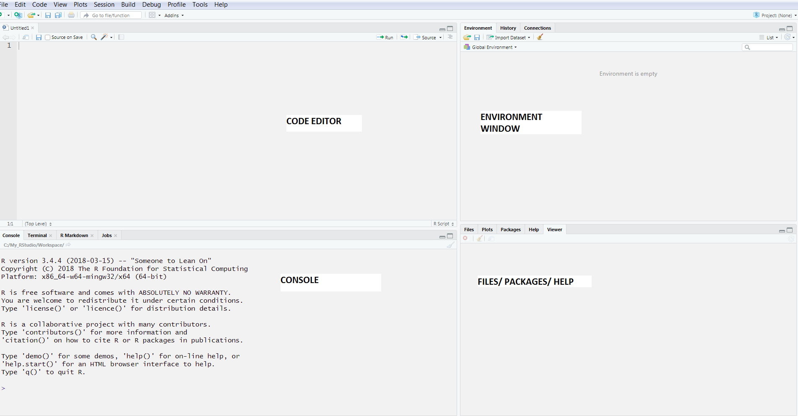
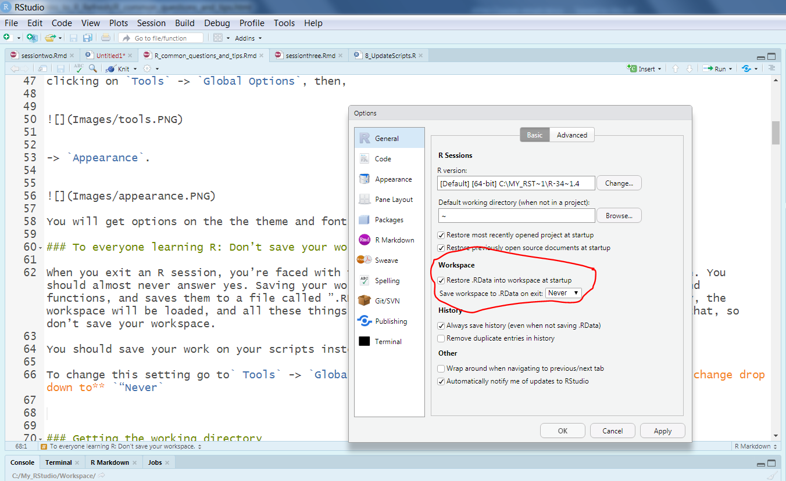

```{r, echo=FALSE}
htmltools::img(src = knitr::image_uri("./Images/LATree.PNG"),
               alt = 'logo', 
               style = 'position:absolute; top:0; right:0; padding:10px; width:200px;')
```


```{r setup, include=FALSE}
knitr::opts_chunk$set(echo = TRUE)
```

<br>

***
# The Basics{-}

***

# Learning Objectives.

<br>

**The goal of this session is to**

* Be familiar with R Studio.
* RStudio environment, layout, and customization.
* Understand the Key Benefits of using R.
* How to run code in R.
* Know where to get help.
* Discover R's data types.
* Be able to create Variables.

 ***
 
 <br>
 
# What is R?
 
An open source **programming language** and environment for statistical computing and graphics.

It provides a wide variety of statistical techniques (e.g. linear and non-linear modelling, statistical tests, time-series analysis, etc) that's why its often used by Analysts, Statisticians and Data Scientists.

R was initially written by **Ross Ihaka and Robert Gentleman** at the Department of Statistics of the University of Auckland in New Zealand. It is named partly after the first names of the first two R authors. Because it was created by statisticians (instead of computer scientists), R has some quirky aspects to it that take some time to get used to. 

***

<br>

## Benefits of Using R?

There are many programming languages on the market that one can use, but R is becoming very widely used. 

There are several reasons for this trend:

* Free and open source, people can modify and share because its design is publicly accessible.
* Great Community Support, diverse and welcoming community. e.g. #rstats twitter community, numerous [ R Meet Ups](https://www.meetup.com/topics/r-programming-language/). 
* There are lots of [packages available](https://cran.r-project.org/web/packages/available_packages_by_name.html) which contain implementations of processes and ready-made functions you might find useful
* Cross Platform, it can be used across a range of operating systems i.e Windows, Linux, OS.
* R has extensive and powerful graphics abilities. e.g [ The BBC use R to produce their graphics](https://medium.com/bbc-visual-and-data-journalism/how-the-bbc-visual-and-data-journalism-team-works-with-graphics-in-r-ed0b35693535)
* Powerful tool for communicating results, i.e.. [RMarkdown](https://rmarkdown.rstudio.com/)  makes its easy to turn your files into PDF'S, Power point presentations and [Shiny](https://shiny.rstudio.com/) allows you to make beautiful interactive apps and dashboards.

***

<br>

## R Studio.

R is a programming language that runs computations while R Studio is an integrated development environment (IDE) that provides an interface by adding many convenient features and tools.

You do not have to use R Studio to access R, and many people don’t!
Other IDEs that work with R include: - [Jupyter notebook](https://jupyter.org/) -  [VisualStudio](https://visualstudio.microsoft.com/services/visual-studio-online/) - [Intellij IDEA](https://plugins.jetbrains.com/plugin/6632-r-language-for-intellij)

R Studio is broken down into four panels for our convenience.


When we open R Studio for the first time, we’re likely to see this:

<br>





<br>

If you dont see the **Code editor pane**, go to the tool bar and click **View -> Panes -> Show All Panes**.

The positions of these can be adjusted under the ‘Preferences’ menu, but we will keep like this for now.

We will go through what we can do with each of these panes.

***

<br>


### Changing your R Studio theme


Before we begin using R Studio lets explore the various themes available, by going to **Tools -> Global Options -> Appearance**.

Choose a theme that works best for you and apply it.

You can also amend fonts here.

*** 


<br>

### Don't save your workspace

Another setting we need to change is set R Studio to not save our workspace.

When you exit an R session, you are faced with the question of whether or not to save your workspace. You should **almost never answer yes**. Saving your workspace creates an snapshot of your current variables and functions, and saves them to a file called `.RData`. When you re-open R from that same place in your computer, the workspace will be loaded, and all these things will be available to you again. But you don’t want that, so **don’t save your workspace**.

>**We will look at better ways of saving our work later on during the course.**

To change this setting go to **Tools -> Global Options -> “Save workspace to .Rdata on Exit”** change drop down to **“Never"**.

<br>

 


<br>

***

<br>


### The Console

We are first going to learn about how to interact with the console, which is the bottom left pane.

This is where you can type code that executes immediately. This is also known as the **command line**. 

We’ll spend a little time practising running code in the Console by exploring some basic properties of coding in R.

To run code in the Console, you type your code next to the command prompt > and hit **`Enter`**.


**Try out some arithmetic in your console**;


<br>


### Exercise{.tabset .tabset-fade}

#### **Exercise**{-}

1. Try and type the expression below and hit **`Enter`**. 

   **Make sure you type and hit `Enter` one line at a time.**


```{r, eval=FALSE}

2 + 4

23 - 6; 36 + 5

1 + 3 +

```


<br>

***

#### **Show Answer**{-}

```{r}

2 + 4

```

We didn't just get 6, we also got [1]. This is R's way of printing to the screen; it's telling us the position we're at.

<br>

A semi colon allows multiple commands to be entered on the same line before processing.

```{r}

23 - 6; 36 + 5

```

<br>

Note that if a **"+"** appears instead of the command prompt **">"**, this means that the statement you submitted was incomplete. 


```{r, eval=FALSE}

1 + 3 +

```


Here **1 + 3 + **, is incomplete.

We can either complete the expression or press `Esc` in our console to reset.

<br>

The R Studio Console automatically maintains a ‘history’ so that you can retrieve previous commands.

On a blank line in the Console, press the **`up arrow`**, and see what happens.

The issue with coding in the console is that we cant save it and not easy to edit, which brings us to the code editor.

***

<br>

### Code Editor

This is the top left pane.

This is where you will do the majority of your coding, we will  be using scripts in this course.


***

### R Scripts

A **script** is just a text file which we write our code in, generally we will use them to write code which will be longer than just a few lines.


Lets create a script file which we will use to write and save our code during the course.

To create a new script,

**Click on File -> New file -> R Script** 

>**Alternatively you can press the short cut keys Ctrl+Shift+N**.

Scripts execute sequentially from top to bottom.

R Studio has the advantage of:

* Providing syntax highlighting 

* Assisted code completion

* Smart indentation

We will see the benefits of these as you type your code throughout the course.

<br>

**Lets practise writing some code  and how to run it in a script**.


There are three main ways to run code in an .R script:

* Highlight the line(s) of code you’d like to run and press **Ctrl + Enter**.

* Highlight the line(s) of code you’d like to run and click the **Run button** in the R script pane.

* To run every line of code in your file you can press **Ctrl + Shift + Enter**.

Type the following in your script and run the code.

```{r}

"I am learning R"

2+4

23 - 6; 36 + 5


```


<br>

Its best practise to leave comments in your code to what your code is actually doing as code can get quite long and complicated and other people may need to use it.

We do this by using the **hash (#)**.


The **hash (#)** tells R not to run any of the text on that line to the right of the symbol. This is the standard way of commenting R code; it is **VERY** good practice to comment in detail so that you can understand later what you have done.

Even if you are the only person to ever work on your code, it can be helpful to write yourself notes about what you were trying to do with a specific piece of code. 

Another important comment you can include is explaining reasons behind why you are doing it that way.

>**Writing comments in your code as you work through the course is a great way to help reinforce what you’re learning.**

Lets write a note in our script.

Type the **#** and write yourself a note.


```{r}

# This is my first R script


```

<br>


**If you think you’ll be writing more than one line of code, you can do a `hash (#)` sign followed by a single quotation mark (#'). This will continue to comment out lines of text or code each time you hit “Enter.” You can delete the #' on a new line where you want to write code for R to run. This method is useful when you’re writing a description of what you’re doing in R.**

>**Alternatively you can press the short cut keys Ctrl+Shift+C.**

<br>

I  recommend to  save this script, type in the code as we go along, and only execute the required lines. That way you will have a record of what you have done.

To save the script; 

**Click on File -> Save as**

>**Alternatively you can press the short cut keys Ctrl + S**.


We will now look at the top left pane.

***

<br>

### Environment/History

The Environment pane is very useful as it shows you what objects (such as; data frames, values and functions) you have in your environment (workspace).

Also in the Environment is the History tab, where you can see all of the code executed during the current session. 

This shows the previous code you were working on, and any storage of objects you are using such as variables, data frames.

We will look at these later on in the session.

We will now look at the bottom right pane.

***


<br>


### Files/Help/Packages

This shows the files, packages and help documentation.

This pane has a number of different tabs. 

The Files tab has a navigable file manager, just like the file system on your operating system. 

The Plot tab is where graphics you create will appear. 

The Packages tab shows you the packages that are installed and those that can be installed (we will look packages in details in Chapter 3). 

The Help tab allows you to search the R documentation for help and is where the help appears when you ask for it from the Console. We will look at this in more detail later on in this session.

<br>


We have now gone through all the four panes of R Studio, you should now have a basic idea of what each do.

For more information about R Studio, you can find the **R Studio** Cheat Sheet under the **Help -> Cheat sheet.**.

You will most likely be using data in R, we will now look at the different types.

***

<br>

# Data Types.

To get the best out of R, you will need to have a strong understanding of the basic data types and structures and how to operate on them.

Different processes apply to different types of data.

Different data types have different properties; if you try to add `1 + "two"`, you will get an error due to a mismatch of types.


First data type we will look at is numbers.

***

<br>

## Numbers

You will most likely want to perform mathematical operations with numbers. Here is a list of some operators.

Operators in R:

<br>

|Operator   | Description     |
|:---------:|:---------------:|
|     +     | Addition        |
|     -     | Subtraction     |
|     *     | Multiplication  |
|     /     | Division        |
|       ^   | Exponents/Powers       |
|    %%     | [Modulo Division](https://en.wikipedia.org/wiki/Modulo_operation)|
|    %/%    | [Floor Division](https://en.wikipedia.org/wiki/Floor_and_ceiling_functions)|


<br>


Let's have a play with some of these operators:


Type the code below,

```{r}

# This is my first R script

9 + 27.73


(59 + 73 + 2) / 3


```

It’s also useful to note that R will follow BIDMAS for order of operations.

```{r}

# This is my first R script

10 + 11 * 12 / 3 - 5^2


```


<br>

There are also some built-in functions such as **sqrt()** or **round()**. 

> **Functions are commands that take an input do something and produce an output. You can think of them like mathematic functions, where you substitute in a value.**


Functions in R can are a word followed by a set of parentheses, like so: print(). More often than not, the word is a verb, such as round(), suggesting that we’re about to perform an action.


Let’s see what they do:

```{r}
#Calculating the square root of 9
#using built in function sqrt()
sqrt(9)


#using built in function round()
round(3.6357)

```

You can specify what you the want a function to exactly do with what we call a parameter and argument. This is specified within the brackets of the function. We  will talk more about parameters and arguments(inputs) in chapter 6, 

The inputs of function is called a parameter and what we specify is called an argument.

**A parameter is a name or a label for an argument that follows it**. e.g in the round function below our parameter is `digits` and our `arguement` is 2.

```{r}
#using built in function round()
round(3.6357, digits = 2)
```


There are many more built-in functions which you will discover with more exposure to R, but for now we will move onto the different types of numbers we might work with. 


* Numeric (num) or Double (dbl)
* Integers (int)


`Integers` are whole numbers with no decimal place. for example:, -2, -1, 0, 1, 2, they are denoted in R by an `L` at the end of the number.


A `Double` is treated as the general number type and by default R will treat all numbers you use as double unless you give it an explicit reason to think otherwise. So therefore, any number with or without a decimal place will be treated as double unless emphasised otherwise.

These different types exist in R for operations behind the scenes.We need to worry about them too much at the moment.

We can see they type by using the **`typeof()`** function or command.

```{r}
typeof(10)

typeof(10L)
```

The next data type that we will look at is text data.

***

<br>

## Text Values

In R, we refer to text as 'character' (chr) strings. Strings are sequences of character data.

Strings are contained within either 'single' or "double" quotation marks.

All characters between the opening and the closing quote are part of the string.

```{r}
"This is a string"
```

You actually typed one  when you typed the code below earlier.

```{r}
'I am learning R'
```

The choice between single and double quotes is up to the user. Unlike other languages, there is no difference in behaviour. I recommend always using ", unless you want to create a string that contains multiple ".

```{r}
'If I want to include a "quote" inside a string, I use single quotes'
```

<br>


**A few symbols are awkward to get into character strings and this is because of they have an underlying meaning elsewhere. Generally speaking, a backslash prior to the special character you require will solve the problem. If not, Google will definitely have the answer!.**


Our next data type is logical values.


***

<br>

## Logical or Boolean Values

In R these are written as `TRUE` or `FALSE`.


> **They are special R data types - not strings! So they don't need '' or "" around them.**


Note that you they can be abbreviated to `T` and `F`, this is not regarded as best practise.

They also have numerical value behind them - `TRUE` is 1 and `FALSE` is 0.

Therefore, we can treat them as numbers!
```{r}
TRUE + TRUE
```
And use all the other operators too!
```{r}
TRUE * 2.5
```

It's uncommon to use logical values for simple calculations like above. We are far more likely to deal with logical values when we work with logical (or conditional) operators, for example; to perform comparisons and checks.

<br>

Logical Operator| Description
:--------------:|:------------:
        <       | Less Than
       <=       | Less Than or Equal To
       \>       | Greater Than
       >=       | Greater Than or Equal To
       ==       | Equal To
       !=       | Not Equal To
      %in%      | Membership
       \|       | Or
        &       | And


<br>

Let's see how these work:

Is 4 greater than 5?

```{r}
4 > 5
```

Is 25 equal to 5 squared?
```{r}
25 == 5^2
```

Does 1 not equal 2?
```{r}
1 != 2
```

That covers the simpler logical operators. 

The final two allow us to combine and check multiple conditions.

We will look at these more in detail with examples in Chapter Four Data Manipulation.

>**Please note that there is other data types such as factors, dates, complex numbers, date times etc**


***

<br>


## Exercise{.tabset .tabset-fade}

### **Exercise**{-}

1.What is the data type of the following?

```{r, eval=FALSE}

"10"

10L

10

TRUE

"ten"

"TRUE"

FALSE

"FALSE"

```

<br>

### **Show Answer** {-}

The typeof notation determines the (R internal) type or storage mode of any object.

```{r}

typeof("10")

typeof(10L)

typeof(10)

typeof(TRUE)

typeof("ten")

typeof("T")

typeof(F)

typeof("FALSE")


```

***

Now that there you know some of R's data types we will look at how we can convert between data types.

***

<br>

## Data Type Conversion

Given that R is a dynamically typed language, sometimes the data type you want to work with, and the one R infers are not the same.

R doesn't require you to set the data type when you create it, instead it figures out what the best data type is for the object you are creating - numeric, character, logical, or others.

Sometimes you want to ensure that a particular object is actually a certain type, rather than leaving it up to R. This is done using data type conversion. R has a range of in-built functions that enable you to convert data from one type to another.

Firstly, the `typeof()` function returns the (R internal) type of any given object. e.g.

```{r}
typeof("is this a character?")
```

```{r}
typeof(5L)
```

```{r}
typeof(5)
```

We could equivalently use functions such as `is.` function which checks if our object is a given type. (set cursor after `is.` and hit tab).

```{r, eval = FALSE}
is.
```

```{r}
is.integer(5)
```


In order to convert the data, you need to use the **as** function. As part of this command, you specify the data type you are converting to. The commands are as follows:

* as.numeric to convert to Numeric.

* as.character to convert to Characters.

* as.logical to convert to Logical.


```{r}
as.integer(4.996453)

as.numeric("2")
```

We will look at some other ways to do convert types later in the course.

***

<br>

# Variable Assignment

Variables are an integral part of any programming language. Variables allow us to store and label data under a specific name. It is like a place holder, used to store information. Think of it as a container, they main purpose is to label and store the data in memory.

R has a lot of flexibility when it comes to variable assignment. We can assign a value to name (or label) using `=` operator or `<-` and `->` operators. 

Here are a few examples of them in action:

* `my_first_variable = value`
* `my_first_variable <- value`
* `value -> my_first_variable`

Where `weight_kg` is the variable name and `value` is the data being assigned to `weight_kg`. 

```{r}
#To assign a variable
weight_kg <- 60
```

When reading that code say `“weight_kg  gets the value 60”` in your head.

Once an object has been created it will appear in your Environment window which helps you keep track of what objects you have in your current workspace.(The top right pane)


After the assignment, to access or use the value we simply reference `weight_kg` in our code. 
```{r}
#To assign a variable
weight_kg <- 60


#To display the variable
weight_kg
```

We can use in mathematical operations. Here we are using `weight_kg` to calculate `weight_lb`.


```{r}
#Multiplication using our variable name
weight_lb <- weight_kg * 2.2

#To display the variable
weight_lb
```

<br>

>**`<-` is the most commonly used assignment operator in R and therefore the one we will stick to.  This called the assignemt operator <-, (the short cut is ALT + MINUS).**

RStudio automatically surrounds `<-` with spaces, which is a good code formatting practice. 

<br>

In R it is convention to use `<-` to assign variables and keep `=` reserved to passing key value pair to a function. We will be sticking to this convention. 

`->` is considered bad practice. This is because it makes it harder for others to see where a object has been assigned.


If we ever want to reassign a variable we would simply use the operators above again. 

For example:

```{r}
#To assign a variable
my_second_variable <- 5L

#To display the variable
my_second_variable

```
```{r}
#To assign a variable
#Using the same variable name will overwrite the previously assigned variable
my_second_variable <- 10

#To display the variable
my_second_variable
```

Typing the following into the Console will list everything you’ve loaded into the Environment:

`ls()`


To remove a variable, we would utilise the `rm()` function of R. 

For example: `rm(my_second_variable)` 

```{r}
rm(my_second_variable)
```

Variable names:

* Are case sensitive and must start with a letter.  
* Cannot use reserved words such as `TRUE` or `FALSE` which already mean something in R. 
* Ideally, should be descriptive, so that when someone else is reading your code they don't have to guess, so you’ll need a convention for multiple words. 

I recommend snake_case where you separate lower-case words with `_`. See examples below;


```
i_use_snake_case

otherPeopleUseCamelCase

some.people.use.periods

```

We have more detailed examples and information on good variables names in our other course **Best Practice in Programming for Data Scientists**

***

<br>


## Exercise{.tabset .tabset-fade}

### **Exercise**{-}

1.Why does this code not work?

```{r,eval=FALSE}

my_variable <- 10

my_varIable
```


2. What is the value of each item at each step?

```{r, eval=FALSE}
#1. Time?
Time <- 30


#2. distance?
distance <- 10

#3. Time?
Time <- 30*2

#4. distance
distance <- distance + 5

#5. speed
speed <- distance/Time


```


3. Use the remove function to remove a variable.


<br>

***


### **Show Answer** {-}


1.Why does this code not work?

```{r,eval=FALSE}

my_variable <- 10

my_varIable
```

You would have got the error below;

>Error: object 'my_varIable' not found

The variable printed `my_varIable`is not the variable `my_variable`

Error messages of the form "object '...' not found" mean exactly what they say. R cannot find an object with that name. Unfortunately, the error does not tell you why that object cannot be found, because R does not know the reason that the object does not exist. 


2. What is the value of each item at each step?

```{r}
#1. Time?
Time <- 30

#To display the variable
Time

#2. distance?
distance <- 10

#To display the variable
distance

#3. Time?
Time <- 30*2

#To display the variable
Time

#4. distance
distance <- distance + 5

#To display the variable
distance

#5. speed
speed <- distance/Time

#To display the variable
speed

```

3. Use the remove function to remove a variable.

```{r echo=TRUE, message=TRUE}


#To display the variable
speed

#To remove a variable 
rm(speed)

```

***

<br>


# Help

Being a new user of R chances are you are going to get stuck at some point and will need help.

Very few - if any - people in the world know everything there is to know about R. This means that we all need to look things up, these are some of the resources available.

<br>

***

## Cheat Sheets

You can access these by clicking on **Help** and then **Cheetsheets**.


<br>

 


<br>

***


## R Documentation {.tabset .tabset-fade}

### **Example**{-}

From within RStudio we can access the Help documentation by using `?` or `??` in the console

Try and type the command below in the console,and you should see the Help panel on the bottom right side of your RStudio environment populate with documentation.


**This might not be helpful at this point in time as its quite complicated, we use this throughout the course and get plenty of practise on how to get the best of the R documentation.**


```{r, eval=FALSE}
#To acces the R help documentation
?mean 

or 

help(mean)
```


***

<br>

### **Parts of a Help Page**{-}

Each help page is divided into sections. 

Which sections appear can vary from help page to help page, but you can usually expect to find these useful headings:

<br>

***

**Description** - A short summary of what the function does.

**Usage** - An example of how you would type the function. Each argument of the function will appear in the order R expects you to supply it (if you don’t use argument names).

**Arguments** - A list of each argument the function takes, what type of information R expects you to supply for the argument, and what the function will do with the information.

**Details** - A more in-depth description of the function and how it operates. The details section also gives the function author a chance to alert you to anything you might want to know when using the function.

**Value** - A description of what the function returns when you run it.

**See Also** - A short list of related R functions.

**Examples** - Example code that uses the function and is guaranteed to work. The examples section of a help page usually demonstrates a couple different ways to use a function. This helps give you an idea of what the function is capable of.


***

<br>

## Stack Overflow

[Stack Overflow](https://stackoverflow.com/) is a great site to check if anyone has has a similar problem to you, and see how they got around it.


***

<br>

## Yammer

Within ONS we have two groups on Yammer, 

* The **R User Group** which you can post any issues you are facing and people will suggests solutions

* The **Coding in the Kitchen** group which is used to share tips and best practice.

***

<br>

## Cross Government Data Science Slack

[The Cross Goverment Data Science Slack](https://govdatascience.slack.com/) is a place to talk to other people working with Data across government.

***

<br>

## The **GSS Training team – gss.capability@ons.gov.uk**

If you have any issues with this course; or notice any errors, please contact the training team on the email above. The training team are also here to help with any R questions you have after you have completed the course.

Please be aware that due to training commitments there may be a small wait before we respond to your query. We also expect that you have attempted to solve your query yourself before contacting us.

***

<br>

# Summary - The Basics.{-}

We have covered a lot material in R and yet there is still so much more to cover in terms of functionality, as R has so much to offer. By no means are you expected to remember all the above, but as we move forward, it is important you remain aware of:

* R is an open source **programming language** and environment for statistical computing and graphics.

* The benefits of using R.

* Have a good understanding of R Studio, know what each of the four panes do.

* Be able to create, run and save R scripts.

* Know the data types in R, such as character, numerical and logical

* Be able to convert data to a different type.

* Know variables are and be assign a variable

* Know the options of where to get help when stuck

***

<br>

# Next Chapter{-}


***


**In the next chapter we will look at Data Structures.**


***
