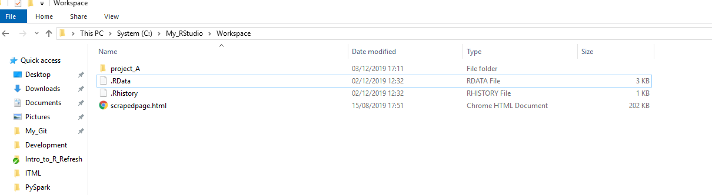
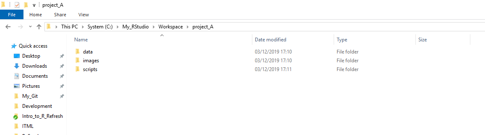
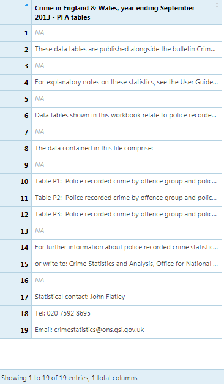
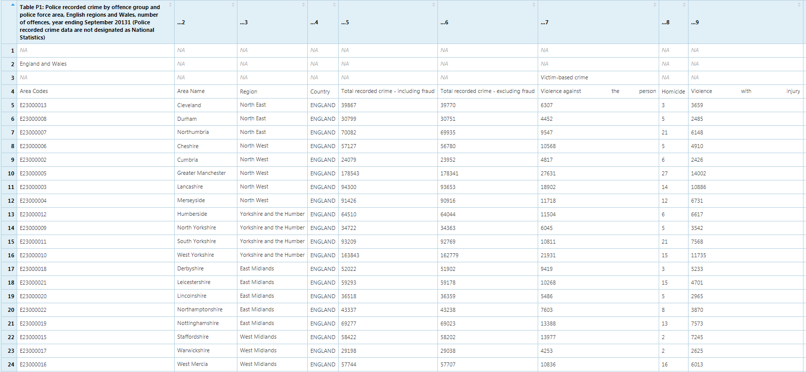

```{r setup, include=FALSE}
knitr::opts_chunk$set(echo = TRUE)
```
```{r, echo=FALSE}
htmltools::img(src = knitr::image_uri("./Images/LATree.PNG"),
               alt = 'logo', 
               style = 'position:absolute; top:0; right:0; padding:10px; width:200px;')
```


***

# Learning Objectives
<br />

**The goal of this session is to:**

* Have an understanding of what packages are.
* Be able to load and install a package.
* Be able to check package versions and R version.
* Be able to import data from multiple formats.
* Be able to inspect loaded data and select elements within the dataframe.
* Be able to export data.


***

# Projects{.tabset .tabset-fade}

## Non-Ons {-}

It is highly recommended to manage your R work in projects. When you’re starting work on a new project, choose **‘New project…’** from the File menu and **‘New Directory’** to create a directory for the project (probably on your OneDrive).

<br />

If you already have data related to the project in an existing diretory, you can choose that option instead.

<br />

To work on this project in the future, you can select **‘Open Project…’** or **‘Recent Projects’** from the File menu and browse to the desired project.

>This will ensure that your working directory will be set to the project folder, meaning you won’t have to worry about full file paths for data you are reading in or writing to that same folder

***

## ONS {-}

Within ONS, the default R working directory is within the `C` drive. 


<br />

**C drive -> My_RStudio -> Workspace**

<br />

It is good practice to organise your folders. 

As shown in the example below, where you include all files to a project in the same folder `Project A`

<br />



<br />

Within the folder, it is good practice to further organise your files within folders, as shown below.

>The data folder would contain your raw and processed data.

>Images would contains any photos you are using.

>Scripts would contain all the R files. You don't have to stick with this exact folder structure, you could add in additional folders, e.g an output folder. 



***

# Packages

Our default R installation – often referred to as **“base R”** gives us a lot of functionality.

<br />

A lot of this code has been around since R’s early days, back to when it was created in 1993. However, if we want to do more complicated, newer or more exciting things with our code we can install packages to achieve these goals.

<br />

>Packages are a collection of functions, compiled code and sometimes data sets which are stored in a “library” of code within R.

In order to use a package, we first need to download it.  
R installs packages from (CRAN)[ https://cran.r-project.org/] – **The Comprehensive R Network.**

>Your department may have a slightly different way of installing packages.

R has over 15,000 packages on CRAN, so it would be impossible to have them all downloaded on your machine. You can also install packages that are not part of CRAN; but please be aware of the source and quality, like any software these can damage your machine if they are malicious.

***

## ONS Note!

Within ONS we use a mirrored version of CRAN on our software repository called **Artifactory**. 

Behind the scenes our R installation is set to install from Artifcactory rather than CRAN. 

>This requires our up to date windows username and password. Without this the package will not install. This is why it is important for ONS staff to make sure their password is up to date in either your settings or your .RProfile.

***

## Installing Packages {.tabset .tabset-fade .tabset-pills}

To install a package, we use the code below. 

<br>

>It is important we use this WHOLE line of code every time we install a package. 


```{r, eval = F}


install.packages(“package_name” , dependencies = TRUE, type = “win.binary”)


```

<br>

***

### **Exercise** {-}


Try installing the packages below using the **R console.**


**Run them line by line – this makes it easy to spot any error messages.**


* “readr”

* “readxl”
 
* “dplyr”

* “janitor”

* “ggplot2”


### **Show Answer** {-}

```{r, eval = F}

install.packages("readr", dependencies = TRUE, type = "win.binary")

install.packages("readxl", dependencies = TRUE, type = "win.binary")

install.packages("dplyr", dependencies = TRUE, type = "win.binary")

install.packages("janitor", dependencies = TRUE, type = "win.binary")

install.packages("ggplot2", dependencies = TRUE, type = "win.binary")


```
<br>

>Successful installation should finish with message as below.

<br>

```{r echo=FALSE}

install.packages("readr", dependencies = TRUE, type = "win.binary")


```

***

<br>

## Loading Packages {.tabset .tabset-fade}

If you think of packages as owning a book. 

>You purchase (install) the book once, and after that when you need to reference it you can pick it off your bookshelf. 

In R we call this loading.

>You should always load packages at the top of your script.

To load a package, use the code below;
<br>

```{r eval=FALSE}

library(package name)

```

>Note here there are no quotes around the package name.

### **Exercise** {-}

Now try to load the packages below.

* readr

* readxl

### **Show Answer** {-}

```{r, eval = F}

library(readr)

library(readxl)

```

Now that we've loaded all the some packages in, there is one point that needs to be made about syntax.

>When we start typing in a function name, R Studio will usually pop-up a window displaying the various functions available. The list of functions includes all base R functions along with all the functions from any libraries you have loaded in.


```{r, eval = FALSE}

# Press tab after the colons to access the list available functions

readr::
  
readxl::
  

  
```

We could select the function we want to use from the list and move on. 

>However, a problem arises when multiple functions from different libraries have identical names and it's not always clear which function you're referencing and implementing. We can avoid this by specifying the library before the function, like above.

R Studio will then only display functions available from that library. This ensures we are implementing the correct function and makes our code easier to understand for ourselves and others!

>It is considered best practice to always spell out where an external function is coming from with **`::`** , particularly when writing production code. 


***

## When to load specific packages

Returning to our book analogy, not all of the books you own are relevant to your project. If you are working on a gardening project, a cookbook isn’t very helpful and you wouldn’t need to use it. 

It’s exactly the same for your R project.

We’re not using ggplot2, dplyr or janitor in these sessions so we are not going to load them yet.

***

##  R and Package Versions {.tabset .tabset-fade}

You may have gotten a message that says,

**package ‘readr’ was built under R version 3.4.4** 

>This means that we are using an older version of R than the one the package is built for.


### **Check R Version** {-}

We can check our R version by running the command version in the console.

```{r}

version

```


I am running version 3.4.4.

>Dont worry if you are running an older version.

>Most packages are fully backwards compatible, so this is something to be aware of but we do not need to worry about it too much.


### **Check Package Version**{-}

To check the version of a package you can type, the code below;


```{r}

packageVersion("dplyr")


```

>If you are working collaboratively you should always check that you are all using the same versions of packages. 

>This helps with the reproducability of your results and allows everyone on a team to work with the code.

### **Masked Objects**{-}

Some packages **overwrite or “mask”** functions from other existing packages.

>The filter function from stats deals with Linear Filtering on a Time Series

>Dplyr’s version of filter selects rows based on specific conditions.

>As you can imagine these both take very different parameters – so it is important to know what we have masked. This is because after we have loaded the dplyr package it will assume we want to use the dplyr version of filter – NOT the one from the stats package.

```{r}

library(dplyr)


```

***

# Tidyverse

So far we have seen a quick introduction to base R with vectors being the building blocks of everything else. 

Now we will take a slight detour away from base R to `tidyverse` which is a collection of various R packages.

>The packages in `tidyverse` share a common philosophy for data manipulation and exploration so they work well together. We will see the what the majority of the family of packages in `tidyverse` have to offer, but not all.

***

## Advantages

`tidyverse` is:

* Well documented. Each sub-library has its own website containing a 'cheat-sheet', as well as examples and a vignette which goes into further detail. We can access the useful information through several methods. The packages panel is links to the help panel if you click on the package name. The package summary below is hyper-linked to their respective website. 

* Established in the R data science community, meaning common issues and queries are already answered on platforms such as Stack Overflow.

* Designed such that all sub packages follow a core 'philosophy' which encourages best practices. 

* Opensource software and free to use. As are the books written by the `tidyverse` creator Hadley Wickham. 

## Disadvantages

* Like R, `tidyverse` can have a steep learning curve, due to its flexibility. There are several ways to solve the same problem and it's not always clear which is best.

* `Tidyverse` does one thing and it does it well. Therefore, it's utility ends when your data are ready to be modelled.

***

## `Tidyverse` Breakdown

Below is a list of the core packages in `tidyverse` to provide some awareness into what they make possible:

* [`readr`](http://readr.tidyverse.org) - Data Import,
* [`tibble`](https://tibble.tidyverse.org/) - `Tibbles`, a modern re-imagining of data frames,
* [`tidyr`](https://tidyr.tidyverse.org/) - Data Tidying,
* [`dplyr`](https://dplyr.tidyverse.org/) - General Data Manipulation,
* [`stringr`](https://stringr.tidyverse.org/) - Strings Manipulation,
* [`forcats`](https://forcats.tidyverse.org/) - Factors Manipulation,
* [`ggplot2`](https://ggplot2.tidyverse.org/) - Data Visualisation,
* [`purrr`](https://purrr.tidyverse.org/) - Functional Programming,


>Note: The majority of the 'heavy lifting', with respect to data manipulation and exploration, will be done through the functions available through the `tidyverse` libraries. On some occasions, we will be using functions from other libraries.

***

# Working Directory

The **'working directory'** is the place that R will try to load files from, or save files to, without any more explicit instructions.

## Checking Working Directory

We can check the working directory by calling the function `getwd()`.

```{r}

getwd()

```
### A Note on File Paths in R

>In windows file paths are specified using back slashes.

>In R a backslash already has a meaning, this means we use a forward slash or two back slashes instead.

## Setting Working Directory

You can use `setwd()` function and provide an absolute or relative file path to change the working directory to.

>e.g. `"C:/users/[yourName]/Documents/Training/Intro_to_R/Notebooks"`

```{r, eval=FALSE}

setwd()

```

Alternatively you could the keyboard shortcut **CTLR+SHIFT+H**.


### Relative File Paths

We can also use what's called a **relative file path**. 

>These file paths are *relative* to whatever the working directory is at the time.

Think of a file structure like a tree diagram. 

From a given folder you can either move up or down the file structure.

```
Introduction_to_R
|    
|
 ---Notebooks
|       Intro to R - Part 1.Rmd
|       Intro to R - Part 2.Rmd
|       Intro to R - Part 3.Rmd
|
 ---Data
|       titanic.csv
|
 ---Solutions
|   |     
|    ---Part2
|   |       exercise1.R
|   |       exercise2.R
|   |       ...

```
If our current working directory is 'Notebooks', and we want to switch to 'Data', we can use the relative path:

```{r, eval = FALSE}

setwd("../Data")

```
This effectively says, first go up a directory (..), so from `Notebooks` to `Intro_to_R`. Then go down a directory into `Data`.

>Going up a directory always requires .., 

>whereas going down a directory always requires you to name the intended directory.

Some great base R functions for exploring your directory are:

```{r, eval = FALSE}

file.choose()


dir()

```

***
# Reading in Data

There are a variety of ways of reading data into R, in this chapter we will look at reading data using **readr** and **readxl** packages.

Here are a few other options for various file types:

* `haven` - SPSS, Stata and SAS files,
* `DBI` + `dplyr` or `dbplyr` - Databases,
* `jsonlite` - json files,
* `httr` - Web APIs,
* `rvest` - HTML (Web Scraping)

## Readr

The package provides a fast and friendly way to read data, csv, tsv formats, it converts the data into tibbles.

>For this section we are going to use the `read_csv` function. 

```{r, eval = FALSE}

readr::read_csv()

```

>Note that there other functions like read_tsv() and read_delim() within the package. 

>They are very similar, once you can use one of them, you can easily use the others.


Before loading your data you need to know,

* Where it is stored

* What kind of file it

* Another thing you need to consider is if there are missing values in the data. 

>Missing values in R are denoted by `na`.

The code below demonstrates how you can read csv data.

```{r, eval=FALSE}


dataframe_name <- readr::read_csv("file_path")


```

**Things To Keep in Mind**

>Readr will assume that the first row of your data is the headings of the columns.

>Readr will automatically try and guess the data types in your columns, i.e if a column has only numerical data, it will be classed as numeric or if it only contains logical values it will be classed as logical. If the values do not match then R keeps them as characters.

It is good practise to check your column data types, just incase R chose the wrong type automatically.

## **Example** {.tabset .tabset-fade}

Load the titanic data using the code below,

>You will need to change the file path to your location

>You will have noticed that we had some parsing information after reading the file in.

```{r}

titanic <- readr::read_csv("D:/Git/Intro_to_R_Refresh/Data/titanic.csv")


```


To look at the data in R we use the `View` command as below.


>Make sure you spell it with a capital V.


```{r eval=FALSE}


View(titanic)


```

```{r echo=FALSE, message=FALSE, warning=FALSE}
library(kableExtra)

library(dplyr)

titanic %>% 
  kable() %>% 
  kable_styling(bootstrap_options = c("striped", "hover", "condensed")) %>% 
  scroll_box(width = "100", height = "500px")


```

### **Exercise**

* Have a look at the column `age` in your excel file.

* What type of data is this column?

* Then `View` the column in R to see the data type R has set it to be.

### **Show Answer**

* The data is numeric data.

* We can see that R has classes the column as character because of the `NULL`

* We can easily correct this by adding an additional arguement when the reading the data to specify that `NULL` is a missing value.

The code below, can be read as;

> Where they is a blank space, nothing and "NULL", class is it as a missing value.

> We can now see that the NULL's in the age column have been replaced with NA's and the data has been read is as numerical data.


```{r}

titanic <- readr::read_csv("D:/Git/Intro_to_R_Refresh/Data/titanic.csv", 
                           na=c("", " ", "NULL"))


```

```{r echo=FALSE, message=FALSE, warning=FALSE}


titanic %>% 
  kable() %>% 
  kable_styling(bootstrap_options = c("striped", "hover", "condensed")) %>% 
  scroll_box(width = "100", height = "500px")


```

> On this instance our missing values have been classed as NULL, missing values in other datasets can be classed as other symbols or words. e.g *, -9,


## Readxl{.tabset .tabset-fade}

We use readxl to read excel data into R, it supports both `.xls` and `.xlsx` formats.

The code below demonstrates how you can read excel data.

```{r eval=FALSE}

dataframe_name <- read_excel("file_path")

```  

One handy thing to know is the `excel_sheets()` function.

As excel files often have multiple sheets, this function will provide the names without having to open the file.

We run this function with the code below.

```{r eval=FALSE}

excel_sheets("filePath")

```

### Question{-}

Read in the excel file Police data.

Use the `excel_sheets` function to see the names of the sheets in the police data.


### Show answer{-}

```{r eval=FALSE}

library(readxl)

police_data <- read_excel("Data/police_data.xlsx")

excel_sheets("Data/police_data.xlsx")

```

### Question{-}

After reading in the file our data should look like this.



This is the first sheet in our excel which is just the notes.

If we dont specify the default setting from readxl is to give us the first sheet.

**Can you add an additional arguement in the read_excel funtion to read in the second sheet (Table P1) from the police data.**


### Show Answer{-}

Alternatively you could use the name of the rather than the number. 

This would be useful if you have alot of sheets.

```{r, eval=FALSE}

library(readxl)

police_data <- read_excel("Data/police_data.xlsx",
                      sheet=2)

```
### Question{-}

Our file should now look like this,



As we can see the top columns are mostly blank with no real significant data, to get around this we can add in a range of columns and rows that have the data we want to analyse.

**Can you add an addtional argument in the `read_excel` function to read the second sheet (Table P1), and have the row4 as the column headings from the police data.**


### Show Answer{-}

```{r, eval=FALSE}

library(readxl)

police_data <- read_excel("Data/police_data.xlsx",
                      sheet=2, range = "A5:AA48")

```
