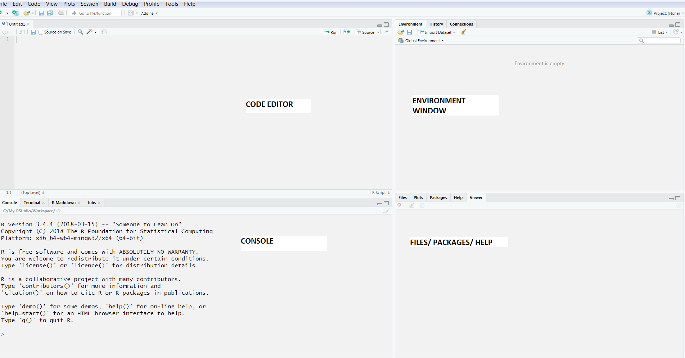

```{r, echo=FALSE}
htmltools::img(src = knitr::image_uri("../Images/LATree.PNG"),
               alt = 'logo', 
               style = 'position:absolute; top:0; right:0; padding:10px; width:200px;')
```

<br>

***

<br>

# General Information

This is an introductory level course for Introduction to R. This course will cover basic concepts and give you the confidence to work independently.

No prior coding or statistical knowledge is assumed.

The course is split into chapters; each chapter will build upon the previous one.

You can see the course overview at the end of this document.

In this course we emphasise the application of skills, and building confidence and resilience in programming in R so that you can continue to learn back at your desk. 

It is essential that you have frequent opportunities to practice what you have learnt from the course. 

***

<br>

# Course Materials

A folder containing the dataset and teaching files for the course will be provided or can be downloaded from the [Learning Hub](https://uksalearning.co.uk/login/index.php) , please download and unzip this to folder you are familiar with.

To unzip the file save it to a location. Right click and choose Unzip file.

The course materials are in several folders:

* Additional Content - Documents etc to support the course.

* Data - contains the data we will use during the course.

* Course Content - Contains the learning Documents which are in html format.

* Pre Course Information - Contains documents with instructions on how prepare for the course.


***

<br>

# File Formats

This course contains documents in the following formats:

* HTML Files
*	CSV Files
* .R files
*	Excel Files

*** 

<br>

# Software Requirements

* R and R studio.

    + _R studio is makes interacting with R much easier_
    

* Web browser.

    + _Internet connection not necessary_
    

*	Excel/Spreadsheet program. 

    + _Viewing csv and xlsx documents in the native program_
    

* Packages we use during this course are

    + tidyverse

    + readxl

    + janitor
    
***

<br>

# Pre-Course Check-list:

* Install R and RStudio on your laptop `(see instructions below)`

* Ensure RStudio can install packages `(see instructions below)`

* Save the data from the ZIP file to your hard drive.
  
* Bring your laptop, charger, and your WIFI connector (contact Learning Academy immediately if you do not have a laptop)

* Please bring with you a water bottle, and a mug for hot drinks (not provided – however you have access to a hot water boiler. Please bring your own supplies) 

* Arrive 10 – 15 minutes before the course starts to get set up and ready to learn

***

<br>

# Install R and R studio


Please follow your departmental instructions for installing R and RStudio. 

Please ensure you leave adequate time for installation as this may vary from department to department.

***

<br>

## Set up R Studio {-}

This is vital for installing the packages we’ll use during the course. Packages are bundles of code and functions that allow you to extend the capability of R.

Your department may have its own rules about how you can download packages. 

Please ensure you’re aware of any local restrictions. For example, within ONS all our packages must be downloaded via an artifactory – you may have to request packages in your department. Please ensure you leave plenty of time before the course to have this actioned.

Packages we use during this course are

* tidyverse

* readxl

* janitor

***

<br>


## Installing Packages

***

### **Open R Studio**{-}

Once installed, RStudio should be accessible from the start menu. Start up RStudio. 
Once running it should look something like:



<br>

If you dont see the **Code editor pane**, go to the tool bar and click **View -> Panes -> Show All Panes**.

***

<br>

### **Find “Console” Pane**{-}

By default the console window will be on the left side of RStudio. Find that pane.

***

<br>

### **Installing Packages**{-}

To installs the packages, type **EXACTLY** the code below in the console and then press `Enter`. 


>**It is important we use this WHOLE line of code every time we install a package.**


```{r warning=FALSE, eval=FALSE}
# Installing packages

install.packages("tidyverse", dependencies = TRUE, type = "win.binary")

install.packages("readxl", dependencies = TRUE, type = "win.binary")

install.packages("janitor", dependencies = TRUE, type = "win.binary")

```

<br>

>**Successful installation should finish with message as below, the last box.**

```{r echo=FALSE, warning=FALSE}
# Installing packages

install.packages("tidyverse", dependencies = TRUE, type = "win.binary")

install.packages("readxl", dependencies = TRUE, type = "win.binary")

install.packages("janitor", dependencies = TRUE, type = "win.binary")

```

***

<br>

# Course Overview

The course is divided into 6 chapters, over the 2 days we will cover,

1. **Chapter One - Getting Started with R**

    * Be familiar with R Studio.
    
    * RStudio environment, layout, and customization.
    
    * Understand the Key Benefits of using R.
    
    * How to run code in R.
    
    * Know where to get help.
    
    * Discover R’s data types.
    
    * Be able to create Variables.

***
    
<br>    
    
2. **Chapter Two - Data Structures**

    * Be familiar with data structures in R.
    
    * Understand how vectors operate.
    
    * Be familiar with lists.
    
    * Be familiar with data frames and tibbles.

***

<br>    
    
    
3. **Chapter Three - Importing and Exporting Data**

    * Organise our work
    
    * Have an understanding of what packages are.
    
    * Be able to load and install a package.
    
    * Be able to check package versions and R version.
    
    * Be able to import data from multiple formats.
    
    * Be able to inspect loaded data and select elements within the data frame.
    
    * Be able to export data.
    
    * Be able to explore data.

***

<br>

4. **Chapter Four - Working with Data frames**


    * Understand the importance of clean variable names.

    * Be able to clean column names using `janitor`or `gsub`.

    * Be able to sort data.

    * Be able to `select` data.

    * Be able to `filter` data.

    * Be able to use the `mutate` function and use the pipe operator.

    * Be able to join data.

***

<br>
    
5. **Chapter Five - Summary Statistics and Aggregation**

    * Describe numeric and categorical data

    * Aggregate and data
    
***    

<br>    
    
6. **Chapter Six - Control Flow and Functions**

    * Be able to use conditional statements: *if*, *else* and *else if*.

    * Be able to use loops: *for* loops and *while* loops.

    * Learn what functions are.

    * Understand why we need to use functions.

    * Be able to write functions.

    * Have a basic understanding of scoping within functions.

***


