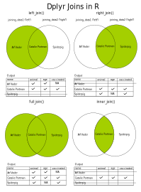

```{r setup, include=FALSE}
knitr::opts_chunk$set(echo = TRUE)
```
```{r, echo=FALSE}
htmltools::img(src = knitr::image_uri("./Images/LATree.PNG"),
               alt = 'logo', 
               style = 'position:absolute; top:0; right:0; padding:10px; width:200px;')
```


# Session Four

## Learning Objectives
**The goals of this session are to:**

* Understand the importance of clean variable names.
* Be able to clean column names using `janitor`or `gsub`.
* Be able to sort data.
* Be able to select data.
* Be able to filter data.
* Be able to use the mutate function and use the pipe operator.
* Be able to join data.

## Exercise {.tabset .tabset-fade}
### **Question**

Before we begin, could you load the packages below into your script,

- `readr`

- `janitor`

- `dplyr`


And then,

- Read in the **schools.csv** and assign it to `school`

- Read in the **joining_data1.csv** and assign it to `joining_data1`

- Read in the **joining_data2.csv** and assign it to `joining_data2`

- Read in the **joining_exercise1.csv** and assign it to `marvel_left`

- Read in the **joining_exercise2.csv** and assign it to `marvel_right`

- Read in the **union_data.csv** and assign it to `union_joined`


### **Show Answer**

```{r echo=TRUE, message=FALSE, warning=FALSE}
# Load libraries

library(readr)
library(janitor)
library(dplyr)


# Read in data

school <- read_csv("Data/schools_data.csv", 
                   na = c("", " ", "NULL"))

joining_data1 <- read_csv("Data/joining_data1.csv") 

joining_data2 <- read_csv("Data/joining_data2.csv") 

marvel_left <- read_csv("Data/joining_exercise1.csv")

marvel_right <- read_csv("Data/joining_exercise2.csv")

union_joined <- read_csv("Data/union_data.csv")


```


## Column Names

In the previous section we looked at reading data into R and also inspecting it. In this section we are going to look at how to manipulate it.

In the previous session we stated that every column in a data frame is a variable and it is good practice to not have spaces within variable names.

This makes it easier for us to call on the variables when we need to use them.


### Example

For example if we wanted to pick the `school name` column from the school dataset. The code below does not work. 

```{r, eval=FALSE}

school$school name

```

To get around this we enclose `school name` with back ticks like the code below (the key above the tab key on left hand side).

```{r, eval=FALSE}

school$`school name`

```

If your column names have spaces and you keep them, you must use backticks.
However its good practise to remove spaces and symbols.


### Cleaning Column Names {.tabset .tabset-fade}

#### `janitor` Package

The `janitor` package offers many functions used to manipulate data, in this session we will use the library to to clean our data set names.

We can clean the names of our dataset with the `clean_names()` function as shown below.


```{r}

# Apply the function to the data set.
school <- clean_names(school)


head(school)

```

`clean_names()` removes spaces, symbols, changes characters to lower case and makes all columns start with letters.

This is the default setting, other options we could use are:

```{r, eval = F}

"snake", "lower_camel", "upper_camel", 

"screaming_snake", "lower_upper", "upper_lower", 

"all_caps", "small_camel", "big_camel", "mixed"

```

Which can be put inside the `clean_names()` function as shown below:
```{r, eval = F}

clean_names("snake")

```


#### `gsub`

We can also do this using the function `gsub()`. `gsub()` here is used on the column names, but can be used on text columns too.

The code below substitues in any instance of the first symbol within the "" with the second set of "".

For example, the output of `gsub(" ", "_", "piece of text")` would be `piece_of_text`.


```{r, eval = F}


# We can apply different substitution to the names of our columns.
names(school) <- gsub(" ", "_", names(school))
names(school) <- gsub("," , "", names(school) )
names(school) <- gsub("-" , "_", names(school))


```

The `tolower()` function changeds a string of characters to lower case.


```{r, eval = F}

# We can lower case the names of the data frame.
names(school) <- tolower(names(school)) 


```

We can also rename column name. The first argument is the data frame to be changed, the second is the column and it's change.

```{r, eval = F}

school <- rename(school, study_programmes_16_19 = study_programmes)

```

We can also use it on full columns.
 
```{r, eval = F}

# This lower cases all records in the column we have chosen.
school$school_name <- tolower(school$school_name) 


```

## `dplyr`

This is one of the most powerful tools in the *tidyverse*, which makes data manipulation simple and code easy to read.

We are going to look at the following concepts,

1. arrange/sort
2. select
3. filter
4. mutate
5. joining data

`dplyr` functions (verbs) all have the same structure.

```{r, eval = F}

# This is the format they follow.
verb(data, more information)


```

```{r}

# Loading the library
library(dplyr)


```

### Arrange

`arrange()` lets you sort data by a variable.

#### Example {.tabset .tabset-fade}

We can sort the column `overall_effectiness` with code below.

```{r}

# We input the data we want to sort, and what we are going to sort it by.
school_sorted <- arrange(.data = school,
                          overall_effectiveness)

# This shows us some of the sorted data.
head(school_sorted$overall_effectiveness, n = 10)

# This shows us some of the unsorted data.
head(school$overall_effectiveness, n = 10)

```

`.data` is the argument name for the data argument in `dplyr`.

It is optional, but can help us read the code more effectivly.

If we don't specify how we are sorting, the default is to sort in ascending order.

To sort in descending order, we use the code below:

```{r}

school_sorted <- arrange(.data = school,   
                          desc(overall_effectiveness))

head(school_sorted$overall_effectiveness, n = 10)

head(school$overall_effectiveness, n = 10)

```

##### **Question**

1. Can you sort the school data set by Ofsted region *and* local authority.

2. Can you sort the school data set by Ofsted region *and* local authority in descending order for both variables.


##### **Show Answer**

Sorting by multiple variables, arranged them within each other. meaning it will sort the data by `ofsted_region` first and then within each region it will sort by local authority.

```{r}

# Sort the school data based on two variables.
school_sorted <- arrange(.data = school,
                          ofsted_region,
                          local_authority)
                          
head(school_sorted, n = 10)

```
To sort both descending order we have to use `desc()` around each column name.

If you only had one `desc` on the `ofsted_region`, it will show Ofsted region in descending order, but local authority in ascending.

```{r}

# Sorting both variables in descending order.
school_sorted <- arrange(.data = school, 
                         desc(ofsted_region),
                         desc(local_authority))
                          

head(school_sorted, n = 10)

```

### Select

The `select()` function lets you pick columns by specifying the column names. Previously we selected columns using the `$` symbol.

#### Example.

We can select the multiple columns using the column names with the code below,

```{r}

# Input which data set and columns.
name_region <- select(.data = school,
                      school_name, ofsted_region)

# Output the variable.
name_region


# We can select as many columns as we like by naming them one by one.
current_rating <- select(.data = school, 
                          school_name,
                          local_authority, 
                          overall_effectiveness)

# Output the variable.
current_rating

```

We can also select the columns using numbers, positive numbers and negative numbers to drop.

For example the code below will select the first 4 columns and then column 7.

```{r}
# We can both use regular sequences with ":" and specific numbers.
select(.data = school, 1:4, 7)
                    
                    
```

In this example we select all columns, except column 2.

```{r}

# The negative indicates which columns we do not want.
select(.data = school, -2)
                    
                    
```

We can also drop columns using the names.

```{r}

# This selects all the columns in "school" except the ones with negative signs.
select(.data = school, -local_authority, -school_name)
                    
                    
```
### Filter

`filter()` selects the rows from the data which meet the condition given. The conditions are specified using logical statements.

Given some variable `x` and `y`.

The logical statements in the language include:

| Symbol | Meaning|   
|:--------:|:----------|
|`x ==  y`     | `x` is exactly equal to `y`|
| `x != y`       | `x` does not equal `y`|
| `x > y`      | `x` is greater than `y`|
| `x >= y`       |`x` is greater than or equal to `y`|
| `x < y` |`x` is less than `y`|
|`x <= y` |`x` is less than or equal to`| 
| `x & y` | ``x` and `y`|
| `!x` | not `x`|
| is.na()| is NA |
|  `x\|y`  | `x` or `y` |

A conditional statement returns `TRUE` if the condition is met.

**Remember that `==` is to test equality and `=` is to assign something.**

#### Example Single Conditional Filtering {.tabset .tabset-fade}
We can filter out a new data set where deprivation index is equal to 1.

This is refered to as single conditional filtering as we only have one condition.

```{r}

deprivation_initial <- filter(.data = school,
                              deprivation_index == 1 )
                    

head(deprivation_initial, n = 10)

```

A quick way to check that the filter worked is to look at all the unique values, in the data set above, using the `unique()` function.

```{r}

unique(deprivation_initial$deprivation_index)    

```

##### **Question**

**Can you create a new data set called `big_schools` by filtering the school data set, to have only the schools which have 2000 or more pupils?**

##### **Show Answer**

In the code below, we are creating a new data set called `big_schools`, by filtering through the school data and picking all the rows where the `total_number_of_pupils` is equal to or greater than `2000`.

```{r}

# Our conditional statement means our new data set will only
# contain data where the condition is TRUE.
big_schools <- filter(.data = school,
                      total_number_of_pupils >= 2000)

big_schools

```
#### Multiple Conditional Filtering {.tabset .tabset-fade}

Just as we can filter by one condition we can also filter by multiple conditions.

**The | (Shift and \) symbol means an OR relationship**

**The & (Shift and 7) symbol indicates an AND relationship**

These are called chaining operators.

##### **Question**

**Can you create a new data set called `mainstream` by filtering the school data set, to have only the schools which are in primary *or* secondary school**

##### **Show Answer**

In the code below, we are creating a newdataset called `mainstream` by filtering the school dataset to have only the schools which are either primary or secondary school, using the `phase_of_education` variable.

```{r}
# The | idicates one condition or the other must be TRUE.
mainstream <- filter(.data = school, 
                      phase_of_education == "Primary" |
                      phase_of_education == "Secondary")

mainstream
 
```

or


```{r}

# A more compact method of looking for a set of specific values.
mainstream_alternative <- filter(.data = school,
                                  phase_of_education %in%
                                  c("Primary", "Secondary"))

mainstream_alternative
```

`%in%` is shorthand for filtering multiple values in a `chr` column.

We have a quick way to check that the filter worked, we can see all the unique values in the data set above. Again, this is done using the `unique()` function.

```{r}

# Returns the set of unique values in the data set.
unique(mainstream$phase_of_education)
  

```

### Mutate

This is one of the most useful commands. Mutate is used to transform variables in your data to create new ones.

#### Example {.tabset .tabset-fade}

We can quickly see the names of our data set columns using the the `names()` function.

We can see that have 19 columns in this data set. We can use the `mutate()` function to create a new column.


```{r}

names(school)

```

The code below creates a new column  called `outstanding` into our dataset. This new column is filled with `TRUE/FALSE` when the condition specified matches `overall_effectiness == 1`.

In this example we have used a conditon, but you could also have mathematical formulas inplace. We can see below that we now have 20 columns.

```{r}

# Fill the new column "outstanding" with TRUE/FALSE when overall_effectiveness == 1.
school <- mutate(.data = school,
                  outstanding = 
                    overall_effectiveness == 1)

head(school$outstanding, n = 10)

names(school)

```


##### **Question**

**Create a new column in the school dataset, called `nursery`. Using the `phase_of_education` when it is equal to nursery *or* the `early_years_provision` is less than 5 years** 

##### **Show Answer**

The code below is using the school data set and creating a new column called `nursery`, which is filled the the multiple condition of `phase_of_education == "Nursery"` or `early_years_provision <= 5`.

```{r}

# Create a new column using multiple conditional statements.
school <- mutate(.data = school,   
                 nursery =   # my new column name 
                   phase_of_education == "Nursery" | # Two conditions combined by the OR operator
                   early_years_provision < 5)

head(school$nursery, n = 10)

names(school)
```

#### Deleting Data

We can also use the `mutate()` function to delete data.

For example, we previously added a new column called `nursery` to our school data set.

We can quickly see the names of our data set using the the `names()` function.

```{r}

names(school)

```
We can delete the column using the code below.

We take the school data set and set equal the column we want to delete to `NULL`.

```{r}

# Setting a column = NULL effectively removes it. 
school <- mutate(.data = school, nursery = NULL)

names(school)

```

Alternatively, this will work too.

```{r, eval = F}

school$nursery <- NULL

```

### The Pipe Operator

`dplyr` makes it easy to combine multiple commands together, to do this we use the *"pipe operator"*.

**`%>%`**

The shortcut is CTL + SHIFT + M

What this does is it takes the output of one statement and makes it an input to the next statement. You can think of it as saying **`and then`**

#### Example{.tabset .tabset-fade}

We can read the code below as:

take the school data set and create a new data set called `school_one` **%>%** *(and then)*

create a new column called `total_number_of_pupils_rounded` which is equal to rounding the total number of pupils  **%>%** *(and then)*

filter the column `phase_of_education` by meeting the condition `secondary`.

Notice how the `mutate()` and `filter()` functions don't use the data argument as it already included in the pipe.

**%>%** allows you to combine multiple commands and the makes the code quite easy to read.


```{r}

school_one <- school %>%
  mutate(total_number_of_pupils_rounded = round(total_number_of_pupils)) %>%
  filter(phase_of_education == "Secondary")

head(school_one, n = 10)

head(school_one$total_number_of_pupils_rounded)

```

##### **Question**

Lets practice piping a few `dplyr` functions.

**Can you use at least 3 `dplyr` commands within a pipe?**

##### **Show Answer**

```{r}

greenwich_schools <- school %>%
               filter(ofsted_region =="London" &
                        local_authority =="Greenwich") %>%
               arrange(desc(total_number_of_pupils)) %>%
               select(school_name,total_number_of_pupils, deprivation_index)

greenwich_schools
```

## Joining Data

Let’s have a look at the two `joining_data` data frames.

In `joining_data1` we have the columns **name, animal and age.**

In `joining_data2` we have the columns **name and vaccinated.**

"Arf Vader" only appears in `joining_data1` and "Spiderpig" only appears in `joining_data2`. The remainder of the animals appear in both data frames.


```{r}

joining_data1

```
```{r}

joining_data2

```

These two data frames have a column in common that we could use to join them on - **name**.

We can create a variety of joins. These are often best demonstrated with a Venn diagram.

I’m going to say that `joining_data1` is my “left” data frame, and that `joining_data2` is my “right” data frame.

For this I’m going to highlight the position of three animal names. As we mentioned earlier:

* "Arf Vader" is only in `joining_data1`, our “left” data frame.

* "Spiderpig" is only in `joining_data2`, our “right” data frame. 

* "Catalie Portman" is in both `joining_data1` and `joining_data2` and will represent values in *BOTH* data frames.



As you can see "left" and "right" merges take the data from that data frame and any matches from the other. 

This means that in our "left":

"Arf Vader" is included because he has data in the "left" data frame. 

"Arf Vader" has missing values for `vaccinated`, as he isn’t in that data frame.

"Catalie Portman" has data in all columns, as she appears in both the "left" and "right".

"Spiderpig" doesn’t have any data in this one. We’re only taking data from the "left", and he’s only in the "right".

Let’s look at how we do this "left" merge in code. We’re going to use `left_join()` and do a "left" join.

```{r}

# The first data frame is the one on the left.
join_left <- left_join(joining_data1, 
                        joining_data2,
                        by = "name")

join_left

```

If you dont specify which column to join by, `R` will look to match by any column that matches.

If we're joining on more than one column we can specify using the parameter `by = c(vector))`.

This is shown below.

```{r, eval=F}

# Joining using multiple columns
join_left <- left_join(joining_data1, joining_data2,
                        by = c("column name", "column name"))

join_left

```

### Exercise{.tabset .tabset-fade}
#### **Question**

Using `marvel_right` and `marvel_left` perform a `full_join()` using the column `name`.

#### **Show Answer**

```{r}

marvel_full_join <- full_join(marvel_left, marvel_right, by = "name")
                                                                          

marvel_full_join
```

### Exercise 2{.tabset .tabset-fade}
#### **Question**

Using `marvel_left` and `marvel_righ`t perform a "left" join.

Join on *BOTH* the column containing `names` and the column containing `years`.

Note that the names of these columns may not be the same in both data frames.

Use the help function to explore solutions to this.

#### **Show Answer**
```{r}
# We can join two columns that are named differently.
marvel_left_join <- left_join(marvel_left, marvel_right, by = c("name", "year"="release_year"))

marvel_left_join
```

### Union Joins

We can also do what is called a union join.

This is where we can add data on to the bottom of an existing data frame.

The `union()` command will merge the data from both data frames but keep only the distinct (unique) rows. That means, any duplicated rows that exist in the target data frames are not going to be brought over to the current data frame.

Union of two data frames in R can be easily achieved by using `merge()` function.

For example we have some new animals to add on to joining_data1, these are contained in the union_joined DataFrame.

```{r}

joining_data1

```
```{r}

union_joined

```


```{r}

my_first_union_join <- merge(joining_data1, union_joined, all = TRUE)

my_first_union_join

```

We can see our new additions - "Andy Warhowl", "Voldetort" and "Repecka" here now.