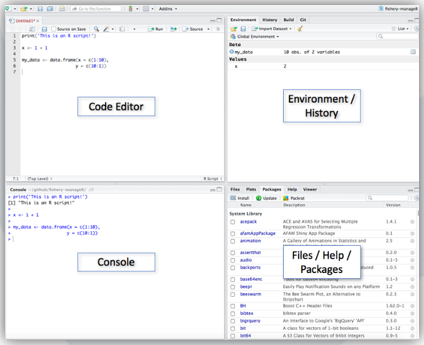
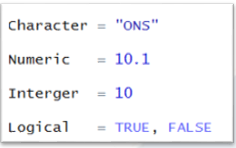

```{r setup, include=FALSE}
knitr::opts_chunk$set(echo = TRUE)
```

  

# Session One.

## Learning Objectives
The goal of this session is to:

* Be familiar with R and R Studio.
* Understand the Key Benefits of using R.
* Know where to get help.
* Discover R's basic data types and structures.
* Creating Variables.

    
## What is R?


R is a programming language, you can use it for statistical analysis, data manipulation and visualiasation.

Why Use R?

* Free and open source.
* Great Community Support.
* Lots of packages available.
* Cross Platform, i.e Windows, Linux, OS.
* R has extensive and powerful graphics abilities.

## Using R Studio




**Code Editor**
  -  This is where you will do the majority of your coding.
  
**Console**
  - This is where calculations take place, you can also code here, but not easy to correct.
  
**Environment/History**
  - This shows the previous code you were working on, any objects, i.e variables, data frames.
  
**Files/Help/Packages**
  - This shows the files, packages and help documentation

For more information about R, you can find the RStudio Cheat Sheet under the Help -> **Cheatsheet.**

***

## The Console

Try out some arimetic in your console;

## Exercise one, Basic Arithmetic {.tabset .tabset-fade .tabset-pills}

### Questions
```{r, eval = F}

25*15

(76 + 94)^3

97623/9

2+4*

23-6; 36*5    
  

```

### Answer
```{r, echo=TRUE, highlight.output=TRUE}

25*15

(76 + 94)^3

97623/9
```
Note that if a "+" appears instead of the command prompt, this means that the statement you submitted was incomplete. For example, it might be missing a closing bracket.

A semi colon allows multiple commands to be entered on the same line before processing.

## The Code Editor

A script is just a plain text file which we write our code in.

You can type code and save it for later.

You can add comments to your code using #. R will ignore anything to the right of the # symbol.

Create a new script, choose a sensible name (e.g. intro.R)

Try out some arithmetic as before.

This time around to run the code you need to select the section you want to run and then press CTRL + ENTER.

***
## The Environment Window

Shows all the objects that you have created or working with.

we can assign these objects names, this is called a variable.

They are used to store data and can be changed according to your need.

Once an object has been created it will appear in your Environment window which helps you keep track of what objects you have in your current workspace

we assign variables using the assignemt operator,(short cut is ALT + MINUS)

Assigning a variable provides no output. To see the variable, you need to call it.

### Excerise 2. Creating Variables

```{r}
myVariable <-1+3

another_variable <- 2*4


```

A note on Variable Names:
Choosing variable names is one of the most difficult bits of programming; choose something that that is descriptive, recognisable. 
*camelCase vs. snake_case*
It doesn't really matter which you use, just be consistent.
Can not start with a number.
R is case sensitive!

***

## Help

Working with R chances are you are going to get stuck at some point and will need help, these are some of the resources available.

- **Cheat Sheets**

You can access thes by clicking on **Help** and then **Cheetsheets**.

- **R Documentation **

By typing in the search box, you can also use the console to access help.Try and type the command below in the console.

```{r, eval=FALSE, message=FALSE, warning=FALSE, include=FALSE}

?vector or help(vector)

?list or help(list)

```

- **Stack Overflow**

Great site to check if anyone has has a simmilar problem to you, and see how they got around it.

- **Yammer**

Within Ons we have 2 groups on Yammer, the **R User Group** which you can post any issues you are facing and people will suggests solutions and the **Coding in the Kitchen** group which is used to share tips and best practice.


## Data Types/Classes
To get the best out of R, you will need to have a strong understanding of the basic data types and structures and how to operate on them.

Different processes apply to different types of data.

Different Types have different properties; if you try to add 1 + "two", you will get an error due to a mismatch of data types.

Some of R basic data types are;

- **Characters/text**
needs to surrounded in single `''` or double quotes `""`, that how R understands its a character.

- **Numeric**


- **Interger**
Whole numbers with no decimal place, they are denoted in R by an L at the end of the number.

- **Logical,(also know as Booleans)**
have to be capital letters or can be abbreviated to T or F
They are special R data types - not strings! So they don't need '' or "" around them.

They also have numerical value behind them - TRUE is 1 and FALSE is 0.





## Examples of Data Types {.tabset .tabset-fade .tabset-pills}

### Code
```{r}

a <- "ten"

b <- 10L

c <- 10

d <- TRUE


```


### Result
```{r}
class(a)

class(b)

class(c)

class(d)


```

***

## Data Structures
We dont work with single data values, we often work with a combination or collection of data.

R organises these in certain structures.

This is how R stores data in a way that we manipulate and work with it.

some of R data structures are;

- **Vector**

- **Matrix**

- **List**

- **Dataframe**

***
## Examples of Data Structures {.tabset .tabset-fade .tabset-pills}

### Vector

```{r}
Numerical_Vector <- c(1,2,3,4,5,6,7,8,9,10)

Logical_Vector <- c(TRUE, FALSE, TRUE, FALSE, TRUE, FALSE)

Character_Vector <- c("Cardiff", "Newport", "Bristol")


```
one column/row data of the same type/class


### Matrix

```{r}

matrix (c(3:14), nrow = 4, byrow = TRUE)


```
multiple columns and rows of data, same type/class 

### List

```{r}

list(1,2,3,4, "two")

list("ONS", 10, TRUE)


```
one column/row, different data types/classes


### Dataframe

```{r}

mtcars

```

multiple columns/rows of data, multiple types/classes.

combination of vectors

***

## Operators In R {.tabset .tabset-fade .tabset-pills}

### Numerical Operators

Operator   | Description
:---------:|:------------:
     +     | Addition
     -     | Subtraction
     *     | Multiplication
     /     | Division
  ^ or **  | Exponents

### Logical Operators

Logical Operator| Description
:--------------:|:------------:
        <       | Less Than
       <=       | Less Than or Equal To
       \>       | Greater Than
       >=       | Greater Than or Equal To
    == or **    | Equal To
       !=       | Not Equal To
       \|       | Or
        &       | And    

