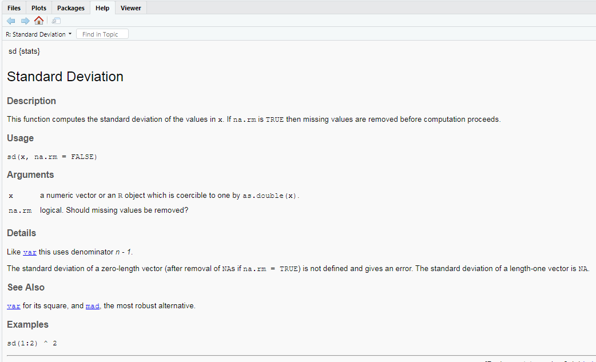

```{r setup, include=FALSE}
knitr::opts_chunk$set(echo = TRUE)
```
```{r, echo=FALSE}
htmltools::img(src = knitr::image_uri("./Images/LATree.PNG"),
               alt = 'logo', 
               style = 'position:absolute; top:0; right:0; padding:10px; width:200px;')
```


# SESSION SIX.

## LEARNING OBJECTIVES

**The goal of this session is to:**

* Be able to use conditional statements, i.e, if, else and elseif statements

* Be able to use loops, i.e for loops and while loops

* Know what functions are.

* Understand why we need to use functions.

* Be able to write functions.

* Have a basic understanding of scoping within functions.


## CONDITIONAL STATEMENTS.

A conditional statement will check if a condition is TRUE or FALSE.

So if our data meets this criteria apply this action or function otherwise do nothing.

Useful if we want a function to run only data means a certain condition, this is termed `control flow`.

We use comparison and logical operators.

### Comparison Operators

| Operator | Description | 
| ------ |:------:| 
|   ==   | equal to | 
|  !=    | not equal to |   
| <      | less than|
| >      | greater than |
| <=     | less than or eaqual to|
| >=     | greater than or equal to|

### Logical Operators

| Operator| Description| 
| ------  |:------:| 
|   &     | And | 
|   \|    | Or |
|    !    | Not|


You might want an action to be perfomed depending on the outcome, to be able to do this in R, we use the;

- if statement

- else statement

- elseif statement

### IF statement

They follow the basic structure below,


```{r, eval=FALSE}

If (logical condition){
  
Commands
  
}

```

- So, `if` followed by round brackets, in which we enter our logical condition 

- then curly brackets in which we enter a series of commands. Its good practice to put the commands on a new line as its easier to read, notice the code is also indented so we can see that its part of the if statement.

`If statements` on their own do not work with vectorised arguments. They will only work with a single element and not a vector of elements. If applied to a vector it will only check the first obersevation, if this doesnt meet the condtion then no statements will be executed, you will get an error/warning.

#### **Example**

We can look at the example below, lets say we set our `height` as 6.

Our condition is `height is equal to 6`

Our Command is if `height is equal to 6` to `print me too`

```{r}

height <- 6

if(height == 6){
  
  print("me too!")
  
}

```
### ELSE Statement

It has to be used together with an `if statement`.

The `else statement` does not require a condition; the code of an else statement gets executed when ever the result of an `if statement` is False.

They follow the basic structure below,

```{r, eval=FALSE}

If (logical condition){
  
Commands
  
}else{
  
  New command
  }

```

All we have added is else and an additional commands.
Else has to be on the same line as the closing bracket or else wont work.

#### **Example**

Going back to our previous example in which we said `height <-6`.

We can add an else statement.

This will get executed if the `height` is not equal to 6.

So lets say `height` is now equal to 7.

The first condition is FALSE (height ==6 ), hence it executes the else statement.


```{r}

height <- 7

if(height == 6){
  
  print("me too!")
  
}else{
  
  print("Not my height")
  
  }

```
### ELSE IF

This allows you to further customise your control flow. With `else if`, you can add as many conditions as we want.

The else if statement specifies a new condition if the first condition is false.

Keep in mind that R ignores the remainder of the control structure once a condition has been found that is TRUE and the corresponding expressions have been executed.

They follow the basic structure below,

it’s important that the else if keyword comes on the same line as the closing bracket of the previous part of the control structure.

```{r, eval=FALSE}

If (logical condition){
  
Commands- executed if logical condition is true
  
}else if( second condition) {
  
  commands- executed if the logical condition is false and second condtion is true
  
}else if (third condition){
  
  commands- executed if logical condition and second condition are false
  
} else {
  
  commands- executed when all conditions are false
}

```

#### **Example**
```{r}

height <- 9

if (height == 6){
  
  print("me too!, my height is 6")
  
}else if( height == 7) { 
  
  print("me too!, my height is 7")
 
}else if (height == 8){
  
  print("me too!, my height is 8")
  
}else {
  
  print("Not my height")
  
}

```

#### **Exercise**{.tabset .tabset-fade}

##### **Question**

Now lets try and practise.

can you write an `else if` statement, that looks at `grades`

It should class grades 

- between 0 and 40 as failed.

- between 41 and 50 a D

- between 51 and 60 as C

- between 61 and 70 as B

- between 71 and 100 as an A

It should also print the grade and an optional comment on the grade.

##### **Show Answer**

```{r}
grade <- c(56)

if (grade <= 40 & grade >=0){
  
  print("You have absolutely Failed!!")
  
  print("We are really sorry for you")
  
}else if (grade <= 50 & grade >=41){
  
  print("You have got a D")
  
  print("Need to work harder")
  
}else if (grade <= 60 & grade >=51){
  
  print("You have got a C")
  
  print("Not bad, can do better")
  
}else if(grade <= 70 & grade >=61){
  
  print("You have got a B")
  
  print("Well done")
  
}else if (grade >= 71 & grade <=100){
  
  print("You have got an A")
  
  print("Congratulations, this is excellent")
  
} else {
  
  print("Error, grades can not be less than 0 or more than 100")
  
  }


```


## LOOPS

A loop is a way to repeat a sequence of instructions under certain conditions. 

They allow you to automate parts of your code that are in need of repetition.

In R you have multiple options when repeating calculations, `vectorized operations`, `for loops`, and `apply functions`.

We covered 'vectorized operations` in session 2 (section 1.4), we will look at loops in session and we will not cover the apply functions.

### Types of loops
 
 We are going to look at `for loops` and `while loops`.

- For loops

- While loops


#### For loops {.tabset .tabset-fade}

These are the most common types.

They follow the basic structure below,

```{r, eval=FALSE}

for (Variable in Vector){
  
  commands
}


```
 
- So we start with the word `for`

- followed by `()` brackets where we specify an index variable, `i` is commonly used but it can be anything that you want.

- then the word `in`

- then specify a vector

- followed by `{}` curly brackets which will have our commands which could be multiple lines of code.

lets look at an example.

Lets start by creating a vector, I have created one with **even numbers from 2 to 10**.


```{r}

example_vector <- c( 2,4,6,8,10 )

```

We will now run our `for loop` on our vector.

```{r}


for( i in example_vector ){
  
  print( i + 1 )
  
}

```

So our index variable is `i`, our vector is `example_vector` and then our command is to add `1`.

So the first time the loop runs **(Iteration)** the index variable `i` was assigned to our first number in our vector `2` and since our command is add a 1, we get a result of 3.

An **iteration** is a single run through lines of code contained in a loop

So the second time the loop runs the index variable `i` is assigned to the second number in our vector `4` and this adds a 1, we get a result of 5.

This will continue until the command has been run into all elements of the vector.

we cant really use our put like this as it just prints to the console, if we wanted to save our output into something we wanted to use. We could assign it.

```{r, eval=FALSE}

for( i in example_vector ){
  
  odd_numbers <- append(odd_numbers, i + 1 )
  
}

odd_numbers

```

The code above will not work as odd_numbers does not exist outside the brackets **We will look at this under function scoping below **, to solve this issue we create an empty vector, called `odd_numbers` and we add our results into in using the `append function`.

**append() function simply adds elements to a vector.**.

```{r}

odd_numbers <- c()

for( i in example_vector ){
  
  odd_numbers <- append(odd_numbers, i + 1 )
  
}

odd_numbers

```


#### While loops{.tabset .tabset-fade}

The main difference between the while loops and the for loops is that we dont specify the number of iterations in the loop.

We want the loop to keep running until a specified condition is met.

They follow the basic structure below,

```{r, eval=FALSE}

while (logical condition){
  
  commands
  
}


```
- So, stat with the word `while`

- followed by the `()` brackets in which we specify our logical condition, using the **conditional operators**.

- and then `{}`, which hold our commands. These commands will be run repeatedly in order of appearance while the specified condtion is TRUE.

lets look at an example,

- If we say `x` is equal to 2.

- and we set out condtion to be `x < 6`

- then print `x`

- and then `add a 1`

```{r}

x <- 2

while(x<6){
  
  print(x)
  
  x <- x+1
  
}


```

- so we know that starting value is `2`. ( As set by `x <- 2` ).

- the first thing the loop does it to test it against the condition `x<6`

- in our case x is `2` which is less than `6`, so the condtition is `TRUE`

- So we can move on to the next part of the loop, which is `print x` which is equal to `2`. (This is our first 2 in the output)

- The next step is to override the value of x by adding a 1. **(x <- x+1 )**

- As our new x value is still less than 6, the condition is TRUE, so it will print x which is now 3 and get a new value for x (x <- x+1), which will now be 4.

- This continues like this until we get to x is 5, this passes the fist conditional statement `x<6` so it will print a 5 but after we add the 1 `x <- x+1 ` and x becomes 6, it is not less than 6, so it fails the first conditional statement and the loop can not continue, hence our results are between 2-5.


**The order of the commands is important.**

##### **Question**

- Can you work out what the ouput would be if we reversed the order of the commands?. i.e, start with the  `y <- y+1` and then `print x`

- What would happen if we removed the line of code `y <- y+1`

```{r, eval=FALSE}

y <- 2

while(y<6){
  
  y <- y+1
  
  print(y)
  
}


```


##### **Show Answer**

```{r}

y <- 2

while(y<6){
  
  y <- y+1
  
  print(y)
  
}


```
- As we can see we now get values between 3 and 5.

- So we start we with y is equal to 2, which passes the first condition `y<6`

- We then add a 1 to it `y <- y+1`, so 2 + 1. Which is equal to 3.

- Our fist output is 3

- And that continues on.

-For the next question, if we removed the code `y <- y+1` y would always be less than 6 and you will be stuck in an infinite loop, as R will keep running the code. You will have to hit the stop sign to exit the loop.

#### Exercise loops{.tabset .tabset-fade}


##### **Question**

Code a while loop with the following characteristics:

- The condition of the `while` loop, should check if the temperature is hiegher than 20

- The first command in the body should print out `"Its way too hot!"`

- The next command should decrease the `temperature` by 2 and assign this new value to `temperature` again.

##### **Show Answer**

```{r}
temperature <- 40

# Code the while loop
while (temperature > 20) {
  
  print("It way too hot!")
  
  temperature <- temperature - 2
  
}

# Print out the temperature variable
temperature

```

##### **Question**

We can combile a `loop` and and `if else statement`.

create a vector, with values from 1-7 and assign it to number_of_takeaways_ordered 

create a for loop with an if and else statement shows that if you order more than 2 takeaways a week it print too many and if you order less than two it prints enough.

##### **Show Answer**

```{r}

number_of_takeaways_ordered <-c(1,2,3,4,5,6,7)

for (i in number_of_takeaways_ordered){
  
  if (i > 3){
    
    print("too many")
    
  }else{
    
  print("enough")
    
  }
  
  print(i)
  
}

```
##### **Question**

Can you write an loop with a if and else statement, that prints out numbers from 1 to 30.

But for multiples of 3 print `fizz` instead of the number

For multiples of 5 print `Buzz`

And for multiples of both 3 and 5, print `fizzBuzz`

##### **Show Answer**

```{r, eval=FALSE}

for (i in 1:30){
  
  if(i%%3 == 0 & i%%5 == 0) {
    print('FizzBuzz')
  }
  else if(i%%3 == 0) {
    print('Fizz')
  }
  else if (i%%5 == 0){
    print('Buzz')
  }
  else {
    print(i)
  }
  
}

```

first thing we do is create the index.

```{r}

for (i in 1:30){
  
print (i)
  
}

```

We then need to find the multiples of 3, we will use the `%%` modulo operator, which returns the remainder of a division.

If a number is a multiple of another number it will return a 0.

The code below, will divide the numbers between 1 and 30 by 3 and if the result is 0, it will print `fizz` and if not print the number.

```{r}

for (i in 1:30){
  
  if (i %% 3 == 0){
    
    print ("Fizz")}else
      
      print(i)
  
}

```

Simmilary for the multiples of 5, the code below will divide the numbers between 1 and 30 by 5 and if the result is 0, it will print `Buzz` and if not the number.

```{r}

for (i in 1:30){
  
  if (i %% 5 == 0){
    
    print ("Buzz")}else
      
      print(i)
}

```

Now for the `fizzbuzz` 

We need to have the if statement to check if `i` is multiple of 3 and 5 before it checks them individually.

If it is a multiple of 3 and 5, the loop will reset and go to the next value in the range .

If not it will try 5 and then 3.

If none are multiples of `i` it will print `i` and go on to the next value in the range until the end.

```{r}

for (i in 1:30){
  
  if(i%%3 == 0 & i%%5 == 0) {
    print('FizzBuzz')
  }
  else if(i%%3 == 0) {
    print('Fizz')
  }
  else if (i%%5 == 0){
    print('Buzz')
  }
  else {
    print(i)
  }
  
}

```

## FUNCTIONS

We have previously used preset functions (from Base R or from packages) In R already, e.g `excel_sheets()`, `help()`,`merge()`,`clean_names()`, we are now going to look at creating our own functions,which we call **user defined functions**.

We can see that basically a function takes and **input**, perfoms some **commands** and produces an **output**.

### Why we use functions

- They make code shorter and easier to understand.

- Make it easier to update code, as only need to change one place

- Helps reduce errors caused from copied and pasted code.

### Basic Structure of a function

Basic structure of a function looks like below,

```{r, eval=FALSE}

function_name <- function(input){
  
  statements of what the function is doing
  
}


```
So, it will have a;

- `function name`

- `Parameters/Arguments/Inputs` 

- `Function body`


### Function Name

Always good practise for the function name to be what the function going to do, should be short.

It can be any valid variable name. This is assigned by the assignment operator and for R to know its a function you need to use word `function` as above.

### Inputs/Parameters/Arguments

These are the inputs of a function, these are set in the `()` brackets, sometimes referred to as `arguments` or `parameters`.
These can be any R object, data frames, numbers etc, separated by commas.

The statements in the body are indented by two spaces, which makes the code easier to read but does not affect how the code operates.

**Arguments are optional; that is, a function may contain no arguments, we will look at an example.** 

**Some arguments have default values specified, we will look at an example.**


### Function body
 These are statements of what you want a function to do, they are set in the curly brackets. This can be long or short, its ideal for a function to do only one thing.
 
 Variables created within the function body do not exist outside it.

### Examples{.tabset .tabset-fade}

#### **Function with no Arguments**

```{r}

#Creating a function

sayHello <-  function(){
  
  print("Hello there !")
  
}


#Calling a function

sayHello()

```

Once we run our function, it gets created in the environment window ready for us to use it, to use it, termed **calling a function**

We simply just type it.

As this function has no inputs, we dont need to specify anything within the brackets.

#### **Function with a default value**

If you remember form the previous session where we talked about getting summary statistics, where we calculated the`Standard deviation`, from the `school` dataset from the `total number of pupils`.

We used the `sd()` function, in which our input was the `total number of pupils`, we had another input which was `na.rm = TRUE`. (removed missing values from the calculation.)

```{r, eval=FALSE}


sd(school$total_number_of_pupils, na.rm = TRUE)


```

If we look at the `sd()` function in detail.

```{r, eval=F}

?sd

```




We can see that in the usage, it states that,

```{r, eval=F}

sd(x, na.rm = FALSE)

```

The function has 2 arguments, `x` and `na.rm = FALSE`

- So `x` needs to be defined by us.

- But `na.rm = FALSE`, Already has a value specified. Not including this argument when using the function wont cause an error.

We can do this for our user defined functions too, using the basic structure below,

```{r, eval=FALSE}

function_name <- function(first_argument, second_argument = a_defined_value){
  
  statements of what the function is doing
  
}

```

Looking our example below, 

- we have created our function `function_with_default_value`

- our arguments are `x` and `xlabel1= "I am adding my X label here"`, which i have already predefined. so where ever I state `xlabel1` i will get "I am adding my X label here"`

- I have added a print command for `x`

- And then a `hist` function which prints a histogram, on `x` and uses the default value, for the `xlab`

- I have then called the function on R's default dataset `iris` using the `Sepal.Length` column.

```{r}

function_with_default_value <- function(x, xlabel1= "I am adding my X label here"){
  
    print(summary(x))
  
    hist(x, xlab = xlabel1)
   
  }
  
function_with_default_value(iris$Sepal.Length)

```


#### **Mode function example**

If you remember form the previous session on summary statistics, we said there is no function for calculating the mode in, you would to have either use a package or create your own function.

Notice that we're using capital M to avoid overwriting the base R `mode() function`


```{r, eval=F}

Mode <- function(x) {  # name the function, function has on paramater (x)
  
  unique_values <- na.omit(unique(x) ) # find the unique values of x - omiting missing
  
  table_with_frequency <- tabulate(match(x, table_with_frequency)) # create a table with the frequency
  
  maximum_value <- unique_values[which.max(table_with_frequency)]
  
  return(maximum_value) # return the max value
}


#creating a vector

test_vector <- c(1,1,1,1,2,2,3,4,5)

#Calling our function on the vector

Mode(test_vector)

```
### Exercise {.tabset .tabset-fade}

#### **Question**

If we remember the exercise  we did with the loop which prints `fizz`, `Buzz` and `FizzBuzz`.

We could alternatively write a function.

Can you write a function, that will take an numerical input, i.e a vector of numbers from 1 to 30.

But for multiples of 3 print fizz instead of the number

For multiples of 5 print Buzz

And for multiples of both 3 and 5, print fizzBuzz


#### **Show Answer**

```{r}

# define the function
fizz_buzz <- function(number_sequence_f){
  if(number_sequence_f%%3 == 0 & number_sequence_f%%5 == 0) {
    print('FizzBuzz')
  }
  else if(number_sequence_f%%3 == 0) {
    print('Fizz')
  }
  else if (number_sequence_f%%5 == 0){
    print('Buzz')
  }
  else {
    print(number_sequence_f)
  }
  
}

#Create a vector

vector_to_test_function <- 1:30

#Apply it to our vectors

sapply (vector_to_test_function, fizz_buzz)


```


### Function Scoping

Simmilar to the loops in the session above, where we said, `odd_numbers` does not exist outside the function.

```
for( i in example_vector ){

  odd_numbers <- append(odd_numbers, i + 1 )
  
}

odd_numbers

```

function scoping implies that variables defined inside the function do not exist outside it, i.e Variables created inside the function are local to that function and NOT visible outside of the function.

When we write and run a function, R creates a new, temporary environment for the function.
The function environment is temporary and stops existing after the function is run.

### Example

Lets look at an example.

If you run the code below, it will return an error stating that object z is not defined, even though we have defined within the function as `z <- 5`

```{r, eval=FALSE}

scope_example <- function(){
  
  z <- 5
  
  return(z)
}

z

```

### Exercise {.tabset .tabset-fade}

#### **Question**

What would you expect the function below to return?


```{r, eval=FALSE}

#Creating function which adds 1 to x

add_one <- function(x) {
  
  x <- 1+x
  
  x
}

#creating a vector

y <- c(1,2,3)

#Calling the function on our vector

add_one(y)

```

#### **Show Answer**

```{r}

#Creating function which adds 1 to x

add_one <- function(x) {
  
  x <- 1+x
  
  x
}

#creating a vector

y <- c(1,2,3)

#Calling the function on our vector

add_one(y)

z <- add_one(y)

```

We can see that our function returns the same values for the vector `y` 

as `x` was defined inside the add_one function and therefore it is not accessible outside of that function

## SUMMARY

We have looked at lot in this session, You should now be;

* **Be able to use conditional statements, i.e, if, else and elseif statements**

* **Be able to use loops, i.e for loops and while loops**

* **Know what functions are.**

* **Understand why we need to use functions.**

* **Be able to write functions.**

* **Have a basic understanding of scoping within functions.**

