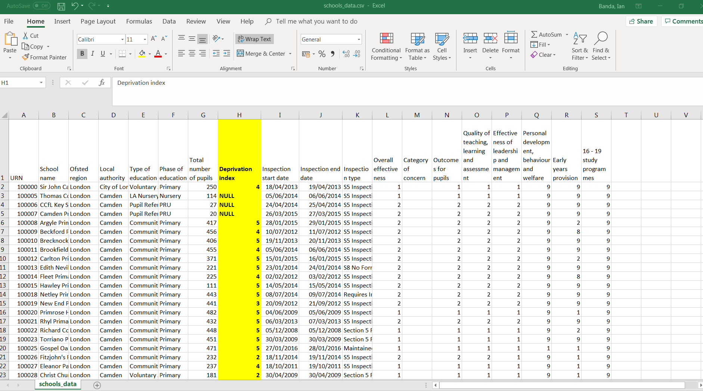

```{r setup, include=FALSE}
knitr::opts_chunk$set(echo = TRUE)
```
```{r, echo=FALSE}
htmltools::img(src = knitr::image_uri("./Images/LATree.PNG"),
               alt = 'logo', 
               style = 'position:absolute; top:0; right:0; padding:10px; width:200px;')
```


# Session Three.

## Learning Objectives
**The goal of this session is to:**

* Have an understanding of what packages are.
* Be able to load and install a package.
* Be able to check package versions and R version.
* Be able to import data from multiple formarts.
* Be able to inspect loaded data and select elements within the dataframe.
* Be able to export data.


## Projects{.tabset .tabset-fade}

### Non-Ons {-}

It’s highly recommended to manage your R work in projects. When you’re starting work on a new project, choose ‘New project…’ from the File menu and ‘New Directory’ to create a directory for the project (probably on your OneDrive). If you already have data related to the project in an existing diretory, you can choose that option instead.

To work on this project in the future, you can select ‘Open Project…’ or ‘Recent Projects’ from the File menu and browse to the desired project.

This will ensure that your working directory will be set to the project folder, meaning you won’t have to worry about full file paths for data you are reading in or writing to that same folder

### ONS {-}

Within Ons, R default working directory is within the `C` drive. 

**C drive -> My_RStudio -> Workspace**

It is good practice to organise your folders. 

As the example below, where you include all files to a project in the same folder `Project A`


Within the folder, its good practice to further organise your files in folders, as example below,

Data folder would contain your raw and processed data.

Images would contains any photos you are using.

Scripts would contain all the R files. You dont have to stick with this exact folder structure, you could add in additional folders. e.g an output folder. 


## Packages

Our default R installation – often referred to as “base R” gives us a lot of functionality.

A lot of this code has been around since R’s early days, back in 1993. However, if we want to do more complicated, newer or exciting things with our code we can install packages.

Packages are a collection of functions, compiled code and sometimes data sets which are stored in a “library” of code within R.

In order to use a package, we first need to download it.  
R installs packages from (CRAN)[ https://cran.r-project.org/] – The Comprehensive R Network.

Your department may have a slightly different way of installing packages.
R has over 15,000 packages on CRAN, so it would be impossible to have them all downloaded to your machine. You can also install packages that are not part of CRAN; but please be aware of the source and quality, like any software these can damage your machine if they are malicious.

***

## ONS Note!

Within ONS we use a mirrored version of CRAN called Artifactory. Behind the scenes our R installation is set to install from Artifcactory rather than CRAN. 

This requires our up to date windows username and password. Without this the package will not install. This is why it’s important for ONS staff to make sure their password is up to date in either your settings or your .RProfile.

## Installing Packages {.tabset .tabset-fade .tabset-pills}

To install a package, we use the code below;


```{r, eval = F}

install.packages(“package_name” , dependencies = TRUE, type = “win.binary”)

```


### Question {-}

Try installing the packages below;

“readr”

“readxl”
 
“dplyr”

“janitor”

“ggplot2”

**Run them line by line – this makes it easy to spot any error messages.**


### Show Answer {-}

```{r, eval = F}

install.packages("readr", dependencies = TRUE, type = "win.binary")

install.packages("readxl", dependencies = TRUE, type = "win.binary")

install.packages("dplyr", dependencies = TRUE, type = "win.binary")

install.packages("janitor", dependencies = TRUE, type = "win.binary")

install.packages("ggplot2", dependencies = TRUE, type = "win.binary")


```

Successful installation should finish with message as below.

```{r echo=FALSE}

install.packages("readr", dependencies = TRUE, type = "win.binary")


```


## Loading Packages {.tabset .tabset-fade}

If you think of packages as owning a book. You purchase (install) the book once, and after that when you need to reference it you can pick it off your bookshelf. In R we call this loading.
**You should always load packages at the top of your script.**

To load a package, use the code below;

```{r eval=FALSE}

library (readr)

```

Note here there are no quotes around the package name.

### Question {-}

Try loading the packages below;

readr

readxl

### Show Answer {-}

```{r, eval = F}

library(readr)

library(readxl)

```

## When to load specific packages
Returning to our book analogy not all of the books you own are relevant to your project. If you’re working on a gardening project a cookbook isn’t very helpful and you wouldn’t use it. It’s exactly the same for your R project.
We’re not using ggplot2, dplyr or janitor in these sessions so we’ll not load them in to this session yet.

##  R and Package Versions {.tabset .tabset-fade}
You may get a message that says
package ‘readr’ was built under R version 3.4.4 

This means that we are using an older version of R than the one the package is built for.


### Check R Version{-}
We can check our R Version by running the command 
version
in the console.

```{r}

version

```


I am running version 3.4.4, dont worry if you are running an older version.

Most packages are fully backwards compatible, so this is something to be aware of but we need to worry about it too much.


### Check Package Version{-}
To check the version of a package you can type


```{r}

packageVersion("dplyr")


```

You should always check if you’re working collaboratively that you’re using the same versions of packages for reproducibility.

### Masked Objects{-}

```{r}

library(dplyr)


```

Some packages overwrite or “mask” functions from other existing packages.

The filter function from stats deals with Linear Filtering on a Time Series

Dplyr’s version of filter selects rows based on specific conditions.

As you can imagine these both take very different parameters – so it’s important to know that after we’ve loaded the Dplyr package it will assume we want to use the dplyr version of filter – NOT the one from the stats package.


## Importing Data 

We are going to practise loading data using the `readr` and `readxl` packages.

`readr` is for flat files, csv

`readxl` is for excel Files.

### Readr {-}

Its provides a fast and friendly way to read  data, csv, tsv formats, it converts it into tibbles.

For this section we are going to use the read_csv function, note that there other functions like read_tsv(), read_delim(). They are very similar, once you know you can the other ones easily.


Before loading your data you need to know where it is stored and what kind of file it.

Another thing you need to consider is if there is missing values in the data. Missing values in R are denoted by `na`.


### Importing CSV Files {-}

To load a csv file we use the code below,

```{r eval=FALSE}

dataframe_name <- read_csv("file_path")

```

The first thing you need to specify is the file path (where the file is stored).

**File paths In R**

In windows, file paths are specified using back slashes.
Since in R a backslash already has a meaning, we use a forward slash or two back slashes instead.

**Things To Keep in Mind**

Readr will assume that the first row of your data are the headings of the columns.

Readr will automatically try and guess the data types in your columns , i.e if a column has only numerical data, it will be classed as numeric or if it only contains logical values it will be classed as logical, if they don’t match then it keeps it as characters.

Also good practise to check your column data types, just incase R didn’t guess it correctly.

#### Example {.tabset .tabset-fade}

load the schools data using the code below,

You will need to change the file path to your location

You will have noticed that we had some parsing failures after reading the file in.

```{r}

#install.packages("readr", dependencies = TRUE, type = "win.binary")

#library(readr)

#school <- read_csv("Data/schools_data.csv")

getwd()


```
To look at the data in R we use the `View` command as below

```{r eval=FALSE}


View(dataframe_name)


```
```{r}


#View(school)


```

##### Question {-}

If you could have a look at the column in `Deprivation index` in your excel file.

**what type of data is this column?**

**Then `View` the column in R see the data type are has set to be.**

##### Show Answer {-}

The data is numeric data.




```{r}


#View(school)


```

We can see that R has classes the column as character because of the `NULL`

We can easily correct this by adding an additional arguement when the reading the data to specify that `NULL` Is a missing value.


```{r eval=FALSE}
library(readr)

school <- read_csv("Data/schools_data.csv",
                   na=c("", " ", "NULL"))


```

### Readxl.{-}

We use readxl to read excel data into R, it will support both `.xls` and `.xlsx` formats.

### Importing Excel Files {.tabset .tabset-fade}

To load an excel file we use the code below,

```{r eval=FALSE}

dataframe_name <- read_excel("file_path")

```  

One handy thing to know is the `excel_sheets()` function.

As excel files often have multiple sheets, this function will provide the names without having to open the file.

We run this function with the code below.

```{r eval=FALSE}

excel_sheets("filePath")

```


#### Question{-}

Read in the excel file Police data.

Use the `excel sheets` function to see the names of the sheets in the police data.


#### Show answer{-}

```{r eval=FALSE}

library(readxl)

police_data <- read_excel("Data/police_data.xlsx")

excel_sheets("Data/police_data.xlsx")

```

#### Question{-}

After reading in the file our data should look like this.


This is the first sheet in our excel which is just the notes.

If we dont specify the default setting from readxl is to give us the first sheet.

**Can you add an additional arguement in the read_excel funtion to read in the second sheet (Table P1) from the police data.**


#### Show Answer{-}

Alternatively you could use the name of the rather than the number. 

This would be useful if you have alot of sheets.

```{r, eval=FALSE}

library(readxl)

police_data <- read_excel("Data/police_data.xlsx",
                      sheet=2)

```
#### Question{-}

Our file should now look like this,


As we can see the top columns are mostly blank with no real significant data, to get around this we can add in a range of column and rows that have the data we want to analyse.

**Can you add an addtional arguement in the read_excel function to read the second sheet(Table P1), and have the row4 as the column headings from the police data.**


#### Show Answer{-}

```{r, eval=FALSE}

library(readxl)

police_data <- read_excel("Data/police_data.xlsx",
                      sheet=2, range = "A5:AA48")

```
### Reading Url Files{-}

You can also read in URLs too, see code below;

                   
```{r eval=FALSE}

library(readr)

#school <- read_csv(url("https://share.sp.ons.statistics.gov.uk/sites/KLC/LeAc/AnLe/CPD_Shared/Programming_Courses/R_Intro_Ruth/schools_inspection_data.csv"),
                  # na=c("", " ", "NULL"))

```                   

## Exploring the Data.{.tabset .tabset-fade}

After the files have been imported in R, its good practise to inspect it.

we can do this by typing the commands below,

**Have a play around with them and see if you can figure out what they are doing.**

### Functions {-}

```{r eval=FALSE}

library(dplyr)

str(school)

glimpse(school)  

head(school) 

tail(school) 

dim(school) 

school[1,1] 

school[3:6, ] 


```

### Show Answer {-}

```{r eval=FALSE}

library(dplyr)

str(school) # Structure of the table

glimpse(school)  # Similar to str - from dplyr package

#View(school)  # Pops file into a Viewer.

head(school) #top of the table

tail(school) #bottom of the table

dim(school) #dimensions

#selecting elements

school[1,1] #selecting the first row and column

school[3:6, ] #selescting row 3 to 6 and all columns


```
## Exporting Data.

Exporting tables works in much  in the same way.

**write_csv(data_frame, "file path.extension")**

```{r eval=FALSE}

write_csv(police_data, "Data/test.csv")

```  